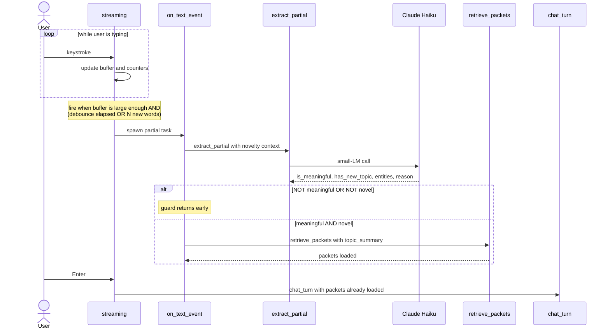

# When Vibe Coding Hits a Wall: The AI Engineering Workflow Behind Coco, a Self-Learning Knowledge Agent

*A walk-through of Coco: a conversational agent that builds long-term memory while you type, organizes it as multi-link knowledge packets, and retrieves it under 100ms — plus the engineering workflow that made building it actually possible.*


---

Imagine you're the head of risk at an investment firm. You need a counterparty risk management system. You sit down with a top-tier technology consultancy, put $5 million on the table, and tell them: *"You've built five of these at other firms. Surprise me with an implementation."*

You wouldn't. Of course not.

Even though the consultancy is genuinely expert, your firm is different — different regulations, different desks, different counterparty universe, different legacy stack. The five systems they built before are *priors*, not blueprints. 

So why do we sit down with an AI coding assistant, type *"build me a self-learning conversational agent,"* and expect anything other than the median answer?

The economics are different — minutes of compute, not millions of dollars — but the epistemic asymmetry is identical. The AI doesn't know what you actually need until you tell it. "Surprise me" produces what surprise-me always produces: something almost right and expensive to fix.

This post is a worked example. I wanted a self-learning conversational agent — something that would remember what we talked about the way a person does, surface it back without being asked, and feel instant. My first prompt — *"help me build a self-learning conversational agent"* — produced something perfectly competent and entirely generic. A chat loop with conversation history. A vector store of documents. Some RAG. All the canonical pieces of "AI memory" circa 2025. Useful. Also exactly nothing like what I wanted.

What follows is how I figured out which variant I actually wanted, what the architecture turned out to be, and how I worked with the AI to build it — two halves that turn out to be the same skill.

## The thousand variants

The phrase *"self-learning conversational agent"* describes a thousand different systems. RAG over uploaded documents. Long-term conversation history with summarization. Episodic journaling. Knowledge graphs with typed edges. Vector memory with topic clustering. Reinforcement-learned chat. Persistent agent loops with reflection. Each of those is "self-learning" by some definition.

When you give an AI an underspecified prompt, you don't get a bad answer. You get a *median* answer — the most common interpretation, averaged across whatever the model was trained on. For something genuinely useful, the median is rarely what you want. You want a *specific* variant chosen on purpose.

So I started over. Not by re-prompting harder, but by writing down what I actually meant.

## The variant I wanted

Concretely:

- **Learns from conversation**, not from documents. I don't want to upload files. I want to just talk, and useful things get remembered.
- **Organized into compact, named units** — not raw transcript chunks. Something I could inspect.
- **Reachable from many conversational paths.** Mentioning a project codename should pull its memory; mentioning a specific technical decision the team made on that project should pull a *different slice* of the same memory.
- **Sharper with use, dimmer with neglect.** Things I keep referring back to should stay vivid; things I haven't touched in a year should fade gracefully.
- **Real-time feel.** Memory retrieval should fire *while I'm typing*, not after I press Enter.
- **Scalable in the small.** Ten packets should work. Ten thousand should still work, with the same code.

That list is what was missing from the first prompt. Once it existed, the design problem became tractable.

## A mental model from how humans remember

To turn the requirements into a system, I started with how human memory actually behaves.

Memories aren't flat. You don't recall a fact by reading your entire brain. A single cue — a name, an entity, a context — surfaces a *cluster* of related stuff. That cluster has many entry points; mentioning the right detail can pull it from any angle. The cluster also has *intensity*: stuff you use often is vivid and detailed; stuff you don't touch fades to a vague feeling.

Translated into a system, that gives me four requirements:

1. A **unit of memory** that's neither a single fact nor a whole document. Something topic-scoped — a person, a project, a procedure.
2. **Multi-entry-point indexing** — each unit reachable by several different cues.
3. **Strength dynamics** — usage reinforces; neglect decays.
4. **Multi-fidelity content** — when a memory is fresh, you have only a gist; as you use it more, you can articulate the whole thing.

That maps cleanly to a data structure. I called it a packet — but before we get to its shape, the workflow that produced it.

## The AI engineering process

Every section after this — the packet shape, the retrieval math, the streaming layer — is an artifact of running the loop below. The architecture isn't something I deduced and then handed to the AI; it's something that emerged through iterations on a spec document, with the AI implementing each iteration against the spec.

```
       ┌──────────────────────────────────────────┐
       │              DESIGN.md                   │
       │   Pick the variant. Architecture +       │
       │   rationale. High-level only.            │
       └───────────────────┬──────────────────────┘
                           │
              ┌────────────┴────────────┐
              ▼                         ▼
    ┌────────────────────┐   ┌────────────────────┐
    │  Experiment-first  │   │   Design-first     │
    │                    │   │                    │
    │  AI builds +       │   │  Draft TDS.md      │
    │  emits TDS.md with │   │  before any code:  │
    │  sequence diagrams │   │  modules, sigs,    │
    │  alongside code    │   │  sequence diags,   │
    │                    │   │  observability     │
    └─────────┬──────────┘   └─────────┬──────────┘
              └───────────┬────────────┘
                          ▼
       ┌──────────────────────────────────────────┐
       │              TDS.md                      │ ◄─┐
       │  module signatures, data shapes,         │   │
       │  SEQUENCE DIAGRAMS, observability hooks  │   │
       └───────────────────┬──────────────────────┘   │
                           ▼                          │
       ┌──────────────────────────────────────────┐   │
       │              Code                        │   │
       │  AI implements against TDS               │   │
       └───────────────────┬──────────────────────┘   │
                           ▼                          │
       ┌──────────────────────────────────────────┐   │
       │           Run + Observe                  │   │
       │  Langfuse traces, dev-mode debug,        │   │
       │  per-channel breakdowns, dim hints       │   │
       └───────────────────┬──────────────────────┘   │
                           │                          │
                           └──────────────────────────┘
                            update TDS, code follows
```

**Step 0: DESIGN.md.** Before any code, write what you want as a conceptual design. Which variant. Which trade-offs. Why each choice. This is the document I should have started with on day one (instead of typing *"help me build a self-learning conversational agent"*). It doesn't need to be long — Coco's DESIGN.md is around five pages — but it does need to commit to a *specific* variant.

**Step 1: pick an entry path.** Two ways to bring code into existence:

- **Design-first.** If you already know what you want — say you've built two systems like this before — derive `TDS.md` from `DESIGN.md` before any code. Module signatures, data shapes, sequence diagrams of the main flows, observability hooks. Then ask the AI to implement against the spec.
- **Experiment-first.** If you're still figuring out what you want, ask the AI to take a reasonable first crack. But *demand* a `TDS.md` alongside the code — including sequence diagrams. Now you have something to run AND something to read.

**Step 2: the loop.** Either entry path lands here. Iterate:

1. **Run the system. Observe what it does** through traces, dev-mode debug output, and the dim user-visible hints. Don't read the code first.
2. **Update TDS.md.** If the behavior isn't what you want, change the spec. New module shape, new sequence diagram, new data field — whatever the design needs.
3. **AI updates the code to match.** Mostly mechanical from the AI's side; the design work happened in step 2.
4. **Read the diff against the TDS section it implements.** Spot anything the AI added that wasn't asked for. Cut it.
5. Back to 1.

The non-negotiable rule: **TDS changes first, code follows.** If TDS and code disagree, TDS wins. Otherwise you're vibe coding with extra steps.

Two pieces the TDS must carry, because they're load-bearing for everything else:

- **Sequence diagrams** (Mermaid is fine). Each major flow gets one. They're the contract you state to the AI when you want to reroute control flow. They're also how *you* read AI-written code without going line by line. We'll see the central one for Coco's streaming flow shortly.
- **Observability hooks.** The TDS specifies what gets traced (Langfuse spans and generations), what gets logged in dev-mode, and what gets surfaced as end-user hints. When step 1 shows something odd, you don't grep the code — the traces tell you where it broke.

Why this discipline produces better code than vibe coding:

- **The code structure is better organized.** The AI has a clear contract to satisfy, so it stops inventing helper modules and abstractions you didn't ask for. The module layout reflects the TDS, which reflects the design.
- **You stay on top of what the AI is producing.** Sequence diagrams + debug output + Langfuse traces become your interface to a codebase you didn't type. You reason about the architecture, not every line.
- **The AI maintains its own code better.** When you come back in two months, the AI reads `TDS.md` first. The code mirrors the spec, so the AI's mental model converges fast and edits don't drift into incoherence.

With the workflow in mind, here's the architecture that emerged.

## Try it yourself (4 commands)

Before the deep architecture walk-through: if you'd rather poke at a running Coco than read about one, the repo is up at [github.com/shishircc/self-learning-knowledge-agent](https://github.com/shishircc/self-learning-knowledge-agent), with `DESIGN.md`, `TDS.md`, and the code that this post is about. Full setup is in the [README](https://github.com/shishircc/self-learning-knowledge-agent/blob/main/README.md). The quickstart:

```bash
git clone https://github.com/shishircc/self-learning-knowledge-agent.git
cd self-learning-knowledge-agent
python3 -m venv .venv && source .venv/bin/activate
pip install -e .
```

Drop an `.env` file at the project root with at least `ANTHROPIC_API_KEY=sk-ant-...` (and optionally `LANGFUSE_*` keys if you want traces). Then:

```bash
python -m coco
```

That gives you a colored prompt, a streaming reply, and brief `recalling:` / `remembered:` hints as the memory layer moves. Flip `debug_print_streaming: true` in `config.json` if you want to watch the per-channel RRF breakdown live while you type — that's the developer-mode view I used to catch the scoring issue you'll read about later.

## Architecture

Six pieces, in the order they make most sense: the packet (the data shape everything operates on), retrieval against it, how retrieval gets triggered in real time, the write path, the strength dynamics that make the whole thing alive, and the three iterations that produced this design.

### The packet

The atomic unit of long-term memory is a **packet** — a topic-scoped unit (a project, a person, a procedure), not a document chunk. Each carries five things:

```
Packet
  topics:    [{text, vector}, ...]   multiple short topic phrases
  entities:  [str, ...]              proper nouns / names / places, lowercased
  content:
    gist     one line
    summary  one paragraph
    full     markdown, the complete content
  strength_events: append-only log of retrieval / use / write events
```

Each field earns its place:

- **Multiple topic phrases** make the same memory reachable from many angles. A packet about a work project might carry facets like `["Apollo — vLLM inference platform migration", "Apollo's rollout timeline", "Apollo's GPU cost trade-offs"]`. "The migration deadline" matches the second; "H100 spot pricing" matches the third. One memory, many doors.
- **The entity list** is the named-lookup channel — cheap, direct. Mentioning "Apollo" or "vLLM" anywhere reaches matching packets without any embedding.
- **Multi-fidelity content** lets weak packets surface as a one-line gist and well-used packets unfold to full content — that's how the prompt budget gets allocated across many candidates.
- **Strength events** are an append-only log decayed by time. Stuff you use stays sharp; stuff you don't fades. The system feels *alive*, not static.

### Retrieval: three channels, fused by rank

Given a moment in conversation — say you've just typed "I need to check on the Apollo rollout" — three independent signals score every candidate packet:

- **Channel A (topic BM25):** lexical overlap with the packet's combined topic phrases. Fast, no embedding.
- **Channel B (max cosine across topic vectors):** semantic match; the *best matching facet* wins. Catches paraphrases ("model serving costs" → "GPU cost trade-offs").
- **Channel C (entity bag BM25):** direct name lookup. Mentioning "Apollo" reaches Apollo-packets even with no semantic signal.

These get combined by **Reciprocal Rank Fusion**:

```
RRF(packet) = Σ_channel  1 / (k + rank_in_channel + 1)
```

RRF sums *ranks*, not scores — which normalizes wildly different scoring scales (BM25 is unbounded; cosine is 0–1). The default `k = 60` is tuned for million-document IR corpora; at personal scale it over-compresses, so Coco uses **`k = 2`**. Combined with **zero-score filtering** (a packet only gets a rank in a channel if its raw score is meaningfully above zero), irrelevant packets land at exactly `0.0` instead of inheriting "lowest in queue" noise.

A small per-packet **strength bias** rides on top — packets you've used recently nudge ahead in close races, but a sharp semantic match can still surface a packet you haven't touched in months.

### Real-time: retrieving while you type

The naive way to do retrieval is to wait for Enter, search memory, then call the LLM. Two-second pause. The agent feels slow.

The model that works is *predict and prefetch*: retrieve while the user is still typing.

As you type, a streaming layer fires `partial(text)` events — debounced (350ms quiet), with a word-count override (every 5 new words). For each partial, a small fast LM (Claude Haiku) extracts:

```json
{
  "is_meaningful":     true,
  "has_new_topic":     true,
  "has_new_entities":  false,
  "topic_summary":     "Apollo platform migration status",
  "entities":          ["apollo", "vllm"],
  "reason":            null
}
```

Two gates: is it substantive (not niceties)? Is it novel (not already in the session)? Both pass → 3-channel RRF runs and packets load. By the time you press Enter, the right memories are already there. The main reply LLM is then *purely conversational* — it doesn't classify topics or trigger retrieval; it just talks.



The small LM owns novelty (no cosine double-check) and the reply LLM no longer classifies topics — moving that to streaming resolved a chicken-and-egg where retrieval needed the topic but the topic came from the same LLM call that needed retrieval.

The effect: tokens of the reply arrive in under a second with the right memory loaded. It feels like talking to something that knows you.

### The write path: how knowledge gets stored

Every turn potentially produces new knowledge. The reply LLM declares it as structured output:

```json
{
  "new_knowledge": [
    {"content": "Apollo's Q3 deadline moved to Q4 due to H100 procurement delays.", "conflicts_with": null}
  ]
}
```

For each item, a three-way decision:

1. **Strong facet match to a loaded packet** (cosine ≥ 0.6)? *Integrate-on-write* — an LLM call merges the new content in, updates topic facets and entities, and flags contradictions. Conflicts pause to ask you.
2. **Match a recent scratchpad entry?** Promote both to a fresh packet — "spaced repetition" consolidation.
3. **Neither?** Insert into scratchpad. It'll wait for another mention.

The **scratchpad** is the buffer that gives the system judgment. Without it, every passing mention either becomes a packet (noise) or vanishes (missed). With it, only things you reinforce earn permanence; entries unused for ~10 sessions get pruned.

### Strength: the system feels alive

Strength gates two things: which content slice loads (weak packet → gist; strong → full) and a small additive bias on retrieval ranking. The computation:

```
strength(packet, now) = Σ over events of:
                         weight(event_type) · 0.5^((now − ts) / half_life)

weights:   retrieval = 1, use = 3, write = 5
half_life: 30 days
```

Every retrieval adds 1, every "use" adds 3 (the reply LLM actually drew on the packet), every write adds 5. All decay exponentially at a 30-day half-life.

Trivially cheap math; the behavior is that the system *feels alive*. Packets you stop using gracefully demote. The moment you start using them again, they ramp back up. No garbage collection, no archival — just a weighted log per packet.

### How the architecture actually emerged

The shape above came from three iterations against a running system. Each followed the same pattern: observe a problem, update TDS, code change follows.

**Iteration 1 — single-topic → multi-facet packets.** The first build had one topic and one vector per packet. Conversations revealed the gap: mentioning the codename "Apollo" pulled its packet, but "the inference platform we're standing up" didn't. A single vector couldn't span both angles. The fix was structural — a list of topic facets, each with its own vector. TDS first, four files updated, ~15 minutes total.

**Iteration 2 — Enter-only → streaming retrieval.** The agent worked but felt slow. The fix wasn't faster code; it was *earlier* code. This needed a real architectural shift — streaming console, small-LM extractor on partials, novelty gates, the reply LLM moving out of the retrieval business. I drew the new flow as the Mermaid sequence diagram above *before* writing any code. Once the diagram captured intent, the code cascaded.

**Iteration 3 — RRF over-compression.** Coco was running but retrieval still occasionally surfaced irrelevant packets. The debug log showed why:

```
[final 0.0492] apollo-packet         (rank 1 in all channels)
[final 0.0476] postgres-packet       (irrelevant)
[final 0.0469] hr-policy-packet      (totally irrelevant)
```

A 0.002 gap between the perfect match and irrelevant ones. `k = 60` (RRF's default for million-doc corpora) was over-compressing at personal scale. Two TDS changes — `k = 60 → 2`, and per-channel zero-score filtering — and after:

```
[final 1.0000] apollo-packet         (rank 1 in all three channels)
[final 0.0000] postgres-packet       (filtered everywhere)
```

None of the three changes was a structural rebuild. Each was a refinement caught by running the system, observing it, and updating the TDS first.

## Observability is what made the iterations possible

The RRF compression took thirty seconds to catch — not because I read the code, but because I watched the debug output. That trick generalizes.

Coco has two layers:

- **Langfuse traces every LLM call.** Each `chat_turn` is a trace; all turns of one conversation group under a single session. When something feels off, the trace shows what was extracted, what packets loaded, what the reply LLM saw.
- **A developer-mode toggle** prints the per-channel RRF breakdown to the console as you type. That's where the compression issue surfaced.

End-user mode shows just the conversation and dim `recalling:` / `remembered:` hints so the memory layer is visible without being noisy.

Skip observability in an AI-built system and you have a black box that the AI also can't see into. That's strictly worse than handwritten code — at least handwritten code has an author who remembers their intent.

## Where AI gets it wrong (and you need to catch it)

A few honest moments from the Coco build:

- **Hallucinated SDK methods.** When I switched to the direct `anthropic` SDK, the first attempt called methods that didn't quite exist in the installed version.
- **Subtle async bugs.** The streaming "fire-and-forget partials, drain on submit" pattern took two passes to get right.
- **Bias toward over-engineering.** Without an explicit constraint, the AI suggested helper modules and abstractions I didn't ask for. The TDS is also where you say *what doesn't exist*.

None are show-stoppers. All get caught by reading the diff, running the code, and reading the traces. Specs-first doesn't remove failure modes — it makes them quick and visible.

## Two takeaways

Two things — orthogonal-feeling but actually the same.

**One: a concrete architecture for a real-time self-learning agent.** Topic-scoped *packets* with multi-facet retrieval handles, an entity bag for direct lookups, multi-fidelity content gated by dynamic strength, and a streaming extraction layer that retrieves *before* you press Enter. The math is simple — 3-channel RRF with zero-score filtering at `k = 2`, plus a decaying weighted sum for strength. Under 2000 lines of Python.

**Two: an AI engineering workflow that delivers it.** Don't ask the AI to "build a self-learning agent." Specify the variant. Capture the conceptual design in `DESIGN.md`. Derive a `TDS.md` with module signatures, data shapes, and sequence diagrams. Update the TDS *first*, then the code. Wire observability before features. Read the traces.

AI is a force multiplier — and a multiplier on zero is still zero. The TDS-first discipline is what let me iterate from a generic first draft to a specific architecture without producing tech debt at every turn.

None of this means vibe coding is always wrong — for throwaway scripts, learning a library, and spike-and-discard exploration, it's exactly the right tool. The discipline above kicks in when the system has any meaningful lifespan or when anyone else might read or extend what you built. A useful test: if you'd be embarrassed by it breaking at 2am, write the spec.

Don't ask the AI to "build X." Specify the variant. Write it down. *Then* open any `.py` file.
