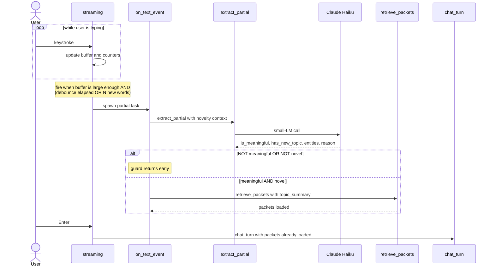

# Using Good AI Engineering process to Build Coco, A Self Learning Knowledge Agent

*A walk-through of Coco: a conversational agent that builds long-term memory while you type, organizes it as multi-link knowledge packets, and retrieves it under 100ms — plus the engineering workflow that made building it actually possible.*


---

Imagine you're the head of risk at an investment firm. You need a counterparty risk management system. You sit down with a top-tier technology consultancy, put $5 million on the table, and tell them: *"You've built five of these at other firms. Surprise me with an implementation."*

You wouldn't. Of course not.

Even though the consultancy is genuinely expert, your firm is different — different regulations, different desks, different counterparty universe, different legacy stack. The five systems they built before are *priors*, not blueprints. 

So why do we sit down with an AI coding assistant, type *"build me a self-learning conversational agent,"* and expect anything other than the median answer?

The economics are different — minutes of compute, not millions of dollars — but the epistemic asymmetry is identical. The AI doesn't know what you actually need until you tell it. "Surprise me" produces what surprise-me always produces: something almost right and expensive to fix.

This post is a worked example. I wanted a self-learning conversational agent — something that would remember what we talked about the way a person does, surface it back without being asked, and feel instant. My first prompt — *"help me build a self-learning conversational agent"* — produced something perfectly competent and entirely generic. A chat loop with conversation history. A vector store of documents. Some RAG. All the canonical pieces of "AI memory" circa 2025. Useful. Also exactly nothing like what I wanted.

What follows is how I figured out which variant I actually wanted, what the architecture turned out to be, and how I worked with the AI to build it — two halves that turn out to be the same skill.

## The thousand variants

The phrase *"self-learning conversational agent"* describes a thousand different systems. RAG over uploaded documents. Long-term conversation history with summarization. Episodic journaling. Knowledge graphs with typed edges. Vector memory with topic clustering. Reinforcement-learned chat. Persistent agent loops with reflection. Each of those is "self-learning" by some definition.

When you give an AI an underspecified prompt, you don't get a bad answer. You get a *median* answer — the most common interpretation, averaged across whatever the model was trained on. For something genuinely useful, the median is rarely what you want. You want a *specific* variant chosen on purpose.

So I started over. Not by re-prompting harder, but by writing down what I actually meant.

## The variant I wanted

Concretely:

- **Learns from conversation**, not from documents. I don't want to upload files. I want to just talk, and useful things get remembered.
- **Organized into compact, named units** — not raw transcript chunks. Something I could inspect.
- **Reachable from many conversational paths.** Mentioning a project codename should pull its memory; mentioning a specific technical decision the team made on that project should pull a *different slice* of the same memory.
- **Sharper with use, dimmer with neglect.** Things I keep referring back to should stay vivid; things I haven't touched in a year should fade gracefully.
- **Real-time feel.** Memory retrieval should fire *while I'm typing*, not after I press Enter.
- **Scalable in the small.** Ten packets should work. Ten thousand should still work, with the same code.

That list is what was missing from the first prompt. Once it existed, the design problem became tractable.

## A mental model from how humans remember

To turn the requirements into a system, I started with how human memory actually behaves.

Memories aren't flat. You don't recall a fact by reading your entire brain. A single cue — a name, an entity, a context — surfaces a *cluster* of related stuff. That cluster has many entry points; mentioning the right detail can pull it from any angle. The cluster also has *intensity*: stuff you use often is vivid and detailed; stuff you don't touch fades to a vague feeling.

Translated into a system, that gives me four requirements:

1. A **unit of memory** that's neither a single fact nor a whole document. Something topic-scoped — a person, a project, a procedure.
2. **Multi-entry-point indexing** — each unit reachable by several different cues.
3. **Strength dynamics** — usage reinforces; neglect decays.
4. **Multi-fidelity content** — when a memory is fresh, you have only a gist; as you use it more, you can articulate the whole thing.

That maps cleanly to a data structure. I called it a packet — but before we get to its shape, the workflow that produced it.

## The AI engineering process

Every section after this — the packet shape, the retrieval math, the streaming layer — is an artifact of running the loop below. The architecture isn't something I deduced and then handed to the AI; it's something that emerged through iterations on a spec document, with the AI implementing each iteration against the spec.

```
       ┌──────────────────────────────────────────┐
       │              DESIGN.md                   │
       │   Pick the variant. Architecture +       │
       │   rationale. High-level only.            │
       └───────────────────┬──────────────────────┘
                           │
              ┌────────────┴────────────┐
              ▼                         ▼
    ┌────────────────────┐   ┌────────────────────┐
    │  Experiment-first  │   │   Design-first     │
    │                    │   │                    │
    │  AI builds +       │   │  Draft TDS.md      │
    │  emits TDS.md with │   │  before any code:  │
    │  sequence diagrams │   │  modules, sigs,    │
    │  alongside code    │   │  sequence diags,   │
    │                    │   │  observability     │
    └─────────┬──────────┘   └─────────┬──────────┘
              └───────────┬────────────┘
                          ▼
       ┌──────────────────────────────────────────┐
       │              TDS.md                      │ ◄─┐
       │  module signatures, data shapes,         │   │
       │  SEQUENCE DIAGRAMS, observability hooks  │   │
       └───────────────────┬──────────────────────┘   │
                           ▼                          │
       ┌──────────────────────────────────────────┐   │
       │              Code                        │   │
       │  AI implements against TDS               │   │
       └───────────────────┬──────────────────────┘   │
                           ▼                          │
       ┌──────────────────────────────────────────┐   │
       │           Run + Observe                  │   │
       │  Langfuse traces, dev-mode debug,        │   │
       │  per-channel breakdowns, dim hints       │   │
       └───────────────────┬──────────────────────┘   │
                           │                          │
                           └──────────────────────────┘
                            update TDS, code follows
```

**Step 0: DESIGN.md.** Before any code, write what you want as a conceptual design. Which variant. Which trade-offs. Why each choice. This is the document I should have started with on day one (instead of typing *"help me build a self-learning conversational agent"*). It doesn't need to be long — Coco's DESIGN.md is around five pages — but it does need to commit to a *specific* variant.

**Step 1: pick an entry path.** Two ways to bring code into existence:

- **Design-first.** If you already know what you want — say you've built two systems like this before — derive `TDS.md` from `DESIGN.md` before any code. Module signatures, data shapes, sequence diagrams of the main flows, observability hooks. Then ask the AI to implement against the spec.
- **Experiment-first.** If you're still figuring out what you want, ask the AI to take a reasonable first crack. But *demand* a `TDS.md` alongside the code — including sequence diagrams. Now you have something to run AND something to read.

**Step 2: the loop.** Either entry path lands here. Iterate:

1. **Run the system. Observe what it does** through traces, dev-mode debug output, and the dim user-visible hints. Don't read the code first.
2. **Update TDS.md.** If the behavior isn't what you want, change the spec. New module shape, new sequence diagram, new data field — whatever the design needs.
3. **AI updates the code to match.** Mostly mechanical from the AI's side; the design work happened in step 2.
4. **Read the diff against the TDS section it implements.** Spot anything the AI added that wasn't asked for. Cut it.
5. Back to 1.

The non-negotiable rule: **TDS changes first, code follows.** If TDS and code disagree, TDS wins. Otherwise you're vibe coding with extra steps.

Two pieces the TDS must carry, because they're load-bearing for everything else:

- **Sequence diagrams** (Mermaid is fine). Each major flow gets one. They're the contract you state to the AI when you want to reroute control flow. They're also how *you* read AI-written code without going line by line. We'll see the central one for Coco's streaming flow shortly.
- **Observability hooks.** The TDS specifies what gets traced (Langfuse spans and generations), what gets logged in dev-mode, and what gets surfaced as end-user hints. When step 1 shows something odd, you don't grep the code — the traces tell you where it broke.

Why this discipline produces better code than vibe coding:

- **The code structure is better organized.** The AI has a clear contract to satisfy, so it stops inventing helper modules and abstractions you didn't ask for. The module layout reflects the TDS, which reflects the design.
- **You stay on top of what the AI is producing.** Sequence diagrams + debug output + Langfuse traces become your interface to a codebase you didn't type. You reason about the architecture, not every line.
- **The AI maintains its own code better.** When you come back in two months, the AI reads `TDS.md` first. The code mirrors the spec, so the AI's mental model converges fast and edits don't drift into incoherence.

With the workflow in mind, here's the architecture that emerged.

## Try it yourself (4 commands)

Before the deep architecture walk-through: if you'd rather poke at a running Coco than read about one, the repo is up at [github.com/shishircc/self-learning-knowledge-agent](https://github.com/shishircc/self-learning-knowledge-agent), with `DESIGN.md`, `TDS.md`, and the code that this post is about. Full setup is in the [README](https://github.com/shishircc/self-learning-knowledge-agent/blob/main/README.md). The quickstart:

```bash
git clone https://github.com/shishircc/self-learning-knowledge-agent.git
cd self-learning-knowledge-agent
python3 -m venv .venv && source .venv/bin/activate
pip install -e .
```

Drop an `.env` file at the project root with at least `ANTHROPIC_API_KEY=sk-ant-...` (and optionally `LANGFUSE_*` keys if you want traces). Then:

```bash
python -m coco
```

That gives you a colored prompt, a streaming reply, and brief `recalling:` / `remembered:` hints as the memory layer moves. Flip `debug_print_streaming: true` in `config.json` if you want to watch the per-channel RRF breakdown live while you type — that's the developer-mode view I used to catch the scoring issue you'll read about later.

## A map of the rest

The remainder of this post does two things: walks through Coco's architecture in enough depth that you could build something similar, and shows the iterations that produced it.

1. **Architecture** — the meat of the post. Five components, then the iterations that shaped them:
   - **The packet** — topic-scoped knowledge with multi-facet retrieval handles and an entity list.
   - **Retrieval** — three-channel hybrid (BM25 on topics, max-cosine on topic vectors, BM25 on the entity bag), fused by Reciprocal Rank Fusion with zero-score filtering.
   - **Real-time** — streaming triggers that retrieve *while you type*, with novelty gates and a small fast LM.
   - **The write path** — how new knowledge gets stored, via a scratchpad consolidation layer.
   - **Strength** — decaying weighted activity that makes the system feel alive (and gates multi-fidelity content).
   - **How the architecture actually emerged** — three iterations against a running system that produced the shape above.
2. **Lessons** — observability as the load-bearing partner to specs; where AI gets it wrong; when vibe coding is still the right call; two takeaways.

If you only want the architecture, the next section is where it starts. If you only want the workflow, jump to "How the architecture actually emerged" and then the lessons.

## Architecture

Six pieces, in the order that makes them easiest to understand. Packets first (the data structure that everything else operates on), then how retrieval works against them, then how retrieval gets triggered in real time, then how new knowledge gets written back, then how strength makes the whole thing dynamic — and finally a walk through the three iterations that shaped this design.

### The packet

The atomic unit of long-term memory in Coco is a **packet**. It's not a document chunk. It's a unit of related knowledge — typically a person, a project, a procedure, or a topic. Think of it as a node in a personal wiki, but smaller and more dynamic.

Each packet carries five things:

```
Packet
  topics:    [{text, vector}, ...]   multiple short topic phrases
  entities:  [str, ...]              proper nouns / names / places, lowercased
  content:
    gist     one line
    summary  one paragraph
    full     markdown, the complete content
  strength_events: append-only log of retrieval / use / write events
  ...metadata (id, timestamps, source sessions)
```

Each field exists for a specific reason.

**Multiple topic phrases, not one.** This is the multi-entry-point requirement, made concrete. The same memory needs to be reachable from many conversational angles. A packet about a project at work might have facets like `["Apollo — vLLM inference platform migration", "Apollo's rollout timeline and milestones", "Apollo's GPU allocation and cost trade-offs"]`. Mentioning "the migration deadline" matches the second facet via semantic similarity; mentioning "H100 spot pricing" matches the third. **One memory, many doors.** A single topic field would force me to pick one — and any conversation that came in through a different angle would miss.

**Entity list, separate from topic phrases.** Some things are reachable by *name*, not topic. If you mention "Apollo" or "vLLM" anywhere in your message, any packet whose entity bag contains those tokens becomes a candidate — no semantic embedding needed. This is the closest thing to a "direct" lookup channel and it's much cheaper than vector search.

**Multi-fidelity content (gist / summary / full).** A brand new packet has only a gist. As it gets used more, it earns the right to surface more detail — a paragraph summary first, then the full content. This solves the prompt-size problem: ten packets at gist-level cost almost nothing to inject; one well-used packet at full-fidelity costs more but is genuinely worth the tokens. The fidelity-vs-strength gate is what makes the memory layer scale gracefully.

**Strength events as an append-only log.** Every retrieval, every "use" (the reply LLM actually drew on the packet), every write event gets logged with a timestamp. Strength is computed lazily from the log with exponential decay. The math is simple — `Σ event_weight · 0.5^((now − ts) / half_life)` — but the effect is profound: the system feels *alive*. Packets you've been using stay strong; packets you've ignored gracefully demote.

This shape is what "multi-link, real-time knowledge memory" actually looks like at a data level. Now: how do you retrieve it?

### Retrieval: three channels, fused by rank

Given a conversational moment — say, you've just typed "I need to check on the Apollo rollout" — how does the system find the right packet?

Three independent signals.

**Channel A: BM25 over topic text.** Treat each packet's combined topic phrases as a tiny "document." Lexical match scores it. If you mention "Apollo rollout" and a packet's facet is "Apollo — vLLM inference platform migration," BM25 picks it up. This is pure word-overlap matching — fast, no embedding required, handles named entities and rare terms well.

**Channel B: max cosine across topic vectors.** Embed your current topic phrase (we'll see where that comes from in a moment), then take the maximum cosine similarity against any of the packet's topic facet vectors. Multi-facet packets shine here — the *best matching facet* wins, not the average. Semantic match, not lexical: "model serving costs" matches a "GPU allocation and cost trade-offs" facet even though no words overlap.

**Channel C: BM25 over the entity bag.** Same as Channel A, but the "document" is the packet's entity list. This is the named-lookup channel. Mentioning "Apollo" anywhere in your message reaches Apollo-packets directly, no semantic similarity needed.

These three channels are combined by **Reciprocal Rank Fusion (RRF)**:

```
RRF(packet) = Σ_channel  1 / (k + rank_in_channel + 1)
```

Each channel ranks all candidate packets independently. RRF sums the *ranks*, not the scores. This is important: BM25 scores are unbounded; cosine similarities live in [0, 1]. Combining raw scores would let whichever channel happens to have larger magnitudes dominate. Combining ranks normalizes them — both channels get equal voice.

There are two important modifications I had to make.

**First: zero-score filtering.** A packet gets a rank in a channel only if its raw score is above a per-channel floor (zero for BM25, a small positive for cosine). Below the floor, the packet contributes nothing from that channel. Without this, every packet — even an obviously irrelevant one — gets *some* RRF contribution just for being in the candidate set, because it's still last in the rank queue.

**Second: `k = 2`, not 60.** RRF's default `k = 60` is tuned for IR corpora of millions of documents, where rank-1 vs rank-10 contributions are still meaningfully different. At my personal scale (tens of packets), `k = 60` over-compresses. With `k = 2`:

```
rank-1 contribution = 1 / (2 + 1)   = 0.333
rank-4 contribution = 1 / (2 + 4)   = 0.167
```

Sharp separation. Combined with zero-score filtering, an irrelevant packet lands at exactly `0.0` instead of inheriting `0.04`-ish noise from being last in the queue.

A small per-packet strength bias gets added on top — packets you've used a lot recently bias slightly higher, but a sharp semantic match can still surface a packet you haven't touched in months. This keeps retrieval responsive without becoming a popularity contest.

### Real-time: retrieving while you type

Here's where it stops feeling like a chatbot and starts feeling like an agent.

The naive way to do retrieval is: wait for the user to press Enter, then search memory, then call the LLM. Two-second pause. The agent feels slow.

The model that actually works is *predict and prefetch*: retrieve while the user is still typing.

Implementation: there's a streaming console layer that fires `partial(text)` events as you type — debounced (350ms quiet), with a word-count override (every 5 new words so long monologues don't stall). For each partial, a small fast LM (Claude Haiku) is called with the partial text and the current session state:

```json
{
  "is_meaningful":     true,
  "has_new_topic":     true,
  "has_new_entities":  false,
  "topic_summary":     "Apollo platform migration status",
  "entities":          ["apollo", "vllm"],
  "reason":            null
}
```

Two gates before the agent does anything:

1. **Substantive?** Niceties like "hi" or "thanks" get `is_meaningful: false`. Skip.
2. **Novel?** If the topic summary is already in the session's topic list and the entities are all already in loaded packets' entity bags, nothing new is happening. Skip.

Only if you pass both gates does the agent run RRF retrieval. By the time you press Enter, the relevant packets are already loaded into context. The main reply LLM (Claude Sonnet) is then *purely conversational* — it doesn't classify topics or trigger retrieval; it just talks, using the loaded packets as its knowledge.

Here's the full flow:



Two design notes about this flow.

**The small LM is authoritative for novelty.** It already knows what's in the session (passed in as context). The agent doesn't double-check via cosine. Cheaper, simpler, faster — and the small LM is genuinely good at this bounded task.

**The main reply LLM no longer emits a topic_facet.** That was the v1 design — and it created a chicken-and-egg problem: retrieval needed the topic, but the topic came from the same LLM call that needed retrieval to have already happened. Moving topic classification to the streaming small LM resolved it cleanly.

The conversational effect is striking. You type a question; tokens of the reply start arriving in under a second; the right memories are already there. It doesn't feel like a chatbot with a memory hack. It feels like talking to something that knows you.

### The write path: how knowledge actually gets stored

Every turn potentially produces new knowledge. The agent has to decide where it goes.

The reply LLM's structured output declares zero or more new-knowledge items:

```json
{
  "reply": "Got it — Apollo's deadline slipped to Q4 because of the H100 procurement delays. I'll keep that context for future roadmap conversations.",
  "packets_used": ["pkt_abc12"],
  "new_knowledge": [
    {
      "content": "Apollo's Q3 deadline moved to Q4 due to H100 procurement delays.",
      "conflicts_with": null
    }
  ]
}
```

For each new-knowledge item, a three-way decision:

1. **Match an existing loaded packet?** If the current conversation topic has a strong facet match (cosine ≥ 0.6) to a packet's topic vectors, *integrate* the new content into that packet. An integrate-on-write LLM call merges the new content into the existing markdown, updates the topic facets and entity list, and flags contradictions. If a contradiction is detected, the agent pauses and asks the user before applying it.
2. **Match a recent scratchpad entry?** If two near-duplicate topic phrases land in scratchpad across sessions, promote them to a fresh packet. This is the "spaced repetition" route: things you mention once get a placeholder; things you mention twice earn permanence.
3. **Neither?** Insert as a fresh scratchpad entry. It'll wait for another mention.

The **scratchpad** is the consolidation layer. Stuff that's mentioned once but isn't yet meaningful enough for a packet lives there. Entries that don't recur within ~10 sessions get pruned. Everything else either consolidates into a packet or fades.

The economic reason this matters: not every passing mention deserves long-term memory. Without the scratchpad layer, the agent would either accumulate noise (every utterance becomes a packet) or miss things (a meaningful detail mentioned briefly never gets captured). The scratchpad is the buffer that gives the system *judgment* about what to keep.

### Strength: the system feels alive

Strength is what makes the difference between a static knowledge base and a dynamic memory.

A packet's strength governs two things:

1. **Which content slice loads.** A weak packet surfaces only its gist (one line). A medium-strength packet loads the paragraph summary. A strong, frequently-used packet loads the full content. This is how the prompt budget gets allocated — ten weakly-relevant packets at gist-level cost what one strongly-used packet at full fidelity costs.
2. **Retrieval ranking bias.** A stronger packet gets a small additive boost on its final RRF score — so when two packets are semantically similar, the one you've been using lately surfaces first.

Computation:

```
strength(packet, now) = Σ over events of:
                         weight(event_type) · 0.5^((now − ts) / half_life)

weights:   retrieval = 1, use = 3, write = 5
half_life: 30 days
```

Three event types: every retrieval adds 1 (you considered the packet), every "use" adds 3 (the reply LLM actually drew on it), every write adds 5 (new content was integrated). All decay exponentially with a 30-day half-life.

The math is trivially cheap. The behavior is that the system *feels alive*: packets you stop using gracefully demote out of the strong tier without disappearing, and the moment you start using them again they ramp back up. There's no global garbage collection, no manual archival — just a single weighted log per packet.

### How the architecture actually emerged

The architecture above didn't come from one design session. It emerged through three iterations against a running system, using the workflow described earlier — `DESIGN.md` → `TDS.md` with sequence diagrams → AI implements → run + observe → update TDS → AI updates code. Each iteration had the same shape: I observed a problem, went back to the TDS, the code change followed.

**Iteration 1: single-topic → multi-facet packets.** The first build had packets with one topic and one vector each. I ran a few conversations. I noticed that mentioning the codename "Apollo" pulled its packet, but mentioning "the inference platform we're standing up" didn't — the single topic phrase ("Apollo migration project") wasn't semantically close enough to a paraphrase that didn't include the codename. A single vector couldn't span both angles.

Going back to the design, the move was clear: each packet needed a *list* of topic facets, each with its own vector. I updated `TDS.md` first — the packet schema, the retrieval algorithm, the write-path facet-match logic. Then asked the AI to align the code. The change touched four files and converged in about fifteen minutes.

**Iteration 2: Enter-only → streaming retrieval.** The agent worked, but it felt slow. The retrieval pass and the LLM call only started after I pressed Enter. I'd type a question, wait a couple of seconds, get a reply.

The fix wasn't faster code — it was *earlier* code. Retrieval should fire while I was typing. This required a real architectural shift: a streaming console layer (prompt_toolkit with debounce + word-count triggers), a small-LM extractor running on debounced partials, novelty gates, and a single handler that ran for both partials and submit events. The main reply LLM moved out of the retrieval business entirely — it just received already-loaded packets and talked.

I drew the new flow as a Mermaid sequence diagram in `TDS.md` *before* writing a line of new code. That's the diagram you saw earlier. Once the diagram captured the design, the code edits cascaded — every module change had a section in the TDS that said exactly what needed to happen.

**Iteration 3: RRF over-compression.** Everything was running. But retrieval still occasionally felt off — Coco would surface an irrelevant packet alongside the right one. I turned on a developer-mode debug toggle and watched a real retrieval log:

```
[final 0.0492] apollo-packet         (rank 1 in all channels)
[final 0.0476] postgres-packet       (irrelevant)
[final 0.0469] hr-policy-packet      (totally irrelevant)
```

The perfect-match packet scored `0.0492`. A genuinely irrelevant packet scored `0.0469`. The gap between them was `0.002`. The `retrieval_threshold` knob couldn't possibly help — every packet was scoring in the same narrow band.

I went to the math. RRF's default `k = 60` is tuned for IR corpora of millions of documents. At my scale, the rank-1 vs rank-N contribution gap was vanishing. Two changes in `TDS.md`:

- `hybrid_search_k: 60 → 2`. Sharpens the per-rank contribution.
- Per-channel zero-score filtering. A packet with zero BM25 in a channel doesn't get a rank — it contributes 0 instead of inheriting noise.

After:

```
[final 1.0000] apollo-packet         (rank 1 in all three channels)
[final 0.2500] kubernetes-packet     (some cosine — Apollo runs on k8s, weak link — no BM25 overlap)
[final 0.0000] postgres-packet       (filtered everywhere)
[final 0.0000] hr-policy-packet      (filtered everywhere)
```

Sharp separation. `retrieval_threshold` does something meaningful again.

The architecture you've been reading about is the post-iteration version. None of the three changes was structural — they were all *refinements*. But each emerged from running the system, observing its behavior, and updating the TDS *before* the code.

## Observability is what made the iterations possible

I caught the RRF compression in about thirty seconds — not because I read the code, but because I watched the debug output. That trick generalizes, and it's the discipline that pairs with TDS-first.

Coco has two observability layers:

- **Langfuse traces every LLM call.** Each `chat_turn` is one trace; all turns of one conversation group under a single Langfuse session. I can scroll a session and see exactly what was extracted on each partial, what packets were loaded, what the reply LLM had in its prompt, what came back. When something feels off, the trace tells me where it broke.
- **A developer-mode toggle** (`debug_print_streaming: true` in `config.json`) prints the per-channel RRF breakdown to the console in real time — raw scores, ranks, contributions. The compression issue came from staring at that output for one minute.

In end-user mode (the default), Coco shows just a clean welcome banner, a colored prompt, and the streamed reply. But it also surfaces tiny dim hints — `recalling: <gist>` and `remembered: <gist>` — so the user can see the memory layer moving. Even those minimal hints catch the occasional "wait, why did it remember *that*?" moment.

Skip observability in an AI-built system and you've built a black box that the AI also can't see into. That's strictly worse than handwritten code — at least handwritten code has an author who remembers their intent.

## Where AI gets it wrong (and you need to catch it)

A few honest moments where the AI tripped during the Coco build:

- **Hallucinated SDK methods.** When I switched from `claude-agent-sdk` to the direct `anthropic` SDK, the first attempt called methods that didn't quite exist in the installed version. I had to grep the SDK and correct.
- **Subtle async bugs.** The streaming "fire-and-forget partials, drain on submit" pattern took two passes to get right. The first version dropped events on fast typing.
- **Bias toward over-engineering.** Without an explicit constraint, the AI suggested helper modules and abstractions I didn't ask for. I cut a lot. The TDS is also where you say *what doesn't exist*.

None of these are show-stoppers. All of them get caught by reading the diff, running the code, and reading the traces. Specs-first doesn't remove failure modes — it makes them quick and visible.

## Two takeaways

If you've read this far, you've absorbed two things that I hope feel orthogonal but are actually the same.

**One: a concrete architecture for a real-time self-learning agent.** Topic-scoped *packets* with multi-facet retrieval handles, an entity bag for direct lookups, multi-fidelity content gated by dynamic strength, and a streaming extraction layer that retrieves *before* you press Enter. The math behind retrieval is simple (3-channel RRF with zero-score filtering, `k = 2`); the math behind strength is simple (decaying weighted sum). The whole system is under 2000 lines of Python. It feels alive because every design choice — multi-facet, multi-fidelity, strength dynamics, streaming — was made on purpose to map onto how memory actually behaves.

**Two: an AI engineering workflow that delivers it.** Don't ask the AI to "build a self-learning agent." Specify the variant. Capture the conceptual design in `DESIGN.md`. Derive a `TDS.md` with module signatures, data shapes, and sequence diagrams. Update the TDS *first*, then the code. Wire observability before features. Read the traces.

The second one is what made the first one possible. A year ago I would have produced the generic agent the AI offered me first, called it done, and never noticed that the median interpretation wasn't what I wanted. The TDS-first discipline is what let me iterate from a median first draft to a specific architecture without producing tech debt at every turn. AI is a force multiplier — and a multiplier on zero is still zero.

None of this means vibe coding is always wrong — for throwaway scripts, learning a new library, and spike-and-discard exploration, it's exactly the right tool. The discipline above kicks in when the system has any meaningful lifespan, when there's real state to manage, or when anyone else might need to read or extend what you built. A useful test: if you'd be embarrassed by it breaking at 2am, write the spec.

If you're starting a new AI-assisted project this week, the one piece of advice I'd repeat: don't ask the AI to "build X." Specify the variant. Write it down. *Then* open any `.py` file.
