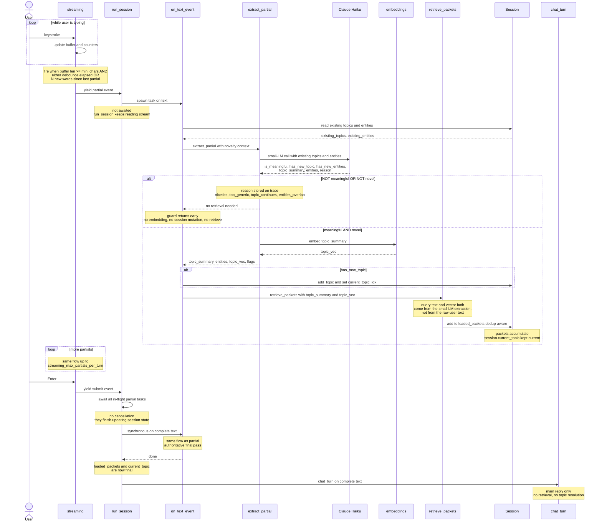
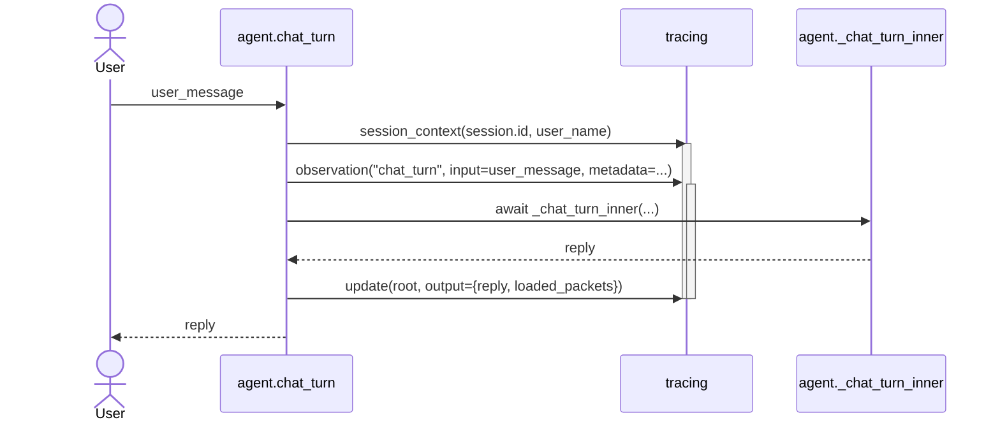
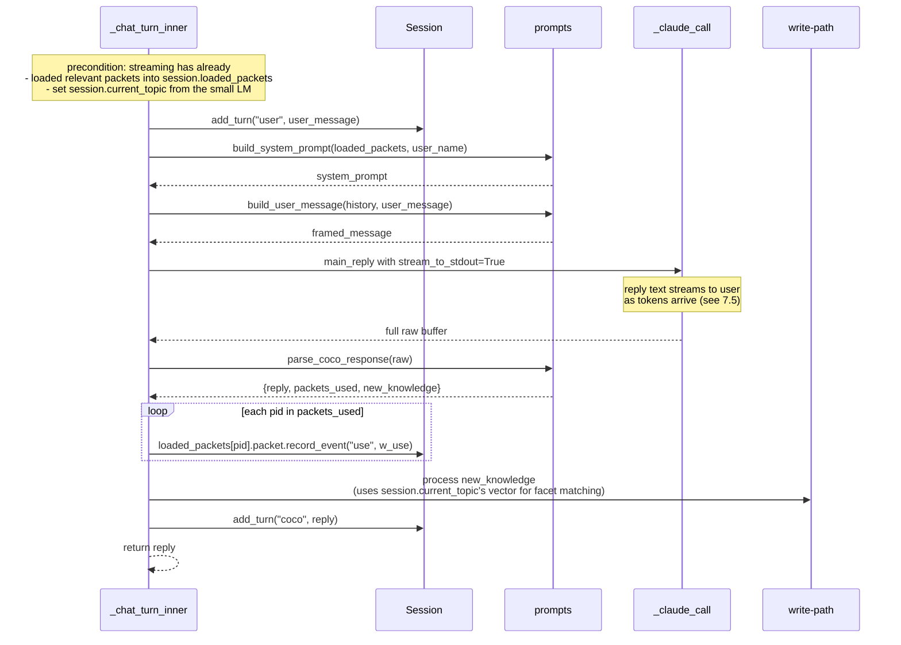
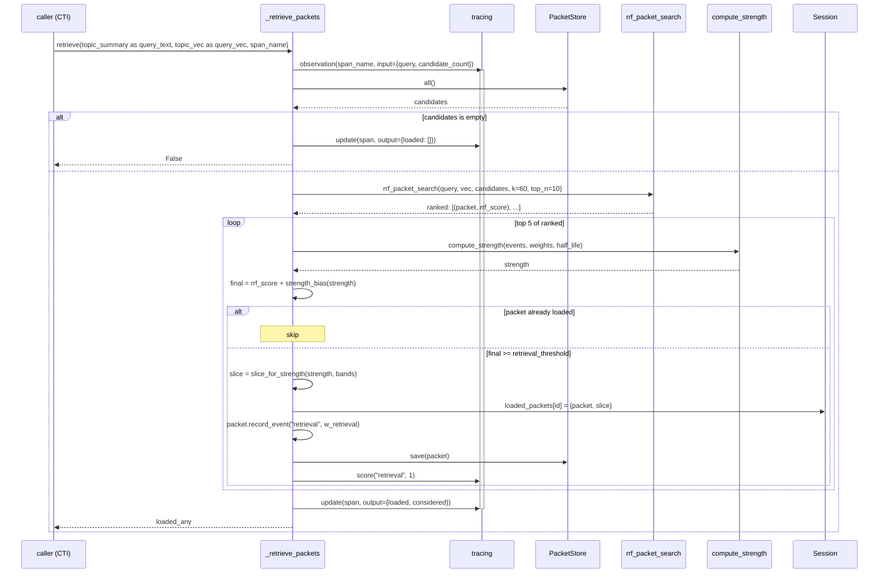
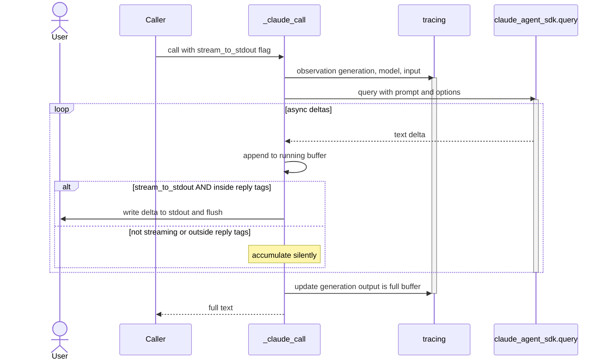
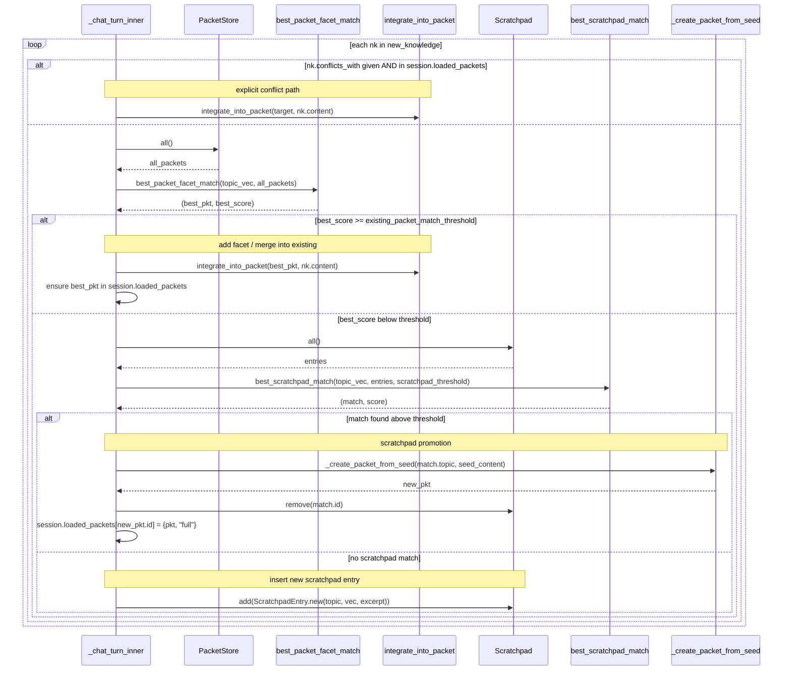
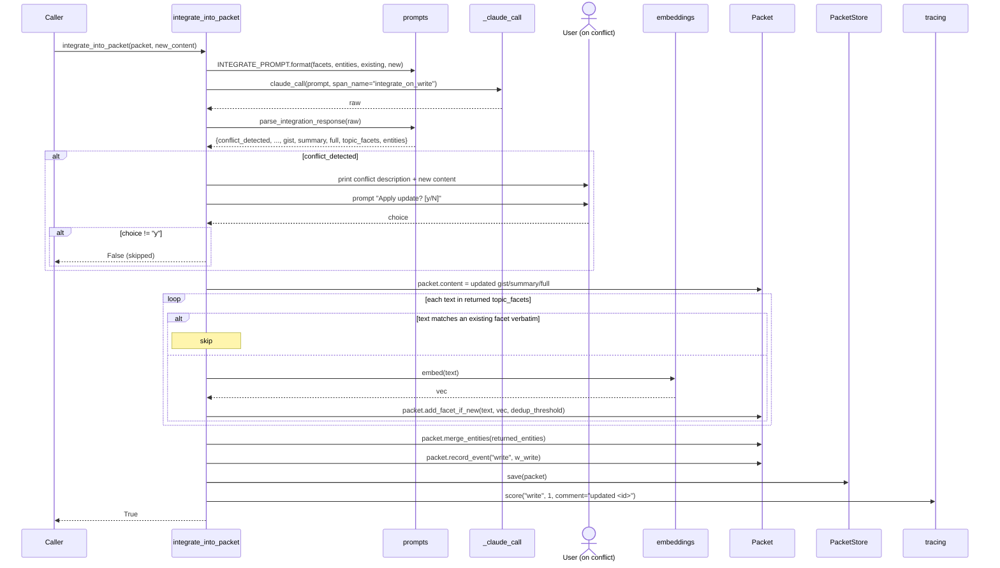
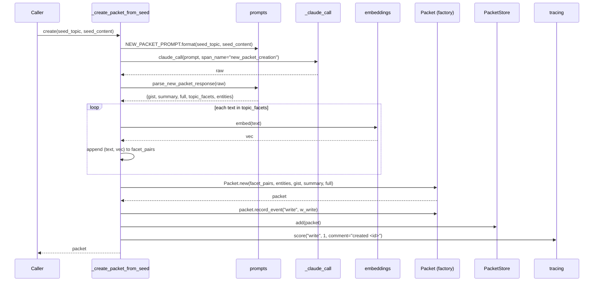
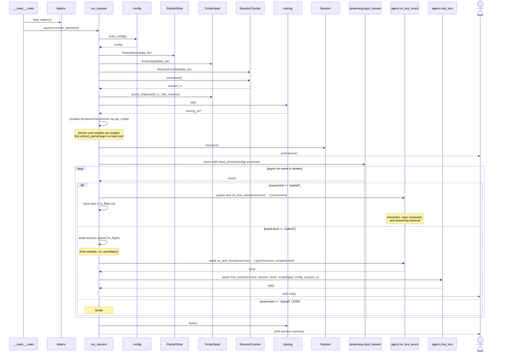

# Coco — Technical Design Specification

This document specifies the **implementation** of Coco: code layout, module contracts, function signatures, data structures, and the call-flow sequence diagrams for each operational path.

For the **conceptual design** (the "why"), see [`DESIGN.md`](./DESIGN.md). This TDS is the source of truth for "what calls what, in what order, with what data."

Sequence diagrams use [Mermaid](https://mermaid.js.org/) syntax — renderable inline in GitHub, VS Code, and most markdown viewers.

---

## 1. Code structure

```
/Users/shishir/self-learning-knowledge-agent/
├── DESIGN.md                  conceptual design (the "why")
├── TDS.md                     this document (the "how")
├── pyproject.toml             package + deps
├── config.json                runtime tuning knobs
├── .env                       (user-created) Langfuse credentials
├── data/                      (gitignored) packets + scratchpad + session counter
│   ├── packets/*.json
│   ├── scratchpad/*.json
│   └── session_counter.json
└── coco/
    ├── __init__.py            empty package marker
    ├── __main__.py            CLI entrypoint; loads dotenv, runs asyncio loop
    ├── agent.py               turn loop orchestration, LLM calls, write-path branching
    ├── config.py              defaults + JSON config loader
    ├── embeddings.py          sentence-transformers wrapper + cosine
    ├── memory.py              Packet, ScratchpadEntry, TopicFacet, storage classes
    ├── prompts.py             system-prompt templates + JSON response parsing
    ├── retrieval.py           3-channel RRF, topic resolution, scratchpad match
    ├── session.py             in-session topic list + loaded packets state
    ├── streaming.py           keystroke-streaming console reader; debounced partial events
    ├── extraction.py          small-LM extractor (topic_summary + entities) from partial text
    ├── llm.py                 lazy AsyncAnthropic client; shared by agent.py and extraction.py
    ├── strength.py            decayed-strength computation, slice bands, bias
    ├── ui.py                  end-user-facing console output (banners, prompt, Coco label) with ANSI styling
    └── tracing.py             Langfuse wrapper with no-op fallback
```

## 2. Module reference

Each module's public surface and its dependencies on other modules.

### 2.1 `coco.config`

**Purpose.** Centralize all tuning knobs in one dict, loadable from `config.json` over hardcoded defaults.

**Public API:**
| Symbol | Type | Description |
|---|---|---|
| `DEFAULT_CONFIG` | `dict[str, Any]` | All defaults; matches `config.json` exactly |
| `load_config(path="config.json")` | `(str) -> dict` | Returns deep-merged config; missing keys filled from defaults |

**Depends on:** stdlib only (`json`, `pathlib`).

### 2.2 `coco.embeddings`

**Purpose.** Single embedding backend, cached at module level; cosine similarity helper.

**Public API:**
| Symbol | Signature | Notes |
|---|---|---|
| `get_model(name)` | `(str) -> SentenceTransformer` | Module-level cache; swaps if name changes. Call once at startup to preload (see below). |
| `embed(text, model_name)` | `(str, str) -> np.ndarray` | Returns L2-normalized float32 vector. If `get_model` was not preloaded, the first call here pays the load cost (~1-3s for MiniLM, longer for larger models). |
| `cosine_similarity(a, b)` | `(np.ndarray, np.ndarray) -> float` | Dot product (assumes normalized inputs) |

**Preload at startup.** `agent.run_session` calls `get_model(config["embedding_model"])` immediately after loading config and before opening the input stream. Effect: the SentenceTransformer is fully loaded and weights are in memory by the time the first user keystroke would fire a partial event. Without this, the first `embed()` call inside `extract_partial` would block on the model load, adding noticeable latency to the first partial event in the very first turn.

**Depends on:** `sentence-transformers` (lazy import inside `get_model`), `numpy`.

### 2.3 `coco.strength`

**Purpose.** Compute decayed strength from a packet's event log; select content slice.

**Public API:**
| Symbol | Signature | Notes |
|---|---|---|
| `parse_iso(ts)` | `(str) -> datetime` | ISO-8601 → tz-aware datetime |
| `compute_strength(events, weights, half_life_days, now=None)` | → `float` | Σ `weight · 0.5^((now − ts) / half_life)` |
| `slice_for_strength(strength, band_gist_max, band_summary_max)` | → `"gist"\|"summary"\|"full"` | Strength → slice name |
| `strength_bias(strength, scale)` | → `float` | `scale · log1p(strength)` — additive bias on retrieval |

**Depends on:** stdlib only.

### 2.4 `coco.memory`

**Purpose.** Data classes and persistence for packets and scratchpad entries.

**Public types:**
| Type | Notes |
|---|---|
| `PacketContent` | `{gist: str, summary: str, full: str}` |
| `TopicFacet` | `{text: str, vector: list[float]}` + `vec_np()` |
| `Packet` | Multi-facet packet; see §3.1 |
| `ScratchpadEntry` | Single-topic short-term entry; see §3.2 |
| `PacketStore` | One-JSON-per-packet on disk; in-memory dict |
| `Scratchpad` | Same shape as `PacketStore` for scratchpad entries |
| `SessionCounter` | Persistent monotonic counter (`data/session_counter.json`) |

**Key Packet methods:**
| Method | Purpose |
|---|---|
| `Packet.new(topics, entities, gist, summary, full)` | Factory; topics are `(text, vector)` pairs |
| `topic_texts()` | List of facet text strings |
| `topic_vectors_np()` | List of facet vectors as `np.ndarray` |
| `combined_topic_text()` | Pipe-joined facet texts (for BM25 corpus) |
| `add_facet_if_new(text, vec, dedup_threshold)` | Adds if cosine to all existing < threshold |
| `merge_entities(new_list)` | Union of lowercased entity strings |
| `record_event(event_type, weight)` | Append to `strength_events` |
| `to_dict()` / `from_dict()` | JSON serialization |

**Depends on:** stdlib (`json`, `uuid`, `pathlib`, `datetime`, `dataclasses`), `numpy`.

### 2.5 `coco.session`

**Purpose.** In-memory state for one conversational session.

**Public API:**
```
class Session:
  id: str                                            ses_<hex>
  topics: list[{topic_text, topic_vector, first_seen_turn, last_seen_turn}]
  current_topic_idx: int | None
  loaded_packets: dict[packet_id -> {packet, slice}]
  turns: list[{role, content}]

  add_turn(role, content)
  recent_turns(n_exchanges) -> list[turn]
  loaded_packets_list() -> list[{packet, slice}]
  add_topic(topic_text, topic_vector)
  update_topic(idx)
```

**Depends on:** `uuid`, `numpy`.

### 2.6 `coco.retrieval`

**Purpose.** Three-channel RRF over packets; cosine-only matching for session topics and scratchpad.

**Public API:**
| Symbol | Signature | Notes |
|---|---|---|
| `tokenize(text)` | `(str) -> list[str]` | Lowercase + whitespace split |
| `rrf_packet_search(query_text, query_vec, packets, k=60, top_n=10)` | → `list[(Packet, float)]` | 3-channel RRF; see §5.2 |
| `resolve_topic(new_topic_vec, session_topics, threshold)` | → `(is_new, matched_idx_or_None)` | Cosine vs session topics. **Unused in the streaming flow** — the small LM owns the novelty decision via `has_new_topic`. Retained in the module for testing/fallback. |
| `best_packet_facet_match(query_vec, packets)` | → `(Packet, float)` | Max cosine over facets — used in write path |
| `best_scratchpad_match(query_vec, entries, threshold)` | → `(entry_or_None, score)` | Cosine on scratchpad topic vec |

**Depends on:** `rank_bm25`, `numpy`, `coco.embeddings`.

### 2.7 `coco.prompts`

**Purpose.** Hold prompt templates and JSON parsing for structured LLM responses.

**Public API:**
| Symbol | Notes |
|---|---|
| `SYSTEM_PROMPT_TEMPLATE` | Main reply prompt (`user_name`, `loaded_packets` slots). Topic classification is owned by streaming, not this prompt. Output format is XML-tagged so the reply can be streamed to the user as it's generated: `<reply>...</reply><metadata>{packets_used, new_knowledge}</metadata>`. See §5.4. |
| `INTEGRATE_PROMPT` | Integrate-on-write prompt (`existing_facets`, `existing_entities`, `existing_content`, `new_content` slots) |
| `NEW_PACKET_PROMPT` | Scratchpad-promotion prompt (`seed_topic`, `seed_content` slots) |
| `format_packets_for_prompt(loaded_packets)` | Renders facets + entities + slice content per packet |
| `build_system_prompt(loaded_packets, user_name)` | Assembles main system prompt |
| `extract_json_block(text)` | Strips ` ```json` fences if present |
| `parse_coco_response(raw)` | → `{reply, packets_used, new_knowledge}`. Extracts the text inside `<reply>...</reply>` and the JSON inside `<metadata>...</metadata>`. Topic classification is owned by streaming, not this response. |
| `parse_integration_response(raw)` | → `{conflict_detected, conflicting_excerpts, gist, summary, full, topic_facets, entities}` |
| `parse_new_packet_response(raw)` | → `{gist, summary, full, topic_facets, entities}` |
| `build_user_message(history, current_message)` | Frames last-5-turns history before current message |

**Depends on:** stdlib (`json`).

### 2.8a `coco.llm` *(new in this revision)*

**Purpose.** Single owner of the Anthropic SDK client. Replaces `claude-agent-sdk` for *all* LLM calls. Direct HTTP/streaming → no subprocess overhead, real token-level streaming.

**Public API:**
| Symbol | Signature | Notes |
|---|---|---|
| `anthropic_client()` | `() -> AsyncAnthropic` | Lazy module-level singleton; reads `ANTHROPIC_API_KEY` from env |
| `DEFAULT_MAX_TOKENS` | `int` | 4096 |

**Depends on:** `anthropic` (>=0.40).

**Configuration note.** Requires `ANTHROPIC_API_KEY` in the environment (or `.env`). The previous `claude-agent-sdk` path picked up auth from the Claude Code CLI's login; this is no longer the case.

### 2.7a `coco.ui` *(new in this revision)*

**Purpose.** End-user-facing console output: welcome/goodbye banners, the styled `You:` prompt label, the styled `Coco:` reply label, and an optional `hint(...)` for subtle status lines. All developer diagnostics (packet IDs, scores, topics, entities, state dumps) bypass this module and go through `agent._print_state` / `on_text_event` directly, behind the `debug_print_*` flags.

**Public API:**
| Symbol | Notes |
|---|---|
| `banner_welcome(user_name)` | Cyan-rule banner at session start |
| `banner_goodbye()` | Closing line at session end |
| `coco_label()` | Prints `Coco: ` in bold cyan (no newline) before the streamed reply |
| `user_prompt_html()` | Returns the HTML string passed to `PromptSession.prompt_async` so `You: ` renders in bold green |
| `hint(text)` | Dim italic line, used (only when developer mode is on) to surface a brief status string |
| `memory_recall(gist)` | Dim italic `recalling: <gist>` line — printed by `_retrieve_packets` whenever a packet is loaded into the session |
| `memory_saved(gist)` | Dim italic `remembered: <gist>` line — printed by `_create_packet_from_seed` after a new packet is committed |
| `memory_updated(gist)` | Dim italic `updated: <gist>` line — printed by `integrate_into_packet` after content is merged into an existing packet |
| `error(text)` | Red line, reserved for unrecoverable errors |

**Memory-activity hints (`memory_recall` / `memory_saved` / `memory_updated`) are always shown**, in both end-user and developer modes. They trim the gist to ~90 chars, HTML-escape it, and emit a single dim italic line. End-user mode shows just this short hint; developer mode layers the full diagnostic line on top.

**Styling.** Uses `prompt_toolkit.HTML` + `print_formatted_text` which emits ANSI escape codes; renders colored in interactive terminals and falls back to plain text when stdout is piped or `prompt_toolkit` is unavailable.

**Depends on:** `prompt_toolkit` (optional; falls back to plain text).

### 2.8 `coco.tracing`

**Purpose.** Thin wrapper around langfuse 4.x. No-op when `LANGFUSE_PUBLIC_KEY`/`LANGFUSE_SECRET_KEY` are not in env.

**Public API:**
| Symbol | Signature | Notes |
|---|---|---|
| `init()` | `() -> bool` | Idempotent; reads env, instantiates client; returns enabled flag |
| `enabled()` | `() -> bool` | |
| `observation(name, as_type, input, metadata, model)` | context manager → `LangfuseSpan \| None` | Wraps `start_as_current_observation` |
| `session_context(session_id, user_id=None)` | context manager | Wraps `langfuse.propagate_attributes` |
| `update(obs, **kwargs)` | | Safe `obs.update(...)` |
| `score(name, value, comment=None)` | | `client.score_current_trace(...)` |
| `flush()` | | Drain pending traces |

**Depends on:** `langfuse` (lazy import inside `init`).

### 2.9 `coco.agent`

**Purpose.** Top-level orchestration: turn loop, LLM calls, write-path branching, tracing wrap.

**Public API:**
| Symbol | Signature | Notes |
|---|---|---|
| `chat_turn(user_message, session, store, scratchpad, config, session_n)` | async → `str` | Public turn entry; wraps tracing session + root span |
| `_chat_turn_inner(...)` | async → `str` | The actual work; runs inside the tracing root span |
| `_retrieve_packets(query_text, query_vec, session, store, config, span_name)` | sync → `list[{id, slice, topic, score}]` | 3-channel RRF, strength gating, slice selection, event recording. Returns newly-loaded packets (with the post-strength-bias final score) so the caller can print debug output including the score that cleared `retrieval_threshold`. **Callers (only `on_text_event`) pass the small-LM's `topic_summary` as `query_text` and `topic_vec` as `query_vec` — never the raw user message** (see §5.3 for rationale). |
| `_print_state(session, prefix)` | sync → `None` | Prints loaded packets (id/slice/topic/gist), session topics, session entities. Called by `run_session` at session start and after each `chat_turn` ONLY when `debug_print_state` is true. Developer-mode output only — bypassed in the default end-user UX. See §5.6. |
| `_claude_call(system_prompt, user_message, model, span_name, stream_to_stdout=False, max_tokens=4096)` | async → `str` | Direct Anthropic SDK call via `client.messages.stream(...)`, traced as a generation. When `stream_to_stdout=True` (only used by `main_reply`), text inside `<reply>...</reply>` is written to stdout as it arrives via the native token stream; full buffer returned for downstream parsing. See §5.4. |
| `_create_packet_from_seed(seed_topic, seed_content, store, config, session_id)` | async → `Packet \| None` | LLM-driven packet creation from scratchpad seed |
| `integrate_into_packet(packet, new_content, store, config)` | async → `bool` | LLM merge with conflict detection (prompts user on conflict) |
| `on_text_event(text, session, store, scratchpad, config)` | async → `None` | Single handler called for **both** partial and submit events. Runs `extraction.extract_partial`, then (if meaningful) `resolve_topic` + `_retrieve_packets`. This is the ONLY retrieval and topic-classification path in the system. |
| `run_session()` | async → `None` | Drives the streaming loop: `async for event in streaming.input_stream(...)`. For `partial`, spawns `on_text_event` as a background task (fire-and-track). For `submit`: awaits any in-flight partial tasks, runs `on_text_event` synchronously on the complete text, THEN calls `chat_turn`. |

**Depends on:** every other `coco.*` module; `anthropic` (direct SDK, via `coco.llm`).

### 2.10 `coco.streaming` *(new in this revision)*

**Purpose.** Read the user's typing from the console as it happens (not blocked on Enter). Emit a stream of structured events the agent can react to:
- `partial(text)` — the buffer changed; fired after a debounce window of typing pause
- `submit(text)` — user pressed Enter; the buffer is final
- `cancel()` — user pressed Esc / Ctrl-C while typing

**Public API (sketch):**
| Symbol | Signature | Notes |
|---|---|---|
| `input_stream(config)` | async context manager → async iterator of events | Owns the terminal; uses `prompt_toolkit` or raw tty mode |
| `StreamEvent` | dataclass | `kind: "partial"\|"submit"\|"cancel"`, `text: str` |

**Trigger logic (OR of the two below, with the min-length guard):**

On every keystroke:
- Update the buffer, the word counter (`words_since_last_partial`), and (re)start the debounce timer.
- Fire a `partial` event **if** `len(buffer) ≥ streaming_min_chars` **AND** either:
  - **(debounce)** no further keystroke for `streaming_debounce_ms`, OR
  - **(word-count)** `words_since_last_partial ≥ streaming_words_per_partial`
- When a `partial` fires for any reason: reset the word counter to 0 and the debounce timer.
- On Enter, fire `submit` and reset the buffer.

The word-count trigger guarantees Coco doesn't fall behind during long uninterrupted typing — long monologues get periodic partial events without waiting for the user to pause.

**In-flight extraction handling.** Concurrency model:
- Each `partial` event spawns an `on_text_event` task (concurrent with others). They complete in arbitrary order; their updates to `session.loaded_packets` and `session.topics` are dedup-aware so order doesn't matter.
- On `submit`, `run_session` first awaits all in-flight partial tasks, then runs `on_text_event` synchronously on the complete text, then calls `chat_turn`. This guarantees `chat_turn` starts with `session.loaded_packets` and `session.current_topic` already final — no race with the LLM reply.
- No cancellation. Streaming extractions always complete.

**Non-disruption of input during background prints.** Each `session.prompt_async(...)` call is wrapped in `prompt_toolkit.patch_stdout.patch_stdout(raw=True)`. Any `print()` from background `on_text_event` tasks during typing is rendered above the prompt line; the user's typed text is automatically re-rendered below. See §5.5.

**Depends on:** `asyncio`, `prompt_toolkit` (`PromptSession` + `patch_stdout`).

### 2.11 `coco.extraction` *(new in this revision)*

**Purpose.** Use a small/fast model (e.g. Claude Haiku) to extract `(topic_summary, entities)` from a partial in-progress user message AND decide whether they introduce anything *new* given what's already in the session. The single decision combines two checks: substantive-vs-niceties, and novel-vs-already-loaded. Either failure → no retrieval.

**Public API:**
| Symbol | Signature | Notes |
|---|---|---|
| `EXTRACTION_PROMPT` | str | Receives partial text + the session's existing topic-summaries and entity bag; asks for JSON: `{is_meaningful, has_new_topic, has_new_entities, topic_summary, entities, reason}` |
| `extract_partial(partial_text, existing_topics, existing_entities, config)` | async → `ExtractionResult` | Calls small LM with novelty context; if the result will trigger retrieval, embeds `topic_summary` inline |
| `parse_extraction_response(raw)` | → `dict` | Same JSON-fence-aware parser shape as the existing ones |

**`ExtractionResult` shape:**
```
{
  is_meaningful:     bool,            # False → skip (niceties/too-short/too-generic)
  has_new_topic:     bool,            # True iff topic_summary differs meaningfully
                                      #   from all existing session topics
  has_new_entities:  bool,            # True iff at least one extracted entity is
                                      #   not already in the session entity bag
  topic_summary:     str | None,
  entities:          list[str],
  topic_vec:         np.ndarray | None,
  reason:            str | None,      # e.g. "niceties", "too_short", "too_generic",
                                      #      "topic_continues", "entities_overlap"
}
```

**The single retrieval guard:**
```
should_retrieve = is_meaningful AND (has_new_topic OR has_new_entities)
```
If `should_retrieve` is False, `on_text_event` returns immediately. No embedding, no `session.topics` mutation, no `_retrieve_packets`, no event recording. The tracing span still fires with the `reason` so non-retrievals are inspectable.

**When extraction declines (any of the conditions below):**
- **Niceties** — "hi", "hello", "good morning", "thanks", "sorry", "ok", "got it" → `is_meaningful=False`
- **Too short / too generic** — fragments with no nameable subject → `is_meaningful=False`
- **Topic already covered AND no new entities** — user is continuing on a topic the session already has, no new names introduced → `is_meaningful=True`, `has_new_topic=False`, `has_new_entities=False`, `reason="topic_continues"`

**Novelty-check removes the separate `resolve_topic` step.** Previously, `on_text_event` ran `resolve_topic` after extraction to decide whether to add a new session topic. Now the small LM has already made that call. The agent assumes the answer is authoritative: if `has_new_topic == True`, the topic is added unconditionally; the agent does not double-check via cosine.

**Inputs the small LM receives** (in the prompt):
- The partial text
- `existing_topics`: list of every `topic_text` currently in `session.topics`
- `existing_entities`: the union of `entities` lists across every packet in `session.loaded_packets`, lowercased

**Model used:** `config.small_lm_model` (default `claude-haiku-4-5`). Distinct from `config.anthropic_model` which is for main reply.

**Tracing.** Each call wrapped as a Langfuse `generation` named `streaming_extraction`. The two boolean flags + `reason` are written to span output so the Langfuse view shows *why* a retrieval did or didn't happen for each partial.

**Depends on:** `coco.llm` (direct Anthropic SDK via `messages.create`), `coco.embeddings`, `coco.tracing`, `coco.prompts`.

### 2.12 `coco.__main__`

```python
from dotenv import load_dotenv
load_dotenv()
asyncio.run(run_session())
```

Loads env *before* anything imports `tracing.init()`.

## 3. Data structures

### 3.1 Packet (`memory.Packet`)

```
Packet:
  id:                 "pkt_<12-hex>"
  topics:             list[TopicFacet]                    # multiple ≤10-word facets
  entities:           list[str]                           # lowercased
  content: PacketContent
    gist:             str                                 # one line
    summary:          str                                 # one paragraph
    full:             str                                 # markdown
  strength_events:    list[{event_type, timestamp, weight}]
    event_type:       "retrieval" | "use" | "write"
    timestamp:        ISO-8601 UTC string
    weight:           float
  created_at:         ISO-8601
  updated_at:         ISO-8601
  source_session_ids: list[str]
```

**On disk:** one file per packet at `data/packets/<id>.json`. Loaded eagerly into `PacketStore.packets` dict on startup.

### 3.2 ScratchpadEntry (`memory.ScratchpadEntry`)

```
ScratchpadEntry:
  id:                    "scratch_<12-hex>"
  topic:                 str                              # ≤10 words, single
  topic_vector:          list[float]
  raw_excerpts:          list[str]                        # seed material on promotion
  mention_count:         int
  created_at:            ISO-8601
  last_seen_at:          ISO-8601
  last_seen_session_n:   int                              # used by prune_old
  sessions_seen:         list[str]
```

### 3.3 In-memory Session (`session.Session`)

```
Session:
  id:                 "ses_<12-hex>"
  topics:             list[{topic_text: str, topic_vector: list[float],
                            first_seen_turn: int, last_seen_turn: int}]
  current_topic_idx:  int | None
  loaded_packets:     dict[packet_id -> {"packet": Packet, "slice": "gist"|"summary"|"full"}]
  turns:              list[{"role": "user"|"coco", "content": str}]
```

**Lifetime:** one process run of the CLI. Discarded at exit.

## 4. Configuration

All knobs read from `config.json` (defaults in `coco.config.DEFAULT_CONFIG`). Categories:

| Category | Keys |
|---|---|
| Thresholds | `topic_match_threshold`, `retrieval_threshold`, `existing_packet_match_threshold`, `facet_dedup_threshold`, `scratchpad_promote_threshold` |
| RRF | `hybrid_search_method`, `hybrid_search_k` (default `2` — tuned for personal-scale corpora; see §5.2), `hybrid_search_weights`, `cosine_channel_floor` (default `0.1` — Channel B zero-score cutoff) |
| Strength | `strength_weights`, `strength_half_life_days`, `strength_additive_bias_scale`, `band_gist_max`, `band_summary_max` |
| Lifecycle | `recency_window`, `scratchpad_discard_after_sessions` |
| Streaming | `streaming_debounce_ms` (default `350`), `streaming_words_per_partial` (default `5`), `streaming_min_chars` (default `12`), `streaming_max_partials_per_turn` (default `8`) |
| Developer mode | `debug_print_state` (default `false`), `debug_print_streaming` (default `false`) — see §5.6. End-user UX (§5.5) is the default. |
| Models | `embedding_model`, `anthropic_model`, `small_lm_model` (default `claude-haiku-4-5`) |
| Storage | `data_dir`, `user_name` |

## 5. Algorithms in detail

### 5.1 Strength formula

```python
strength = Σ_event  weight(event_type) · 2^(−Δt_seconds / (half_life_days · 86400))
```

Slice band:
```python
if strength < band_gist_max:           "gist"
elif strength < band_summary_max:      "summary"
else:                                  "full"
```

Bias for retrieval scoring:
```python
bias = scale · log(1 + strength)
```

### 5.2 Three-channel RRF (`retrieval.rrf_packet_search`)

For N candidate packets:

1. **Channel A — topic BM25:**  
   `corpus = [tokenize(packet.combined_topic_text()) for packet in packets]`  
   `a_scores = BM25Okapi(corpus).get_scores(tokenize(query_text))`

2. **Channel B — max-cosine across facets:**  
   `b_scores[i] = max(cosine(query_vec, fv) for fv in packets[i].topic_vectors_np())`

3. **Channel C — entity BM25:**  
   `corpus = [list(packet.entities) for packet in packets]`  
   `c_scores = BM25Okapi(corpus).get_scores(tokenize(query_text))`

**Per-channel zero-score filtering.** Each channel applies a floor — packets below the floor are *not* given a rank in that channel and contribute exactly 0 from it (instead of getting a near-rank-1 RRF contribution just for being a candidate). This is the fix for "irrelevant packets get similar RRF scores to relevant ones."

| Channel | Floor | Rationale |
|---|---|---|
| A topic BM25 | `> 0` | A BM25 score of 0 means literally no token overlap — should not contribute. |
| B max-cosine | `> cosine_channel_floor` (default `0.1`) | L2-normalized embeddings of unrelated text often yield small positive cosines (0.0–0.1). Without a floor, every packet contributes some "noise" to Channel B. |
| C entity BM25 | `> 0` | Same logic as Channel A: no entity-token overlap → no contribution. |

For packets that pass the floor in a channel, RRF combines their *ranks*:
```python
rrf[i] = (in_A ? 1/(k + rank_A + 1) : 0)
       + (in_B ? 1/(k + rank_B + 1) : 0)
       + (in_C ? 1/(k + rank_C + 1) : 0)
final[i] = rrf[i] + strength_bias(strength[i], scale)
```

Sort descending by `final`. Load top results above `retrieval_threshold` into the session.

**Why `k = 2` (default), not 60.** RRF's `k=60` is tuned for large IR corpora (millions of docs) where rank-1 vs rank-10 contributions are still meaningfully different. At Coco's personal scale (10s–100s of packets), `k=60` over-compresses: rank-1 contribution `1/61 ≈ 0.0164` vs rank-10 contribution `1/70 ≈ 0.0143` — a `0.002` gap. With `k=2`, rank-1 contributes `1/3 ≈ 0.333` and rank-10 contributes `1/12 ≈ 0.083` — a `0.250` gap. Combined with zero-score filtering, this yields clean separation: relevant packets in the `0.5–1.0` range, partial matches in `0.1–0.4`, irrelevant packets at exactly `0.0`.

### 5.3 Streaming extraction & incremental retrieval

**Streaming is the single source of retrieval and topic classification.** Both `partial` events (mid-typing) and `submit` events (Enter) drive the same `on_text_event(text, ...)` handler. The main reply LLM call (Sonnet) is purely conversational — it produces the reply text and declares what it used / learned, but does NOT classify topics or trigger retrievals.

**`on_text_event(text)`:**

1. Compute `existing_topics` = list of `topic_text` from `session.topics`; `existing_entities` = union of `entities` across packets in `session.loaded_packets`.
2. Call `extraction.extract_partial(text, existing_topics, existing_entities, config)`:
   - Small-LM call (Haiku) prompted to emit `{is_meaningful, has_new_topic, has_new_entities, topic_summary, entities, reason}`.
   - The LM is asked to consider BOTH whether the text is substantive (not niceties / too short / too generic) AND whether it introduces anything novel given what's already loaded.
   - If retrieval will be triggered → embed `topic_summary` → `topic_vec`.
3. **Single guard:** if NOT (`is_meaningful` AND (`has_new_topic` OR `has_new_entities`)) → return. No embedding, no `session.topics` mutation, no retrieval, no event recording.
4. Otherwise:
   - If `has_new_topic` → `session.add_topic(topic_summary, topic_vec)` (and update `current_topic_idx`). The small LM is authoritative — no cosine cross-check.
   - `_retrieve_packets(topic_summary, topic_vec, ...)` runs 3-channel RRF. **Both the `query_text` and `query_vec` come from the small-LM's extraction result**, not the raw user message. Rationale: packet facets are phrased as topic snippets ("Shishir's family members", "NCS strategy practice deck"), so Channel A (topic BM25) and Channel C (entity bag BM25) should be queried with a similarly-phrased topic, not the user's conversational sentence ("tell me about my family"). This makes lexical overlap meaningful and keeps the three channels semantically aligned.
   - Newly-relevant packets are added to `session.loaded_packets`; already-loaded packets are skipped (dedup). `retrieval` strength events are recorded once per packet per turn.

**Streaming trigger** (when `partial` events fire):
- `streaming.input_stream` buffers keystrokes; emits a `partial(text)` event when `len(buffer) ≥ streaming_min_chars` AND either (a) `streaming_debounce_ms` of typing quiet has elapsed, OR (b) `streaming_words_per_partial` new words have been typed since the last partial.

**At `submit(text)` — orchestration in `run_session`:**

1. Await all in-flight partial `on_text_event` tasks (they complete normally, no cancellation).
2. Run `on_text_event(text, ...)` synchronously on the **complete** message. This is the authoritative final pass: extracts, resolves topic, retrieves.
3. Call `chat_turn(text, ...)`. By this point, `session.loaded_packets` and `session.current_topic` are final; `chat_turn` does **not** do its own pre-retrieval, topic resolution, or refinement retrieval.

**Bounding cost:** `streaming_max_partials_per_turn` caps how many extraction+retrieval passes can run before submit. After the cap, further `partial` events are dropped (last extraction stands).

**Why two models:**
- Small LM (Haiku) for streaming extraction + topic classification — fast, cheap, OK-precision on the bounded task of producing a topic phrase + entities.
- Big LM (Sonnet) for the main reply — the conversational quality bar lives here.

### 5.4 Streaming the main reply back to the user

The big LM's reply is **streamed token-by-token to stdout** so the user sees the answer forming as Coco generates it, instead of staring at a blank prompt. The structured metadata (packets used, new knowledge to remember) sits *after* the reply text in the same response, so the agent can stream the visible part and parse the rest at end-of-stream.

**Response format produced by the main reply prompt:**

```
<reply>
... user-facing reply text, possibly multiple paragraphs ...
</reply>
<metadata>
{
  "packets_used": ["pkt_..."],
  "new_knowledge": [
    {
      "content": "...",
      "conflicts_with": "pkt_... or null",
      "conflict_description": "..."
    }
  ]
}
</metadata>
```

**Streaming protocol inside `_claude_call` for `main_reply`:**

1. Open `client.messages.stream(model=..., system=..., messages=[{role:"user", content:...}])` (the direct Anthropic SDK). Iterate `stream.text_stream`, accumulating each text delta into a running buffer.
2. Track an internal state: `before_reply` → `inside_reply` → `after_reply`.
3. On each delta:
   - If still `before_reply` and the buffer has crossed `<reply>` → switch to `inside_reply`; nothing has been emitted to the user yet.
   - If `inside_reply` and the new delta does not contain `</reply>` → write the delta to `stdout`, flush.
   - If `inside_reply` and the delta contains `</reply>` → write only the text before `</reply>` to `stdout`; switch to `after_reply`; remainder goes into the buffer for parsing.
   - If `after_reply` → just accumulate; don't print.
4. At end-of-stream:
   - The complete buffer is returned to the caller (for parsing of `<metadata>`).
   - The caller (`_chat_turn_inner`) parses out the `<metadata>` JSON to get `packets_used` and `new_knowledge`.

**Why XML tags:**
- Robust to commas/braces/quotes inside the reply text.
- Claude is well-trained on XML output.
- The streaming detection is a simple substring scan, not a JSON parser at the token boundary.

**Other LLM calls do NOT stream to the user:**
- `streaming_extraction` (small LM) is a backstage call; its output goes into agent state, not stdout.
- `integrate_on_write` and `new_packet_creation` happen after the reply is already complete; their output is silent (still traced).

### 5.5 User-facing UX (default)

The default experience is **end-user mode** — clean, minimal, professional. Only conversation-level information appears:

- **Welcome banner** at session start: two cyan rules with `Coco — your conversational companion` and a one-line tagline, plus a dim instruction to type `exit` to end.
- **`You:`** prompt in bold green.
- **`Coco:`** label in bold cyan, followed by the streamed reply.
- **Goodbye line** in cyan at session end.
- **Memory-activity hints** in dim italic — single short lines that surface whenever the agent's long-term memory changes:
  - `recalling: <gist>` when a packet is loaded into context (during a partial or submit extraction)
  - `remembered: <gist>` when a new packet is committed from a scratchpad promotion
  - `updated: <gist>` when new content is merged into an existing packet
  The gist is trimmed to ~90 characters and HTML-escaped. These give the user trust signals that Coco is using and growing her memory, without exposing packet IDs, scores, or topic strings.

No packet IDs, scores, topics, entities, "promoted scratchpad" debug notices, or state dumps reach the user in this mode. The conversation plus the brief memory hints IS the interface.

Implemented in `coco.ui` (see §2.7a). Styled via `prompt_toolkit.HTML` (ANSI colors in TTY, plain text on pipe).

### 5.6 Developer mode (opt-in)

For prompt and threshold tuning, Coco can surface internal state alongside the conversation. Two independent flags:

- `debug_print_state` (default `false`) — at session start and after each `chat_turn` completes, print:
  - count of loaded packets, session topics, session entities
  - for each loaded packet: `id [slice] "topic"` + first line of the gist
  - the full session topics list
  - the union of entities across loaded packets (first 25, with a `+N more` indicator)
- `debug_print_streaming` (default `false`) — for every `partial` and `submit` event, print one line summarizing the small-LM extraction outcome:
  - `[partial] 14 words → skipped (niceties)`
  - `[partial] 23 words → no new (topic_continues)`
  - `[partial] 31 words → new topic "Alka's family"; new entities ['alka','delhi']`
  - followed by indented `loaded <pkt_id> (score 0.0328) [slice] "topic"` lines for any newly retrieved packets — the score is the post-strength-bias final RRF score that cleared `retrieval_threshold`, exposed for live threshold tuning.
  - additionally, `_retrieve_packets` passes `debug=True` through to `rrf_packet_search`, which prints a per-channel breakdown for each ranked packet:
    ```
    retrieval (k=2, cosine_floor=0.1, 4 candidate(s)) — query tokens: ['shishir', 'family', 'alka']
      [final 1.0000] pkt_57df... "Shishir's family members"
          A topic-BM25:  raw=0.847  rank=1/1  contrib=+0.3333
          B max-cosine:  raw=0.999  rank=1/2  contrib=+0.3333
          C entity-BM25: raw=0.692  rank=1/1  contrib=+0.3333
      [final 0.2500] pkt_338a... "NCS strategy practice deck"
          A topic-BM25:  raw=0.000  filtered (below floor) contrib=+0.0000
          B max-cosine:  raw=0.102  rank=2/2  contrib=+0.2500
          C entity-BM25: raw=0.000  filtered (below floor) contrib=+0.0000
      [final 0.0000] pkt_80a8... "Python timefold optimization"
          A topic-BM25:  raw=0.000  filtered (below floor) contrib=+0.0000
          B max-cosine:  raw=0.000  filtered (below floor) contrib=+0.0000
          C entity-BM25: raw=0.000  filtered (below floor) contrib=+0.0000
    ```
    For each candidate the breakdown shows: raw channel score, rank within the *ranked-survivor* set for that channel (or `filtered (below floor)` if it didn't pass), and the RRF contribution. Sum of three contributions = the "final" RRF score before strength bias is added. The `rank=1/2` notation reads "rank 1 of 2 packets that survived the channel's floor."

    With the new defaults (`k=2`, `cosine_channel_floor=0.1`), relevant packets land in the `0.5–1.0` range, partial matches around `0.1–0.4`, and irrelevant packets at exactly `0.0` — giving the `retrieval_threshold` knob meaningful selectivity.

When either flag is on, `run_session` also prints a dim banner-adjacent hint summarizing session id / counts / tracing status.

**Non-disruption of input.** All output during typing must NOT corrupt the user's in-progress input line. `streaming.input_stream` wraps each `session.prompt_async(...)` call with `prompt_toolkit.patch_stdout.patch_stdout(raw=True)`. Effect: any `print()` from a background `on_text_event` task is rendered ABOVE the prompt line; the user's typed text is automatically re-rendered below. When the prompt is not active (between turns or during `chat_turn`'s streaming reply), output goes straight to stdout — no interference.

**Why two modes.** Coco's correctness is empirical (right packet loaded? topic categorized well?). The Langfuse trace shows it offline; developer-mode console output shows it live. End-user mode is the polished default that's appropriate when the agent is being *used*, not *tuned*.

**Latency benefit:** With streaming, perceived latency drops from "full reply round-trip" to "time to first token." For a typical Sonnet reply of a few paragraphs, the user starts reading within 1-2 seconds of submit instead of waiting 5-15 seconds for the whole thing.

## 6. Cross-cutting: tracing

`coco.tracing` wraps every relevant call. With streaming, the trace shape is **multiple traces per conversational turn**, all grouped under one Langfuse session.

### 6.1 Session and trace structure

- **Outer session context** — `tracing.session_context(session.id, user_name)` opens an OTel baggage scope at the `run_session` level. All traces created within that scope inherit `session_id` + `user_id`. One Coco conversation → one Langfuse session.
- **Each `on_text_event` invocation is its own trace.** Whether triggered by a `partial` or `submit` event, every `on_text_event` opens a root span that becomes a separate Langfuse trace. Its name carries the trigger kind for filtering: `partial_event` or `submit_event`.
- **Each `chat_turn` is its own trace** (still). It is a separate trace from the `submit_event` extraction trace that precedes it — they appear back-to-back in the Langfuse session view, in submission order.

In the Langfuse UI you scroll one session and see, in time order:
```
session ses_…
├── partial_event       (T+0.4s)   extraction reason=topic_continues, no retrieval
├── partial_event       (T+1.1s)   extracted "Alka", loaded 1 packet
├── partial_event       (T+2.0s)   reason=entities_overlap, no retrieval
├── submit_event        (T+3.2s)   final extraction, no new packets
└── chat_turn           (T+3.2s)   main reply, 1 packet used, 1 new_knowledge integrated
```

### 6.2 Span tree inside each trace

| Outer trace | Inner spans | Notes |
|---|---|---|
| `partial_event` / `submit_event` (root span around `on_text_event`) | `streaming_extraction` (generation, small LM call), `streaming_retrieval` (span around `_retrieve_packets`) | `streaming_retrieval` is absent when the guard fires early (not meaningful / not novel). The trigger reason is recorded on the root span output for visibility. |
| `chat_turn` (root span) | `main_reply` (generation, big LM, streamed), `integrate_on_write` (generation, per merge), `new_packet_creation` (generation, on scratchpad promotion) | One per turn. `topic_resolution`, `pre_retrieval`, `refinement_retrieval` no longer exist — all retrieval happens in the streaming traces. |

Generations carry `model`, `input`, `output`, and for `main_reply` the streaming output is finalized at end of stream.

### 6.3 Scores

`tracing.score(name, 1, comment=...)` is attached to whichever trace is current when the event fires:
- `retrieval` scores fire on `partial_event` / `submit_event` traces (the source of all retrieval).
- `use` scores fire on `chat_turn` traces (Coco cited a packet in her reply).
- `write` scores fire on `chat_turn` traces (integrate-on-write / new packet creation).

This separation makes the UI show *where* memory activity happened across the lifecycle of a single user turn.

### 6.4 Offline mode

When `LANGFUSE_*` env vars are absent, every helper returns immediately and contributes zero overhead. The session and traces simply don't exist.

---

## 7. Sequence diagrams

### 7.1 Streaming input + incremental retrieval (the single retrieval path)

Streaming owns retrieval AND topic classification. Both `partial` (during typing) and `submit` (Enter) drive the same `on_text_event` handler. `chat_turn` waits and runs only the conversational reply.



### 7.2 Top-level: `chat_turn` (submit phase)



### 7.3 Detail: `_chat_turn_inner` (post-streaming: reply only)

After streaming, `chat_turn` does only the conversational reply + write-path. No retrieval, no topic resolution, no refinement.



### 7.4 Detail: `_retrieve_packets` (called from `on_text_event` only)



### 7.5 Detail: `_claude_call` (any generation, with optional streaming to stdout)



### 7.6 Write path — branching for each `new_knowledge` item



### 7.7 Detail: `integrate_into_packet`



### 7.8 Detail: `_create_packet_from_seed` (scratchpad promotion)



### 7.9 Startup: `run_session` (streaming variant)



---

## 8. Error handling

| Failure | Handling |
|---|---|
| LLM JSON parse error in main_reply | `chat_turn` returns the raw text with a `[parse error: ...]` prefix; no memory mutation |
| LLM JSON parse error in integrate-on-write | Print error, return `False` (no mutation), continue turn |
| LLM JSON parse error in new_packet_creation | Print error, return `None`; scratchpad entry retained for next attempt |
| Conflict detected → user rejects | Mutation skipped silently; scratchpad entry not retained either (conflict means it's not "new") |
| `claude-agent-sdk` raises | Bubbles up to `run_session`'s top-level `try/except`, prints `[turn error: ...]`, continues loop |
| Embedding model first download fails | Hard fail — Coco cannot operate without embeddings |
| `langfuse` init exception | Caught; tracing disabled; rest of system proceeds |
| Disk write error (packet save) | Bubbles up; turn fails with `[turn error: ...]` |
| Streaming extraction LLM parse error | Logged at debug level; partial event skipped; no retrieval mutation; next `partial` will retry |
| Streaming extraction timeout | Cancelled; partial event skipped; next `partial` proceeds |
| Streaming input terminal mode fails | Falls back to blocking `input()` mode with a warning; submit-only path: `on_text_event` still runs on the complete message before `chat_turn` |
| Extraction returns `is_meaningful=false` (niceties) | `on_text_event` returns early; no session mutation, no retrieval. `chat_turn` proceeds with prior state. `reason` recorded on trace |
| Extraction returns meaningful but not novel (`has_new_topic=false` AND `has_new_entities=false`) | Same as above — early return, no mutation, no retrieval. `reason` typically `"topic_continues"` or `"entities_overlap"` |
| `main_reply` stream ends without `</reply>` closing tag | Whatever was inside `<reply>` is already on screen; metadata parse fails; `chat_turn` proceeds with empty `packets_used` and `new_knowledge`; warning logged on trace |
| `main_reply` stream contains no `<reply>` tag at all | Nothing streamed to stdout during the call; full buffer is then printed once as a fallback; metadata still parsed if `<metadata>` is present; warning logged |
| Stream interrupted (network drop, Ctrl-C) mid-reply | Partial reply remains on screen; `chat_turn` catches the exception, prints `[stream interrupted: ...]`, no memory mutation |

## 9. Performance characteristics

**Per turn (rough envelope, no integrate-on-write):**

| Phase | LLM calls | Embedding calls | Notes |
|---|---|---|---|
| Streaming partials | 1 small-LM (Haiku) per fired `partial` that crosses the trigger | 1 per `partial` whose guard passes | Capped by `streaming_max_partials_per_turn` (default 8). Guard skip = 1 small-LM call, 0 embeddings, 0 retrieval. |
| Submit-time final pass | 1 small-LM | 0 or 1 (only if novel) | Same logic as partial; usually a no-op when the partials already covered everything. |
| `chat_turn` main reply | 1 big-LM (Sonnet, **streamed**) | 0 | User sees tokens as they arrive via `<reply>...</reply>` extraction. |

**Disk writes per turn:** ≤ 5 (one per retrieved packet's event log) + 1 per integrate-on-write + 1 per new packet creation.

**Perceived latency** (after switching from `claude-agent-sdk` subprocess bridge to direct Anthropic SDK in `coco.llm`):
- Time-to-first-token over direct HTTPS streaming: ~300-600ms for Sonnet, ~100-200ms for Haiku. (Previously 2-3s through the CLI subprocess.)
- Full reply: ~3-6s for a typical Sonnet reply of a few paragraphs; ~1-3s for Haiku. (Previously 10-15s through subprocess.)
- The XML `<reply>` extraction streams text as the model produces it — what the user sees is genuinely token-by-token, not stdio-batched chunks.

**When write path runs** (integrate-on-write or new_packet_creation): add 1 big-LM call per merge/create + 1 embedding per new facet.

**Scaling notes:**
- `PacketStore` keeps all packets in memory → fine to ~10K packets per personal use; revisit (SQLite + FAISS) beyond that.
- BM25 is rebuilt per query → O(N) tokenization cost. Cache when needed.
- `strength_events` log is unbounded; periodic compaction is a known deferred item.
- Small-LM cost grows with typing length (partials per turn). Tune `streaming_words_per_partial` up if costs hurt.

## 10. Extension points

| Want to | Touch |
|---|---|
| Swap embedding model | `config.embedding_model`; `embeddings.get_model` already caches |
| Add a new tracing backend | Replace `tracing.py` with same context-manager interface |
| Replace RRF with weighted-sum or rerank | `retrieval.rrf_packet_search` + `config.hybrid_search_method` (currently only RRF wired) |
| Add image-embedding retrieval channel | Extend `Packet` schema with `image_vectors`; add Channel D in `rrf_packet_search`; update prompts |
| Per-facet strength | Move `strength_events` from `Packet` onto `TopicFacet`; update `compute_strength` callsites; update slice selection to pick per-facet |
| Compact strength events | New `Packet` method to collapse old events into a decayed scalar + reset log; call periodically from `run_session` startup |

### 10.1 LLM SDK migration (this revision)

All LLM calls moved from `claude-agent-sdk` to direct `anthropic` SDK via `coco.llm.anthropic_client()`. Effects:

- `_claude_call` now uses `client.messages.stream(...)` and iterates `text_stream` for token deltas. The XML state machine for `<reply>...</reply>` streaming to stdout is unchanged.
- `_small_lm_call` (extraction) uses `client.messages.create(...)` (no streaming needed for a short JSON output).
- `pyproject.toml`: `claude-agent-sdk` removed; `anthropic>=0.40.0` added.
- `ANTHROPIC_API_KEY` must be set in env (or `.env`). Previously the SDK inherited auth from Claude Code CLI's login.
- Tracing input/output shape unchanged (ChatML messages list for `input`; raw string for `output`).

---

## 11. Open questions for the streaming design (refine before coding)

These are unsettled implementation choices that affect behaviour visibly. Pick before we touch code.

### 11.1 Trigger condition for `partial` events — **DECIDED: (b)**

Fire when `len(buffer) ≥ streaming_min_chars` AND either (a) `streaming_debounce_ms` debounce window elapsed, OR (b) `streaming_words_per_partial` (default 5) new words typed since last partial. The word-count branch prevents long uninterrupted typing from causing a single late firing.

### 11.2 Concurrency / cancellation — **DECIDED**

Retrieval and topic classification *always* happen from the streaming side (whether `partial` or `submit`), never from the main reply path. No cancellation:
- Each `partial` spawns a concurrent `on_text_event` task; they complete in any order; session-level dedup makes ordering irrelevant.
- On `submit`, `run_session` awaits all in-flight partial tasks (drain), then runs one synchronous `on_text_event` on the complete text. Only then does `chat_turn` start.
- `chat_turn` always waits for the latest streaming pass to finish. No race between retrieval and the main reply.

### 11.3 Topic-summary authority — **DECIDED**

The small LM (streaming) is authoritative for everything topic-related:
- It generates the topic_summary and entity list.
- It decides whether the result is *meaningful* (substantive vs niceties).
- It also decides whether the result is *novel* given existing `session.topics` and existing `session.loaded_packets` entities. The agent does not double-check via cosine — the small LM's call is final.

The main reply LLM no longer emits a topic facet; the structured output drops `topic_facet` (now: `{reply, packets_used, new_knowledge}`). `session.topics` and `session.current_topic` are updated only by `on_text_event` during streaming, and only when the small LM returns `has_new_topic: true`.

### 11.4 Reconciliation pre-retrieval in `chat_turn` — **DECIDED**

Removed. Streaming's submit-time pass (running `on_text_event` on the complete text before `chat_turn` is called) is the authoritative final retrieval. `_chat_turn_inner` does no pre-retrieval, no topic resolution, no refinement retrieval.

### 11.5 Console input library
- (a) `prompt_toolkit` — full async support, multi-line, history, key bindings. Heavy dep.
- (b) Raw `tty.setraw` + `sys.stdin` in an asyncio loop. No dep, more code to maintain (handle backspace, arrow keys, paste).
- (c) `readchar` / `getch` style — line-discipline-bypass per keystroke; we layer our own buffering.

### 11.6 Small-LM model choice
`config.small_lm_model` defaults to `claude-haiku-4-5`. Alternatives:
- (a) Haiku via Anthropic API — fastest cloud option.
- (b) A local small model (e.g. via Ollama) — offline, zero per-call cost, more latency.
- (c) Configurable; ship Haiku as default.

### 11.7 What does the user see while typing?
A prompt-toolkit echo gives the normal typed text. Do we additionally show:
- (a) Nothing extra — keep the prompt invisible-internal.
- (b) A subtle indicator (e.g. `[…]` ghost text) when extraction fires or when a packet loads.
- (c) A line above the prompt showing "loaded: family, NCS-practice" dynamically.

### 11.8 When does Coco "know" the user is done?
- (a) Strict: Enter only.
- (b) Smart: Enter, OR sustained typing pause > `submit_pause_ms` (e.g. 4s) — auto-submit.
- (c) Configurable per user preference.

Recommend going through these in order — 11.1 / 11.2 / 11.4 are most consequential for the implementation shape.
