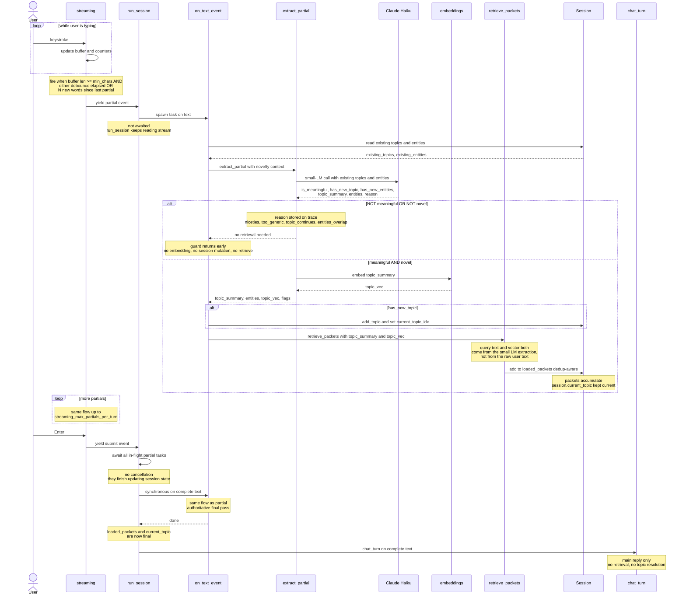
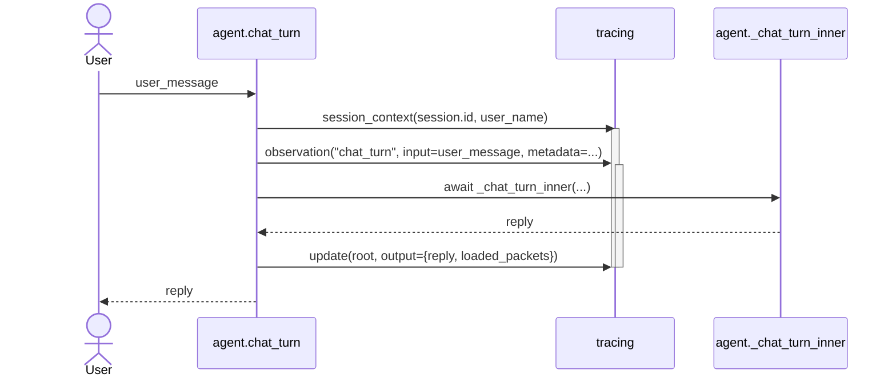
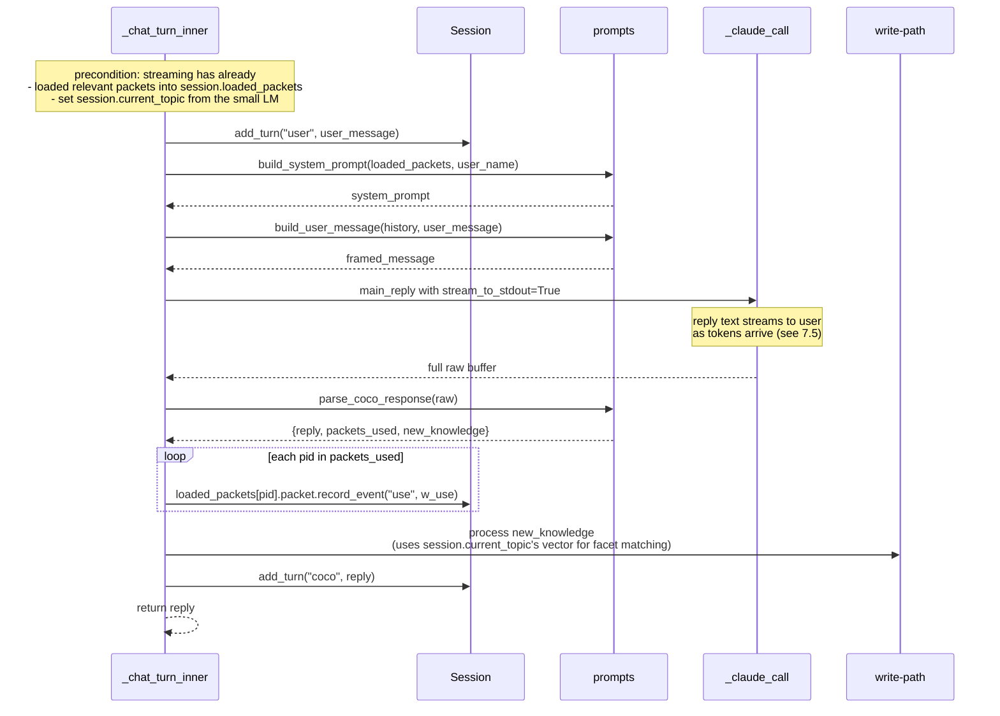
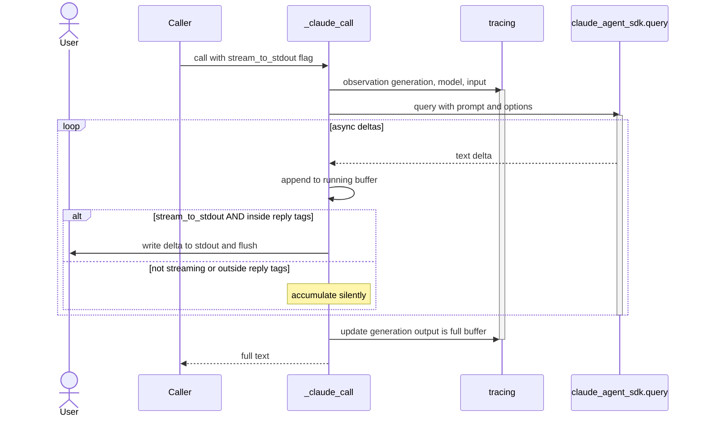
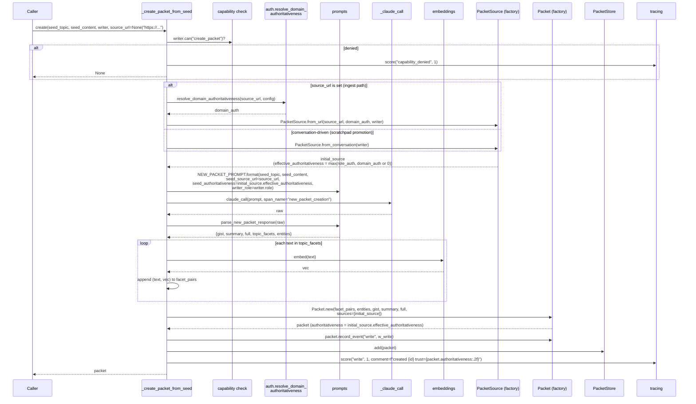

# Coco — Technical Design Specification

This document specifies the **implementation** of Coco: code layout, module contracts, function signatures, data structures, and the call-flow sequence diagrams for each operational path.

For the **conceptual design** (the "why"), see [`DESIGN.md`](./DESIGN.md). This TDS is the source of truth for "what calls what, in what order, with what data."

Sequence diagrams use [Mermaid](https://mermaid.js.org/) syntax — renderable inline in GitHub, VS Code, and most markdown viewers.

---

## 1. Code structure

```
/Users/shishir/self-learning-knowledge-agent/
├── DESIGN.md                  conceptual design (the "why")
├── TDS.md                     this document (the "how")
├── pyproject.toml             package + deps
├── config.json                runtime tuning knobs
├── .env                       (user-created) Langfuse credentials
├── data/                      (gitignored) packets + scratchpad + session counter
│   ├── packets/*.json
│   ├── scratchpad/*.json
│   └── session_counter.json
└── coco/
    ├── __init__.py            empty package marker
    ├── __main__.py            CLI entrypoint; loads dotenv, runs asyncio loop
    ├── agent.py               turn loop orchestration, LLM calls, write-path branching, ingest dispatch
    ├── auth.py                startup identity acquisition — anonymous + SSO (Entra, Google) + role resolution
    ├── config.py              defaults + JSON config loader
    ├── document.py            document upload skill — streaming PDF/DOCX/PPTX reader + chunker + type detection
    ├── embeddings.py          sentence-transformers wrapper + cosine
    ├── fetch.py               URL ingestion skill — httpx + readability + markdownify + image processing
    ├── memory.py              Packet, ScratchpadEntry, TopicFacet, storage classes
    ├── prompts.py             system-prompt templates + JSON response parsing
    ├── retrieval.py           3-channel RRF, topic resolution, scratchpad match
    ├── session.py             in-session topic list + loaded packets state + user identity
    ├── streaming.py           keystroke-streaming console reader; debounced partial events
    ├── extraction.py          small-LM extractor (topic_summary + entities + ingest detection) from partial text
    ├── llm.py                 lazy AsyncAnthropic client; shared by agent.py and extraction.py
    ├── strength.py            decayed-strength computation, slice bands, bias
    ├── ui.py                  end-user-facing console output (banners, prompt, Coco label) with ANSI styling
    └── tracing.py             Langfuse wrapper with no-op fallback
```

## 2. Module reference

Each module's public surface and its dependencies on other modules.

### 2.1 `coco.config`

**Purpose.** Centralize all tuning knobs in one dict, loadable from `config.json` over hardcoded defaults.

**Public API:**
| Symbol | Type | Description |
|---|---|---|
| `DEFAULT_CONFIG` | `dict[str, Any]` | All defaults; matches `config.json` exactly |
| `load_config(path="config.json")` | `(str) -> dict` | Returns deep-merged config; missing keys filled from defaults |

**Depends on:** stdlib only (`json`, `pathlib`).

### 2.1a `coco.auth` *(new for authentication)*

**Purpose.** Acquire the user's identity at startup. Supports anonymous mode and an SSO mechanism with pluggable providers (Microsoft Entra for corporate login, Google for public/social login). Resolves the role (and its scalar power) that the rest of the system carries on the `Session`.

**Public API:**
| Symbol | Signature | Notes |
|---|---|---|
| `Identity` | dataclass | `{name: str, email: str \| None, role: str, role_authoritativeness: float, capabilities: frozenset[str], provider: str, claims: dict}` |
| `ANONYMOUS` | `Identity` | `name="anonymous"`, `email=None`, `role="anonymous"`, `role_authoritativeness=0.0`, `capabilities=resolve_capabilities("anonymous", config)`, `provider="anonymous"`, `claims={}` |
| `local_admin_identity(config, admin_name=None)` | sync → `Identity` | Synthesize the full-trust `admin` identity used by `--admin` mode. `name = admin_name or "local-admin"`, `email=None`, `role="admin"`, `role_authoritativeness=1.0`, `capabilities=resolve_capabilities("admin", config)`, `provider="cli_admin"`, `claims={}`. Never touches an IdP. Callers (only `acquire_identity`, when `cli_flags.admin` is set AND config permits) do the `auth.allow_cli_admin` check first. |
| `ROLE_AUTHORITATIVENESS` | `dict[str, float]` | `{"admin": 1.0, "author": 0.8, "viewer": 0.5, "user": 0.3, "anonymous": 0.0}`. Maps role string → trust scalar. Surfaced for `resolve_role` consumers. |
| `resolve_domain_authoritativeness(url, config)` | sync → `float` | Longest-prefix match of `url`'s host + path against `config["domain_authoritativeness"]` (keys are domain or `domain/path-prefix`). Falls back to `config["default_domain_authoritativeness"]` (default `0.5`). Case-insensitive host match; path match is exact-prefix (no glob). Returns `0.0` only when the config explicitly maps the pattern to `0.0`. |
| `resolve_file_authoritativeness(filename, config)` | sync → `float` | Longest-match of `filename` (and absolute path, if available) against `config["file_authoritativeness"]` keys. Keys can be filename globs (`*.draft.pdf`, `acme-handbook-*.pdf`) and/or path prefixes (`/policies/`). Path prefixes match a normalized absolute path; globs match the basename. Longest match wins; ties are broken by path-prefix > glob. Falls back to `config["default_file_authoritativeness"]` (default `0.5`). |
| `effective_authoritativeness(role_auth, source_trust)` | sync → `float` | Returns `max(role_auth, source_trust or 0.0)`. Canonical computation used by `_create_packet_from_seed`, `integrate_into_packet`, and the document write-path. `source_trust` is whichever applies: `domain_authoritativeness` for URLs, `file_authoritativeness` for documents, `None`/`0` for plain conversation. |
| `CAPABILITIES` | `frozenset[str]` | Known capability strings — see table below. Unknown capabilities found in config warn at startup and are ignored. |
| `DEFAULT_ROLE_CAPABILITIES` | `dict[str, frozenset[str]]` | Hard-coded fallback applied when `config.auth.role_capabilities` is absent or missing an entry for a role. Matches the table in DESIGN.md §"Identity & roles". |
| `acquire_identity(config, cli_flags=None)` | async → `Identity` | Top-level startup entry. Reads `config["auth"]` and drives the flow described below. `cli_flags` is the parsed `argparse.Namespace` from `__main__` (or `None` in tests). When `cli_flags.admin` is truthy AND `config["auth"]["allow_cli_admin"]` is truthy → returns `local_admin_identity(config, cli_flags.admin_name)` immediately (no SSO, no prompt). When `cli_flags.admin` is truthy but the config disallows it → raises `AuthError("cli_admin_disallowed")`. Otherwise falls through to the normal flow below. Always returns a valid `Identity` in non-admin paths (worst case `ANONYMOUS`). |
| `login_entra(provider_cfg)` | async → `Identity` | Runs the configured Entra flow (`device_code` or `browser_pkce`) using `msal`. Reads `name` from `name` claim, `email` from `preferred_username` / `email`, role from `roles` claim or group lookup. |
| `login_google(provider_cfg)` | async → `Identity` | Runs the Google OAuth2 + PKCE flow over a loopback redirect URI. Reads `name` from `name` claim, `email` from `email` claim. Role is resolved from `auth.email_role_map`. |
| `resolve_role(email, claims, provider, config)` | sync → `(role: str, power: float)` | Provider-aware resolver. Entra: try claims first, fall back to email map; non-Entra: email map only. Unknown role strings warn and degrade to `auth.default_role`. |
| `resolve_capabilities(role, config)` | sync → `frozenset[str]` | Look up the capability list for `role` in `config.auth.role_capabilities`; intersect with `CAPABILITIES` (drop unknowns with a warning); fall back to `DEFAULT_ROLE_CAPABILITIES[role]` if config omits the role. Called once at `Identity` construction and stored on the dataclass. |
| `parse_role_from_entra_claims(claims, config)` | sync → `str \| None` | Reads `roles` (Entra App Roles) directly; if absent, intersects `groups` with `auth.entra_group_role_map` and returns the highest-power match. Returns `None` if no role can be derived from claims. |
| `lookup_role_for_email(email, config)` | sync → `str` | Case-insensitive lookup in `auth.email_role_map`; falls back to `auth.default_role` (default `"user"`). Anonymous identities never reach this — they short-circuit to `"anonymous"`. |
| `Identity.can(capability: str) -> bool` | instance method | `return capability in self.capabilities`. The single check used at all enforcement points (§5.9). |
| `CapabilityDenied` | exception | Raised by enforcement points that must abort cleanly. Carries `(capability, role)`; surfaced to the user as a `ui.hint("I'm not able to do that for your account.")` line and recorded as a `capability_denied` score on the current trace. |

**Capability catalogue.** The complete `CAPABILITIES` set, with the agent code path that gates on each:

| Capability | Gates |
|---|---|
| `read_packets` | Retrieval (`_retrieve_packets`) and packet rendering into prompts. If absent, the session loads nothing — Coco can still converse from session memory but never from long-term packets. |
| `write_scratchpad` | `Scratchpad.add` calls in the write path. If absent, scratchpad insertion is skipped; the rest of the turn continues. |
| `promote_scratchpad` | The scratchpad → packet promotion branch in §5.7 / §7.6. If absent, falls through to plain scratchpad insertion (if `write_scratchpad` is allowed) or no-op. |
| `create_packet` | `_create_packet_from_seed`. Required for both ingest-driven new packets and conversation-driven scratchpad promotions. If absent, no packet is ever created. |
| `integrate_packet` | `integrate_into_packet`. If absent, integrate-on-write is skipped (the existing packet is unchanged); `new_knowledge` is dropped with a denial hint. |
| `override_conflict` | The interactive y/N prompt inside `integrate_into_packet` when `conflict_detected=true`. If absent, conflicts auto-skip (no prompt shown); the integration does not commit. |
| `delete_packet` | Future `Packet.delete` (admin-only operation; not yet wired). |
| `force_rewrite` | Future "rewrite full content without merge" path (admin-only). |
| `skill.fetch_url` | The ingest dispatch in `_handle_ingest`. If absent and `is_ingest_request=true`, the fetch is skipped and Coco responds with the denial hint — no network call is made. |
| `skill.upload_document` | The document-upload dispatch in `_handle_document_upload`. If absent and `is_upload_request=true`, no file is read; Coco surfaces the denial hint. |
| `skill.<id>` | Future skills. Each skill registers its capability id (string) and the agent's skill-invocation site checks `session.user.can("skill.<id>")` before calling. |

**`acquire_identity` flow:**
0. **Local admin short-circuit.** If `cli_flags is not None and cli_flags.admin` → check `config["auth"]["allow_cli_admin"]` (default `false`). If disallowed, raise `AuthError("cli_admin_disallowed")` — `__main__` prints the startup-error line and exits. If allowed, return `local_admin_identity(config, cli_flags.admin_name)` immediately. No IdP call, no prompt, no fallback. The mode selection below is skipped entirely.
1. `mode = config["auth"]["startup_mode"]` (`"prompt"` \| `"anonymous"` \| `"authenticated"`).
2. If `mode == "anonymous"` → return `ANONYMOUS` (capabilities populated via `resolve_capabilities("anonymous", config)`).
3. If `mode == "authenticated"` → drive `config["auth"]["default_provider"]` directly.
4. If `mode == "prompt"`:
   - If `providers` is empty or `["anonymous"]` → return `ANONYMOUS`.
   - Else display: `"How would you like to sign in? [a]nonymous / [m]icrosoft / [g]oogle"` (built from `providers`), drive the chosen provider.
5. After the provider returns `(name, email, claims)`: `role, power = resolve_role(email, claims, provider, config)`, then `capabilities = resolve_capabilities(role, config)`, then construct `Identity(name=name, email=email, role=role, role_authoritativeness=power, capabilities=capabilities, provider=provider, claims=claims)`.
6. Provider failure (cancelled login, network error, missing email) loops back to the prompt (or returns `ANONYMOUS` if `mode != "prompt"` and `auth.fallback_to_anonymous` is true; otherwise re-raises an `AuthError` that `__main__` surfaces as `[startup error: ...]` and exits non-zero).

**Provider configuration is config-only.** `coco.auth` reads from `config["auth"]`; no client secrets are baked into source. Secrets that cannot live in `config.json` (e.g. Entra client secret for confidential-client flows) load from `.env` via `os.environ` lookup keyed off the provider config. Public clients (device-code, browser PKCE) do not need a secret.

**Depends on:** `msal` (lazy import inside `login_entra`), `authlib` *or* stdlib `urllib`+`http.server`+`webbrowser` (for Google's loopback PKCE flow), `coco.config`, `coco.tracing` (one `auth` span around the whole acquisition, with provider + role on output), `coco.ui` (login prompt + status hints).

### 2.2 `coco.embeddings`

**Purpose.** Single embedding backend, cached at module level; cosine similarity helper.

**Public API:**
| Symbol | Signature | Notes |
|---|---|---|
| `get_model(name)` | `(str) -> SentenceTransformer` | Module-level cache; swaps if name changes. Call once at startup to preload (see below). |
| `embed(text, model_name)` | `(str, str) -> np.ndarray` | Returns L2-normalized float32 vector. If `get_model` was not preloaded, the first call here pays the load cost (~1-3s for MiniLM, longer for larger models). |
| `cosine_similarity(a, b)` | `(np.ndarray, np.ndarray) -> float` | Dot product (assumes normalized inputs) |

**Preload at startup.** `agent.run_session` calls `get_model(config["embedding_model"])` immediately after loading config and before opening the input stream. Effect: the SentenceTransformer is fully loaded and weights are in memory by the time the first user keystroke would fire a partial event. Without this, the first `embed()` call inside `extract_partial` would block on the model load, adding noticeable latency to the first partial event in the very first turn.

**Depends on:** `sentence-transformers` (lazy import inside `get_model`), `numpy`.

### 2.3 `coco.strength`

**Purpose.** Compute decayed strength from a packet's event log; select content slice.

**Public API:**
| Symbol | Signature | Notes |
|---|---|---|
| `parse_iso(ts)` | `(str) -> datetime` | ISO-8601 → tz-aware datetime |
| `compute_strength(events, weights, half_life_days, now=None)` | → `float` | Σ `weight · 0.5^((now − ts) / half_life)` |
| `slice_for_strength(strength, band_gist_max, band_summary_max)` | → `"gist"\|"summary"\|"full"` | Strength → slice name |
| `strength_bias(strength, scale)` | → `float` | `scale · log1p(strength)` — additive bias on retrieval |

**Depends on:** stdlib only.

### 2.4 `coco.memory`

**Purpose.** Data classes and persistence for packets and scratchpad entries.

**Public types:**
| Type | Notes |
|---|---|
| `PacketContent` | `{gist: str, summary: str, full: str}`. `full` may contain `coco-img:<id>` references but never inline base64. |
| `TopicFacet` | `{text: str, vector: list[float]}` + `vec_np()` |
| `PacketImage` | `{id: str, alt: str | None, mime: str, data_b64: str, dimensions: tuple[int,int], source_url: str | None, added_at: str}`. Factory `PacketImage.new(alt, mime, data_b64, dimensions, source_url)` mints `img_<12-hex>` id. |
| `PacketSource` | Provenance record. `{type: "url"\|"conversation"\|"document", url, domain_authoritativeness, filename, document_type, page_number, paragraph_index, file_authoritativeness, speaker_*, role_authoritativeness, effective_authoritativeness, recorded_at}`. Factories `PacketSource.from_url(url, domain_auth, writer)`, `PacketSource.from_conversation(writer)`, and `PacketSource.from_document(filename, document_type, page_number, paragraph_index, file_auth, writer)`. |
| `Packet` | Multi-facet packet with images + sources; see §3.1 |
| `ScratchpadEntry` | Single-topic short-term entry; see §3.2 |
| `PacketStore` | One-JSON-per-packet on disk; in-memory dict |
| `Scratchpad` | Same shape as `PacketStore` for scratchpad entries |
| `SessionCounter` | Persistent monotonic counter (`data/session_counter.json`) |

**Key Packet methods:**
| Method | Purpose |
|---|---|
| `Packet.new(topics, entities, gist, summary, full, sources=None, images=None)` | Factory; topics are `(text, vector)` pairs; `sources: list[PacketSource]` optional; `images: list[PacketImage]` optional. Initial `authoritativeness` is `max(s.effective_authoritativeness for s in sources)` or `0.0` if no sources. |
| `topic_texts()` | List of facet text strings |
| `topic_vectors_np()` | List of facet vectors as `np.ndarray` |
| `combined_topic_text()` | Pipe-joined facet texts (for BM25 corpus) |
| `add_facet_if_new(text, vec, dedup_threshold)` | Adds if cosine to all existing < threshold |
| `merge_entities(new_list)` | Union of lowercased entity strings |
| `add_source(source: PacketSource)` | Append `source` to `sources`. Recomputes `packet.authoritativeness = max(packet.authoritativeness, source.effective_authoritativeness)`. The aggregate is monotone-up: once trust is high, low-trust additions don't pull it down. |
| `has_source_url(url)` | Returns `True` if any `PacketSource` in `sources` has `type=="url"` and `url == this_url` (case-insensitive). Preserves the dedupe behaviour that the old string-list `source_urls` had. |
| `source_urls()` | Derived: `[s.url for s in sources if s.type == "url"]`. Preserved as a convenience for callers and for backwards-compatible debug rendering. |
| `add_image(image: PacketImage)` | Append to `images` list (no dedupe — ids are unique) |
| `image_by_id(image_id)` | Lookup in `images` (linear scan; lists are small) |
| `referenced_image_ids()` | Set of `img_<id>` strings appearing in `content.full` via `coco-img:` markdown URIs (regex) |
| `unreferenced_image_ids()` | Set of `image.id` not in `referenced_image_ids()` — used by future orphan GC |
| `record_event(event_type, weight)` | Append to `strength_events` |
| `to_dict()` / `from_dict()` | JSON serialization (round-trips `images`, `sources`, `authoritativeness`) |

**Depends on:** stdlib (`json`, `uuid`, `pathlib`, `datetime`, `dataclasses`), `numpy`.

### 2.5 `coco.session`

**Purpose.** In-memory state for one conversational session.

**Public API:**
```
class Session:
  id: str                                            ses_<hex>
  user: Identity                                     acquired by coco.auth at startup
                                                     (anonymous or authenticated)
  topics: list[{topic_text, topic_vector, first_seen_turn, last_seen_turn}]
  current_topic_idx: int | None
  loaded_packets: dict[packet_id -> {packet, slice}]
  turns: list[{role, content}]

  add_turn(role, content)
  recent_turns(n_exchanges) -> list[turn]
  loaded_packets_list() -> list[{packet, slice}]
  add_topic(topic_text, topic_vector)
  update_topic(idx)
```

`user` is set once at construction and is immutable for the session. v2 reads `user.role_authoritativeness` on every write into a packet (via `PacketSource.effective_authoritativeness`) and surfaces it into Langfuse trace metadata for post-hoc analysis. See §5.10 for the trust accounting and §7.7 / §7.12 for how it drives conflict resolution.

**Depends on:** `uuid`, `numpy`.

### 2.6 `coco.retrieval`

**Purpose.** Three-channel RRF over packets; cosine-only matching for session topics and scratchpad.

**Public API:**
| Symbol | Signature | Notes |
|---|---|---|
| `tokenize(text)` | `(str) -> list[str]` | Lowercase + whitespace split |
| `rrf_packet_search(query_text, query_vec, packets, k=60, top_n=10)` | → `list[(Packet, float)]` | 3-channel RRF; see §5.2 |
| `resolve_topic(new_topic_vec, session_topics, threshold)` | → `(is_new, matched_idx_or_None)` | Cosine vs session topics. **Unused in the streaming flow** — the small LM owns the novelty decision via `has_new_topic`. Retained in the module for testing/fallback. |
| `best_packet_facet_match(query_vec, packets)` | → `(Packet, float)` | Max cosine over facets — used in write path |
| `rank_packet_facet_candidates(query_vec, packets, top_n=5)` | → `list[(Packet, float, best_facet_text)]` | Same scoring as `best_packet_facet_match` but returns the top-N ranked. Used by the write-path debug printer to surface "candidates considered → winner" without changing the existing decision logic. |
| `best_scratchpad_match(query_vec, entries, threshold)` | → `(entry_or_None, score)` | Cosine on scratchpad topic vec |
| `rank_scratchpad_candidates(query_vec, entries, top_n=3)` | → `list[(entry, float)]` | Top-N scratchpad entries by topic cosine — for write-path debug output. |

**Depends on:** `rank_bm25`, `numpy`, `coco.embeddings`.

### 2.7 `coco.prompts`

**Purpose.** Hold prompt templates and JSON parsing for structured LLM responses.

**Public API:**
| Symbol | Notes |
|---|---|
| `SYSTEM_PROMPT_TEMPLATE` | Main reply prompt (`user_name`, `loaded_packets` slots). Topic classification is owned by streaming, not this prompt. `user_name` is filled from `session.user.prompt_display_name()` — the acquired `Identity.name` for authenticated sessions, or the literal `"the user"` in anonymous mode (see §3.4). After SSO login Coco sees "…assistant for **Shishir Choudhary**…" from the very first turn. The template enforces the **packet-anchored reply policy** (see §5.4a and DESIGN.md §"Grounded reply policy"): every substantive answer must be anchored by a fact from a loaded packet; general knowledge is permitted only as connective tissue to reason FROM a packet fact toward the answer; when no loaded packet is relevant to the question the reply is exactly `"I do not know about this."`. Output format is XML-tagged so the reply can be streamed to the user as it's generated: `<reply>...</reply><metadata>{packets_used, new_knowledge}</metadata>`. See §5.4. |
| `INGEST_SYSTEM_ADDENDUM` | Appended to `SYSTEM_PROMPT_TEMPLATE` when `is_ingest_request=true`. Adds instructions: (1) acknowledge the source URL, (2) reply with 2-3 takeaways, (3) emit `new_knowledge` items whose `content` references `[IMG_n]` placeholders for content-bearing images and omits placeholders for decorative ones, (4) the image manifest is authoritative — do not invent new `[IMG_n]` tokens. See §5.7. |
| `INGEST_USER_FRAMING` | Wraps the user message when ingesting. Format: `<user_message>... original user text ...</user_message><fetched_sources><source url="..."><markdown>...</markdown><images>[IMG_1] alt="..." 124KB png 800x600 | [IMG_2] alt="..." ...</images></source></fetched_sources>`. Multiple sources if multiple URLs. |
| `INTEGRATE_PROMPT` | Integrate-on-write prompt. Slots: `existing_facets`, `existing_entities`, `existing_content`, `existing_source_urls`, `existing_authoritativeness`, `new_content`, `new_source_url`, `new_authoritativeness`, `writer_role`. `new_source_url` is `null` for conversation-driven integrations, set when integrating ingested content. The two `*_authoritativeness` numbers drive the trust-based conflict rule: the LLM is instructed that for **conflicting facts**, the source with higher authoritativeness wins (new replaces existing if `new ≥ existing`; existing wins if `new < existing`, with the new claim recorded as a less-trusted alternate); for **non-conflicting facts**, normal merge applies. The LLM still emits `conflict_detected` when the trusts are equal — that's the only branch that escalates to the user. The LLM is told to keep `coco-img:<id>` references intact when they appear in `existing_content` or `new_content`. |
| `NEW_PACKET_PROMPT` | Scratchpad-promotion / fresh-packet prompt. Slots: `seed_topic`, `seed_content`, `seed_source_url`, `seed_authoritativeness`, `writer_role`. `seed_source_url` is null for conversation-driven creation, set for ingest. The LLM is told the trust score so it can phrase the gist/summary with appropriate hedging when the seed comes from a low-trust source. |
| `format_packets_for_prompt(loaded_packets)` | Renders facets + entities + `source_urls` + slice content per packet. For each loaded packet that has images (and whose slice is `full`), also renders an `images:` block listing `[img_<id>] alt="..." NNkB mime WxH` lines so the LLM can correlate the multimodal image blocks (attached to the user message) with their alt text. |
| `build_system_prompt(loaded_packets, user_name, ingest_mode=False)` | Assembles main system prompt; appends `INGEST_SYSTEM_ADDENDUM` if `ingest_mode`. Callers (`agent._chat_turn_inner`, `agent._handle_ingest`) pass `user_name=session.user.prompt_display_name()` — the SSO-acquired display name — so Coco has the user's identity in her prompt context each turn. `Identity.prompt_display_name()` returns `Identity.name` for authenticated sessions and normalizes anonymous mode (where `Identity.name == "anonymous"`) to `"the user"`. |
| `build_user_content_blocks(history, current_message, loaded_packets, fetch_results=None, ingest_failures=None)` | Returns a `list[dict]` of Anthropic content blocks: text blocks for history + current message + fetched markdown, followed by `image` blocks for (a) every `PacketImage` belonging to a loaded packet at the `full` slice, and (b) every candidate image in the ingest manifest. Image block shape: `{"type": "image", "source": {"type": "base64", "media_type": mime, "data": data_b64}}`. SVGs are rendered as text (the model doesn't accept image/svg+xml). |
| `build_ingest_user_message(history, current_message, fetch_results, failed_urls=None)` | Convenience: calls `build_user_content_blocks` with `fetch_results` and an empty `loaded_packets`. Returns the same `list[dict]` shape. |
| `extract_json_block(text)` | Strips ` ```json` fences if present |
| `parse_coco_response(raw)` | → `{reply, packets_used, new_knowledge}`. Extracts the text inside `<reply>...</reply>` and the JSON inside `<metadata>...</metadata>`. Each `new_knowledge[i].content` may contain literal `[IMG_n]` tokens — left unsubstituted at parse time. Topic classification is owned by streaming, not this response. |
| `parse_integration_response(raw)` | → `{conflict_detected, conflicting_excerpts, trust_resolution, gist, summary, full, topic_facets, entities}`. `trust_resolution` is `"new_wins"` \| `"existing_wins"` \| `"equal_escalate"` — the LLM's stated decision under the trust rule. `conflict_detected=true` only when `trust_resolution == "equal_escalate"`. `full` may contain `[IMG_n]` tokens (when the integration was for an ingest). |
| `parse_new_packet_response(raw)` | → `{gist, summary, full, topic_facets, entities}`. Same `[IMG_n]` allowance. |
| `build_user_message(history, current_message)` | Frames last-5-turns history before current message (non-ingest path) |

**Depends on:** stdlib (`json`).

### 2.8a `coco.llm` *(new in this revision)*

**Purpose.** Single owner of the Anthropic SDK client. Replaces `claude-agent-sdk` for *all* LLM calls. Direct HTTP/streaming → no subprocess overhead, real token-level streaming.

**Public API:**
| Symbol | Signature | Notes |
|---|---|---|
| `anthropic_client()` | `() -> AsyncAnthropic` | Lazy module-level singleton; reads `ANTHROPIC_API_KEY` from env |
| `DEFAULT_MAX_TOKENS` | `int` | 4096 |

**Depends on:** `anthropic` (>=0.40).

**Configuration note.** Requires `ANTHROPIC_API_KEY` in the environment (or `.env`). The previous `claude-agent-sdk` path picked up auth from the Claude Code CLI's login; this is no longer the case.

### 2.7a `coco.ui` *(new in this revision)*

**Purpose.** End-user-facing console output: welcome/goodbye banners, the styled `You:` prompt label, the styled `Coco:` reply label, and an optional `hint(...)` for subtle status lines. All developer diagnostics (packet IDs, scores, topics, entities, state dumps) bypass this module and go through `agent._print_state` / `on_text_event` directly, behind the `debug_print_*` flags.

**Public API:**
| Symbol | Notes |
|---|---|
| `banner_welcome(user_name)` | Cyan-rule banner at session start |
| `banner_admin_warning()` | Prints the bordered red/yellow **LOCAL ADMIN MODE — UNAUTHENTICATED** warning block described in §5.12 / DESIGN.md §"Local admin mode". Called by `run_session` immediately before `banner_welcome` when `session.admin_mode` is true. On non-TTY stdout renders as plain ASCII with identical wording. |
| `banner_goodbye(admin_mode=False)` | Closing line at session end. When `admin_mode=True`, appends a compact dim-red `local admin mode — session was unauthenticated` reminder so the user leaves aware of the mode they just ran in. |
| `coco_label(admin_mode=False)` | Prints `Coco: ` in bold cyan (no newline) before the streamed reply. When `admin_mode=True`, appends a dim red ` (admin mode)` suffix on the same line so every reply carries the badge even after the startup banner has scrolled off. |
| `user_prompt_html(admin_mode=False)` | Returns the HTML string passed to `PromptSession.prompt_async` so `You: ` renders in bold green. When `admin_mode=True`, prepends a bold red `[ADMIN] ` badge — the user cannot type a message without seeing the mode on the same line. |
| `hint(text)` | Dim italic line, used (only when developer mode is on) to surface a brief status string |
| `memory_recall(gist)` | Dim italic `recalling: <gist>` line — printed by `_retrieve_packets` whenever a packet is loaded into the session |
| `memory_saved(gist)` | Dim italic `remembered: <gist>` line — printed by `_create_packet_from_seed` after a new packet is committed |
| `memory_updated(gist)` | Dim italic `updated: <gist>` line — printed by `integrate_into_packet` after content is merged into an existing packet |
| `error(text)` | Red line, reserved for unrecoverable errors |

**Memory-activity hints (`memory_recall` / `memory_saved` / `memory_updated`) are always shown**, in both end-user and developer modes. They trim the gist to ~90 chars, HTML-escape it, and emit a single dim italic line. End-user mode shows just this short hint; developer mode layers the full diagnostic line on top.

**Styling.** Uses `prompt_toolkit.HTML` + `print_formatted_text` which emits ANSI escape codes; renders colored in interactive terminals and falls back to plain text when stdout is piped or `prompt_toolkit` is unavailable.

**Depends on:** `prompt_toolkit` (optional; falls back to plain text).

### 2.8 `coco.tracing`

**Purpose.** Thin wrapper around langfuse 4.x. No-op when either (a) `config["tracing"]["enabled"]` is `false`, or (b) `LANGFUSE_PUBLIC_KEY` / `LANGFUSE_SECRET_KEY` are not in env. Config wins over env: a deployment can be running with real Langfuse credentials in `.env` and still keep tracing off by setting `tracing.enabled=false`.

**Public API:**
| Symbol | Signature | Notes |
|---|---|---|
| `init(config=None)` | `(dict \| None) -> bool` | Idempotent; consults `config["tracing"]["enabled"]` first (default `true` when absent) — if `false`, short-circuits without touching env, without importing `langfuse`, and returns `False`. Otherwise reads env, instantiates the client, and returns the enabled flag. `config=None` preserves the pre-config-gate behaviour (env-only) for tests. |
| `enabled()` | `() -> bool` | Returns the resolved flag from the last `init(...)` call. |
| `observation(name, as_type, input, metadata, model)` | context manager → `LangfuseSpan \| None` | Wraps `start_as_current_observation`. Yields `None` when tracing is disabled — every `coco.tracing`-consuming site is written to accept `None` gracefully (e.g. `with tracing.observation(...) as span: tracing.update(span, output=...)`), so the disabled path adds zero branching to callers. |
| `session_context(session_id, user_id=None, metadata=None)` | context manager | Wraps `langfuse.propagate_attributes`. No-op when disabled. |
| `update(obs, **kwargs)` | | Safe `obs.update(...)`; no-op when `obs is None`. |
| `score(name, value, comment=None)` | | `client.score_current_trace(...)`; no-op when disabled. |
| `flush()` | | Drain pending traces; no-op when disabled. |

**Config-gate precedence.**
1. If `config["tracing"]["enabled"] is False` → `init(config)` returns `False` immediately. Neither `LANGFUSE_PUBLIC_KEY` nor `LANGFUSE_SECRET_KEY` are read; `langfuse` is not imported. This is the intended path for deployments that need to run Coco fully offline (air-gapped, personal, latency-sensitive) even when credentials happen to be present in the environment.
2. Else if the env credentials are missing → `init(config)` returns `False` (unchanged behaviour — the "no keys, no tracing" case).
3. Else → `init(config)` instantiates the Langfuse client and returns `True`.

**Why config-gate wins over env.** Env credentials are commonly ambient: a shared `.env`, a CI secret, an inherited shell. A developer iterating on a prompt should be able to disable tracing for one session with a single config flip, without having to unset environment variables. Making config authoritative also lets a production config pin `tracing.enabled=false` even in an environment that provides Langfuse keys for other tools.

**Depends on:** `langfuse` (lazy import inside `init`, and only when the config gate permits).

### 2.9 `coco.agent`

**Purpose.** Top-level orchestration: turn loop, LLM calls, write-path branching, tracing wrap.

**Public API:**
| Symbol | Signature | Notes |
|---|---|---|
| `chat_turn(user_message, session, store, scratchpad, config, session_n, ingest_intent=None, upload_intent=None)` | async → `str` | Public turn entry; wraps tracing session + root span. `ingest_intent` is the `{is_ingest_request, urls}` slice of the last submit extraction; `upload_intent` is the `{is_upload_request, file_paths}` slice (same submit extraction). When `is_ingest_request=true`, `_chat_turn_inner` dispatches via `_handle_ingest`; when `is_upload_request=true`, via `_handle_document_upload`. The two intents are mutually exclusive — the small LM picks at most one per submit. |
| `_chat_turn_inner(...)` | async → `str` | The actual work; runs inside the tracing root span. Branches on `ingest_intent.is_ingest_request` and `upload_intent.is_upload_request`. |
| `_handle_ingest(user_message, urls, session, store, scratchpad, config)` | async → `str` | Ingest dispatch: calls `fetch.fetch_url` for each URL (concurrent), assembles ingest-mode prompt + multimodal user content blocks (candidate images attached), runs `main_reply` (streamed to stdout), parses the response, materializes `PacketImage` records from kept `[IMG_n]` tokens and rewrites references in each `new_knowledge[i].content`, then drives the standard write-path via `integrate_into_packet` / `_create_packet_from_seed`. Returns the reply text. See §5.7. |
| `_handle_document_upload(user_message, file_paths, session, store, scratchpad, config)` | async → `str` | Document-upload dispatch. For each file: opens `document.read_document(path, config)` (streaming generator), pulls metadata, then streams chunks into the main reply LLM in batches of `ingest_doc_batch_chunks`. Each batch produces `new_knowledge` items tagged with `(page_number, paragraph_index)`; each item routes through `integrate_into_packet` / `_create_packet_from_seed` with `PacketSource.from_document(...)` provenance. Streams progress hints to stdout every `ingest_doc_progress_interval_pages` pages. Returns a final summary reply. See §5.11. |
| `_materialize_packet_images(content, fetch_images, source_url)` | sync → `(rewritten_content: str, packet_images: list[PacketImage])` | For each `[IMG_n]` token that appears in `content` AND is present in `fetch_images`: mint a new `img_<hex>` id, build a `PacketImage` (copying alt, mime, dimensions, base64 from `ImageBlob.data_uri`), rewrite the `[IMG_n]` token in `content` to ``. Stray `[IMG_n]` tokens (not in `fetch_images`) are stripped with a warning. Returns the rewritten markdown plus the list of newly-minted `PacketImage`s ready to append to a packet. |
| `_attach_packet_images(packet, images)` | sync → `None` | Append each `PacketImage` in `images` to `packet.images`. Idempotent on image id. |
| `_retrieve_packets(query_text, query_vec, session, store, config, span_name)` | sync → `list[{id, slice, topic, score}]` | 3-channel RRF, strength gating, slice selection, event recording. Returns newly-loaded packets (with the post-strength-bias final score) so the caller can print debug output including the score that cleared `retrieval_threshold`. **Callers (only `on_text_event`) pass the small-LM's `topic_summary` as `query_text` and `topic_vec` as `query_vec` — never the raw user message** (see §5.3 for rationale). |
| `_print_state(session, prefix)` | sync → `None` | Prints loaded packets (id/slice/topic/gist), session topics, session entities. Called by `run_session` at session start and after each `chat_turn` ONLY when `debug_print_state` is true. Developer-mode output only — bypassed in the default end-user UX. See §5.6. |
| `_claude_call(system_prompt, user_content, model, span_name, stream_to_stdout=False, max_tokens=4096)` | async → `str` | Direct Anthropic SDK call via `client.messages.stream(...)`, traced as a generation. `user_content` is `str` OR `list[dict]` (multimodal content blocks). When `stream_to_stdout=True` (only used by `main_reply`), text inside `<reply>...</reply>` is written to stdout as it arrives via the native token stream; full buffer returned for downstream parsing. See §5.4 and §5.8. |
| `_build_loaded_packet_image_blocks(loaded_packets)` | sync → `list[dict]` | Walks `loaded_packets`; for every packet at the `full` slice, emits one `{"type":"image","source":{"type":"base64","media_type":mime,"data":data_b64}}` block per non-SVG `PacketImage`. SVGs are skipped here (their text is already in the markdown). Returns the ordered list of image blocks; callers prepend the text blocks before them. |
| `_create_packet_from_seed(seed_topic, seed_content, store, config, session_id, writer, source_url=None, initial_images=None)` | async → `Packet \| None` | LLM-driven packet creation from scratchpad seed. `writer: Identity` is the current session user — required so the new packet's first `PacketSource` carries the writer's role + role authoritativeness. `source_url` is set when called from `_handle_ingest`; resolves a URL-type `PacketSource` (with `domain_authoritativeness = auth.resolve_domain_authoritativeness(source_url, config)`), otherwise a conversation-type `PacketSource`. The packet's initial `authoritativeness` is `source.effective_authoritativeness`. `initial_images: list[PacketImage]` is set during ingest; each image is appended to `packet.images` after creation. |
| `integrate_into_packet(packet, new_content, store, config, writer, source_url=None, new_images=None)` | async → `bool` | LLM merge with **trust-driven** conflict resolution. `writer: Identity` is the current session user. The function (1) computes `new_eff = effective_authoritativeness(writer.role_authoritativeness, resolve_domain_authoritativeness(source_url) if source_url else None)`; (2) passes both `packet.authoritativeness` (existing) and `new_eff` (incoming) into the integrate prompt; the LLM uses them to resolve conflicting facts in favor of the higher-trust source. On commit: a new `PacketSource` is appended via `packet.add_source(...)` (URL-type when `source_url` is set, conversation-type otherwise), which also lifts `packet.authoritativeness` if `new_eff` is greater. The interactive y/N prompt only fires when the LLM reports a conflict at *equal* trust **AND** `writer.can("override_conflict")`; otherwise the LLM's trust-based merge is final. `new_images: list[PacketImage]` is appended to `packet.images` before the integrate-LLM call so the prompt can see the full alt-text manifest. The integrate LLM never sees image bytes — it only manipulates `coco-img:<id>` references in markdown. |
| `on_text_event(text, session, store, scratchpad, config)` | async → `None` | Single handler called for **both** partial and submit events. Runs `extraction.extract_partial`, then (if meaningful) `resolve_topic` + `_retrieve_packets`. This is the ONLY retrieval and topic-classification path in the system. Ingest-detection lives here too (the extractor sets `is_ingest_request`), but the fetch itself is deferred to `chat_turn`. |
| `run_session(cli_flags=None)` | async → `None` | Drives the streaming loop: `async for event in streaming.input_stream(...)`. For `partial`, spawns `on_text_event` as a background task (fire-and-track). For `submit`: awaits any in-flight partial tasks, runs `on_text_event` synchronously on the complete text, captures `ingest_intent` from that final extraction, THEN calls `chat_turn(..., ingest_intent=...)`. `cli_flags` is the `argparse.Namespace` parsed by `__main__` (or `None` in tests); it is threaded straight through to `auth.acquire_identity(config, cli_flags=cli_flags)` so the local-admin short-circuit (§5.12) fires before any other startup work. **Before opening the input stream**, calls `auth.acquire_identity(config, cli_flags=cli_flags)` and constructs `Session(user=identity)`. Calls `tracing.init(config)` — passing the loaded config so the `tracing.enabled` gate is honoured before `langfuse` is imported or env credentials are read. When `session.admin_mode` is true, `ui.banner_admin_warning()` is printed before the welcome banner and every prompt/reply carries the admin visual badge. The acquired `identity` is also passed to `tracing.session_context(session.id, user_id=identity.email or identity.name, metadata={"role": identity.role, "role_authoritativeness": identity.role_authoritativeness, "provider": identity.provider, "admin_mode": session.admin_mode})` (no-op when tracing is disabled). |

**Depends on:** every other `coco.*` module; `anthropic` (direct SDK, via `coco.llm`); `coco.fetch`; `coco.auth`.

### 2.10 `coco.streaming` *(new in this revision)*

**Purpose.** Read the user's typing from the console as it happens (not blocked on Enter). Emit a stream of structured events the agent can react to:
- `partial(text)` — the buffer changed; fired after a debounce window of typing pause
- `submit(text)` — user pressed Enter; the buffer is final
- `cancel()` — user pressed Esc / Ctrl-C while typing

**Public API (sketch):**
| Symbol | Signature | Notes |
|---|---|---|
| `input_stream(config)` | async context manager → async iterator of events | Owns the terminal; uses `prompt_toolkit` or raw tty mode |
| `StreamEvent` | dataclass | `kind: "partial"\|"submit"\|"cancel"`, `text: str` |

**Trigger logic (OR of the two below, with the min-length guard):**

On every keystroke:
- Update the buffer, the word counter (`words_since_last_partial`), and (re)start the debounce timer.
- Fire a `partial` event **if** `len(buffer) ≥ streaming_min_chars` **AND** either:
  - **(debounce)** no further keystroke for `streaming_debounce_ms`, OR
  - **(word-count)** `words_since_last_partial ≥ streaming_words_per_partial`
- When a `partial` fires for any reason: reset the word counter to 0 and the debounce timer.
- On Enter, fire `submit` and reset the buffer.

The word-count trigger guarantees Coco doesn't fall behind during long uninterrupted typing — long monologues get periodic partial events without waiting for the user to pause.

**In-flight extraction handling.** Concurrency model:
- Each `partial` event spawns an `on_text_event` task (concurrent with others). They complete in arbitrary order; their updates to `session.loaded_packets` and `session.topics` are dedup-aware so order doesn't matter.
- On `submit`, `run_session` first awaits all in-flight partial tasks, then runs `on_text_event` synchronously on the complete text, then calls `chat_turn`. This guarantees `chat_turn` starts with `session.loaded_packets` and `session.current_topic` already final — no race with the LLM reply.
- No cancellation. Streaming extractions always complete.

**Non-disruption of input during background prints.** Each `session.prompt_async(...)` call is wrapped in `prompt_toolkit.patch_stdout.patch_stdout(raw=True)`. Any `print()` from background `on_text_event` tasks during typing is rendered above the prompt line; the user's typed text is automatically re-rendered below. See §5.5.

**Depends on:** `asyncio`, `prompt_toolkit` (`PromptSession` + `patch_stdout`).

### 2.11 `coco.extraction` *(new in this revision)*

**Purpose.** Use a small/fast model (e.g. Claude Haiku) to extract `(topic_summary, entities)` from a partial in-progress user message AND decide whether they introduce anything *new* given what's already in the session. The single decision combines two checks: substantive-vs-niceties, and novel-vs-already-loaded. Either failure → no retrieval.

**Public API:**
| Symbol | Signature | Notes |
|---|---|---|
| `EXTRACTION_PROMPT` | str | Receives partial text + the session's existing topic-summaries and entity bag; asks for JSON: `{is_meaningful, has_new_topic, has_new_entities, topic_summary, entities, is_ingest_request, urls, is_upload_request, file_paths, reason}` |
| `extract_partial(partial_text, existing_topics, existing_entities, config)` | async → `ExtractionResult` | Calls small LM with novelty context; if the result will trigger retrieval, embeds `topic_summary` inline |
| `parse_extraction_response(raw)` | → `dict` | Same JSON-fence-aware parser shape as the existing ones |

**`ExtractionResult` shape:**
```
{
  is_meaningful:     bool,            # False → skip (niceties/too-short/too-generic)
  has_new_topic:     bool,            # True iff topic_summary differs meaningfully
                                      #   from all existing session topics
  has_new_entities:  bool,            # True iff at least one extracted entity is
                                      #   not already in the session entity bag
  topic_summary:     str | None,
  entities:          list[str],
  topic_vec:         np.ndarray | None,
  is_ingest_request: bool,            # True iff the user uttered a URL-fetch intent
                                      #   ("read this", "remember this site",
                                      #    "add this to your knowledge", etc.)
                                      #   AND `urls` is non-empty
  urls:              list[str],       # http/https URLs extracted from the text
                                      #   (regex-extracted, deduped, validated)
  is_upload_request: bool,            # True iff the user uttered a file-upload intent
                                      #   ("upload this", "read this file",
                                      #    "add this document", etc.) AND `file_paths`
                                      #   is non-empty. Mutually exclusive with
                                      #   is_ingest_request — the small LM picks one.
  file_paths:        list[str],       # filesystem paths extracted from the text
                                      #   (regex + heuristic match on supported
                                      #    extensions; validated for existence
                                      #    before the agent dispatches)
  reason:            str | None,      # e.g. "niceties", "too_short", "too_generic",
                                      #      "topic_continues", "entities_overlap",
                                      #      "ingest_request", "upload_request"
}
```

**Ingest detection is small-LM-authoritative.** Coco does not run a regex-only "saw a URL" check. The small LM has to confirm intent (user is *asking* her to read, not just pasting a link as a reference). The same model that decides novelty also decides ingest intent — one call, both signals. `urls` is regex-extracted as a backstop, but `is_ingest_request` gates whether the fetch fires.

**On `submit` with `is_ingest_request=true`:** the partial-event extractor would already have set the flag; `on_text_event` still does the standard retrieval pass (so background packets relevant to the URL's likely topic load), then `chat_turn` consults the flag and dispatches to the ingest pipeline (see §5.7).

**The single retrieval guard:**
```
should_retrieve = is_meaningful AND (has_new_topic OR has_new_entities)
```
If `should_retrieve` is False, `on_text_event` returns immediately. No embedding, no `session.topics` mutation, no `_retrieve_packets`, no event recording. The tracing span still fires with the `reason` so non-retrievals are inspectable.

**When extraction declines (any of the conditions below):**
- **Niceties** — "hi", "hello", "good morning", "thanks", "sorry", "ok", "got it" → `is_meaningful=False`
- **Too short / too generic** — fragments with no nameable subject → `is_meaningful=False`
- **Topic already covered AND no new entities** — user is continuing on a topic the session already has, no new names introduced → `is_meaningful=True`, `has_new_topic=False`, `has_new_entities=False`, `reason="topic_continues"`

**Novelty-check removes the separate `resolve_topic` step.** Previously, `on_text_event` ran `resolve_topic` after extraction to decide whether to add a new session topic. Now the small LM has already made that call. The agent assumes the answer is authoritative: if `has_new_topic == True`, the topic is added unconditionally; the agent does not double-check via cosine.

**Inputs the small LM receives** (in the prompt):
- The partial text
- `existing_topics`: list of every `topic_text` currently in `session.topics`
- `existing_entities`: the union of `entities` lists across every packet in `session.loaded_packets`, lowercased

**Model used:** `config.small_lm_model` (default `claude-haiku-4-5`). Distinct from `config.anthropic_model` which is for main reply.

**Tracing.** Each call wrapped as a Langfuse `generation` named `streaming_extraction`. The two boolean flags + `reason` are written to span output so the Langfuse view shows *why* a retrieval did or didn't happen for each partial.

**Depends on:** `coco.llm` (direct Anthropic SDK via `messages.create`), `coco.embeddings`, `coco.tracing`, `coco.prompts`.

### 2.12 `coco.fetch` *(new for URL ingestion)*

**Purpose.** Fetch a URL, extract its main article, convert to markdown with image placeholders, and produce a manifest of downscaled/encoded images. Called from `agent._handle_ingest`.

**Public API:**
| Symbol | Signature | Notes |
|---|---|---|
| `fetch_url(url, config)` | async → `FetchResult` | Top-level entry. Wraps the four steps below; traces as `url_ingest_fetch`. |
| `_get_html(url, config)` | async → `(html, final_url, content_type)` | `httpx.AsyncClient` GET with redirects, UA header, configured timeout. Raises `FetchError` for non-2xx, non-HTML content-types, or oversize bodies. |
| `_extract_article(html, base_url)` | sync → `(article_html, title)` | `readability-lxml` (`Document(html).summary()`). Falls back to whole `<body>` if readability returns < `ingest_min_article_chars`. |
| `_walk_and_placeholder(article_html, base_url)` | sync → `(markdown_with_placeholders, image_manifest)` | Single pass: tokenize `` tags to `[IMG_n]`, build the manifest, then run `markdownify` on the modified HTML. `[IMG_n]` survives markdownify as plain text (no escaping). Resolves relative `src` against `base_url`. |
| `_process_images(manifest, config)` | async → `dict[str, ImageBlob]` | Concurrent `httpx.AsyncClient` fetches with `asyncio.gather(... return_exceptions=True)`. Pillow downscale + re-encode if longest edge > `ingest_image_max_dim`. Drop if post-downscale > `ingest_image_max_bytes`, content-type not in {png, jpeg, gif, webp}, or fetch failed. SVG kept as-is (text). |

**Types:**
```python
@dataclass
class FetchResult:
    url: str                        # final URL after redirects
    title: str | None
    markdown: str                   # main-article markdown with [IMG_n] placeholders
    images: dict[str, ImageBlob]    # keyed by "IMG_n" (placeholder token without brackets)
    errors: list[str]               # non-fatal: per-image fetch failures, oversize drops
    truncated: bool                 # True if markdown was truncated to ingest_markdown_max_chars

@dataclass
class ImageBlob:
    src: str                        # absolute URL after base resolution
    alt: str | None
    mime: str                       # "image/png", etc.
    data_uri: str                   # "data:image/png;base64,..." — ready for substitution
    original_bytes: int
    post_downscale_bytes: int
    dimensions: tuple[int, int]     # (w, h) after downscale

class FetchError(Exception):
    """Fatal fetch failures — bad URL, non-HTML, oversize page, network. Caller turns into a user-facing 'I couldn't read that'."""
```

**`fetch_url` flow:**
1. `_get_html(url, config)` → raw HTML
2. `_extract_article(html, final_url)` → article HTML
3. `_walk_and_placeholder(article_html, final_url)` → markdown + manifest
4. `_process_images(manifest, config)` → realized `ImageBlob`s (concurrent, bounded by `ingest_image_concurrency`)
5. Truncate markdown to `ingest_markdown_max_chars` if needed (preserve `[IMG_n]` references near the cut)
6. Return `FetchResult`

**Tracing.** `fetch_url` opens a `url_ingest_fetch` span with the URL. Sub-spans:
- `fetch_html` (network GET) — input: url; output: status, bytes, content-type
- `extract_article` (sync) — input: html_bytes; output: article_chars, title
- `process_images` (parallel) — input: count_candidates; output: count_kept, count_dropped, dropped_reasons

**Depends on:** `httpx`, `readability-lxml`, `markdownify`, `Pillow`, `lxml`, `coco.tracing`.

### 2.12a `coco.document` *(new for document upload)*

**Purpose.** Streaming reader for uploaded files (PDF, DOCX, PPTX, plain text, markdown). Yields chunks (paragraphs for word-processing, slides for presentations) so the agent can route each chunk through the write-path without loading the whole file into memory. Detects document type for ambiguous formats (PDF) via a small-LM classifier.

**Public API:**
| Symbol | Signature | Notes |
|---|---|---|
| `DocumentChunk` | dataclass | `{text: str, page_number: int, paragraph_index: int \| None, source_filename: str, document_type: str}`. `paragraph_index` is `None` for presentation-style (each chunk is one slide; the slide *is* the unit). |
| `DocumentMetadata` | dataclass | `{filename: str, format: "pdf"\|"docx"\|"pptx"\|"text"\|"markdown", document_type: "word_processing"\|"presentation", page_count: int \| None, file_authoritativeness: float}` — built once at the top of the stream. |
| `read_document(path, config)` | async generator → yields `DocumentMetadata` once, then `DocumentChunk` per chunk | The single streaming entry point used by `agent._handle_document_upload`. Handles format dispatch, classifier call, chunking. Errors surface as `DocumentError`. |
| `detect_document_type(sample_pages: list[str], config)` | async → `"word_processing"` \| `"presentation"` | Small-LM classifier; only fired for PDF. DOCX → `"word_processing"`; PPTX → `"presentation"`; text/markdown → `"word_processing"`. |
| `_iter_pdf_pages(path, config)` | sync generator → yields `(page_number, text)` | `pypdf.PdfReader` page-by-page; never loads more than one page's bytes at a time. Pages with no extractable text are yielded with `text=""` so page numbering stays accurate; they don't drive chunks. |
| `_iter_docx_paragraphs(path, config)` | sync generator → yields `(paragraph_index, text)` | `python-docx` iterates paragraphs in order. |
| `_iter_pptx_slides(path, config)` | sync generator → yields `(slide_number, text)` | `python-pptx`; one chunk per slide. Speaker notes appended after slide text. |
| `_chunk_word_processing(page_iter, config)` | sync generator → yields `DocumentChunk` | Paragraph splitter: double-newline boundaries; merge paragraphs `< ingest_doc_min_paragraph_chars`; split paragraphs `> ingest_doc_max_paragraph_chars` at sentence boundaries; preserves `page_number` + `paragraph_index`. |
| `_chunk_presentation(page_iter, config)` | sync generator → yields `DocumentChunk` | One chunk per page/slide. No merging or splitting — slides are the unit. |
| `resolve_file_authoritativeness(filename, config)` | sync → `float` | Longest-match against `config.file_authoritativeness` keys (glob and/or path-prefix). Falls back to `config.default_file_authoritativeness` (default `0.5`). See §5.10. |

**Types:**
```python
@dataclass
class DocumentChunk:
    text: str
    page_number: int
    paragraph_index: int | None       # None for presentation slides
    source_filename: str
    document_type: str                # "word_processing" | "presentation"

@dataclass
class DocumentMetadata:
    filename: str
    format: str                       # "pdf" | "docx" | "pptx" | "text" | "markdown"
    document_type: str
    page_count: int | None
    file_authoritativeness: float

class DocumentError(Exception):
    """Fatal upload errors — unsupported format, unreadable file, oversize, etc."""
```

**`read_document` flow:**
1. Resolve format from file extension; sniff MIME as a backstop for `.pdf` look-alikes. Reject unsupported formats via `DocumentError`.
2. Resolve `file_authoritativeness` and `document_type` (classifier for PDF; format-implied for the rest).
3. Yield `DocumentMetadata` first so the caller can stamp the trust on every subsequent chunk without recomputing.
4. Open the format-specific page iterator. Drive the appropriate chunker. Yield chunks until exhausted.
5. Tolerate per-page errors: a corrupt page surfaces as an empty `(page_number, "")` so page numbering stays stable; the rest of the file continues processing.

**Document-type classification.** PDFs only. The small LM (`config.small_lm_model`, default `claude-haiku-4-5`) receives the first `ingest_doc_classifier_sample_pages` (default `3`) pages of extracted text concatenated, and is asked to emit JSON `{document_type: "word_processing" | "presentation", reason: str}`. Heuristics the prompt mentions: presentations have many short pages with bulleted layout and large headings; word-processing has long flowing paragraphs. Classification result is cached on `DocumentMetadata.document_type` and reused for every subsequent chunk.

**Chunking parameters** (config knobs, see §4):
- `ingest_doc_min_paragraph_chars` — paragraphs shorter than this merge with the next paragraph on the same page (default `120`).
- `ingest_doc_max_paragraph_chars` — paragraphs longer than this split at the nearest sentence boundary (default `1500`).
- `ingest_doc_max_pages` — hard cap on the number of pages processed per upload (default `500`). Beyond this, `read_document` stops yielding and the caller surfaces a "truncated" notice.
- `ingest_doc_batch_chunks` — the agent's batch size for grouping chunks per write-path LLM call (default `10`). See §5.11.

**Tracing.** `read_document` opens a `document_upload_read` span carrying `filename`, `format`, `document_type`, `file_authoritativeness`, `page_count`. Sub-spans:
- `detect_document_type` (generation, small LM) — input: sample pages; output: type + reason. Only for PDF.
- `read_pdf_pages` / `read_docx_paragraphs` / `read_pptx_slides` (span, parent of chunk emission) — input: filename; output: chunks_emitted, pages_processed, errors.

**Depends on:** `pypdf>=4.0`, `python-docx>=1.1`, `python-pptx>=0.6`, `coco.llm`, `coco.tracing`, `coco.auth` (for `resolve_file_authoritativeness`).

### 2.13 `coco.__main__`

```python
import argparse
from dotenv import load_dotenv
load_dotenv()

parser = argparse.ArgumentParser(prog="coco")
parser.add_argument(
    "--admin",
    action="store_true",
    help="Start in local admin mode (bypasses SSO). Gated by "
         "config.auth.allow_cli_admin — refuses otherwise. Developer "
         "escape hatch for local iteration; must never be enabled in "
         "production configs.",
)
parser.add_argument(
    "--admin-name",
    default=None,
    help="Optional display name for the synthetic admin identity "
         "(defaults to 'local-admin'). Ignored unless --admin is set.",
)
cli_flags = parser.parse_args()

asyncio.run(run_session(cli_flags=cli_flags))
```

Loads env *before* anything imports `tracing.init()`. Parses CLI flags once; passes the resulting `argparse.Namespace` into `run_session`, which threads `cli_flags.admin` and `cli_flags.admin_name` into `auth.acquire_identity` (§2.1a) and `Session.admin_mode` (§3.3). No other CLI flags exist today — future flags follow the same pattern.

**Rejection paths.**
- `--admin` passed but `config["auth"]["allow_cli_admin"]` is falsy → `auth.acquire_identity` raises `AuthError("cli_admin_disallowed")` which `__main__` catches, prints `[startup error: --admin is disabled in this config; set auth.allow_cli_admin=true in a local config to use it]`, and exits non-zero. The turn loop never starts.
- `--admin-name` passed *without* `--admin` → warning printed, ignored. Not treated as a fatal error; normal (non-admin) startup proceeds.

## 3. Data structures

### 3.1 Packet (`memory.Packet`)

```
Packet:
  id:                 "pkt_<12-hex>"
  topics:             list[TopicFacet]                    # multiple ≤10-word facets
  entities:           list[str]                           # lowercased
  content: PacketContent
    gist:             str                                 # one line
    summary:          str                                 # one paragraph
    full:             str                                 # markdown; image refs use
                                                          # ``
  images:             list[PacketImage]                   # see §3.1a; base64 bytes live here
  sources:            list[PacketSource]                  # see §3.1b; one entry per write event
                                                          # into this packet (URL or conversation);
                                                          # append-only
  authoritativeness:  float                               # max over sources[*].effective_authoritativeness;
                                                          # monotone-up; updated by add_source
  strength_events:    list[{event_type, timestamp, weight}]
    event_type:       "retrieval" | "use" | "write"
    timestamp:        ISO-8601 UTC string
    weight:           float
  created_at:         ISO-8601
  updated_at:         ISO-8601
  source_session_ids: list[str]
```

**On disk:** one file per packet at `data/packets/<id>.json`. Loaded eagerly into `PacketStore.packets` dict on startup. Packet files can grow large because `images[*].data_b64` is stored alongside the metadata — see §9 for size envelope and rationale against splitting to a sidecar.

**`Packet` methods added/changed for URL ingestion + provenance:**
| Method | Purpose |
|---|---|
| `add_source(source: PacketSource)` | Append `source` to `sources`; recompute `authoritativeness = max(authoritativeness, source.effective_authoritativeness)`. Idempotency on URL sources is the caller's responsibility (use `has_source_url` first). |
| `has_source_url(url)` | Predicate; iterates `sources` for a URL-type entry whose `url` matches case-insensitively. Used in the write-path to prefer this packet for re-ingest. |
| `source_urls()` | Derived list of URLs present in `sources` (filter `type=="url"`); preserves insertion order. |
| `add_image(image)` | Append a `PacketImage` to `images`. No-op if `image.id` already exists. |
| `image_by_id(image_id)` | Linear scan of `images`; returns the `PacketImage` or `None`. |
| `referenced_image_ids()` | Regex (`coco-img:(img_[0-9a-f]+)`) over `content.full`; returns a `set[str]`. Used by `_build_loaded_packet_image_blocks` and (future) orphan GC. |

### 3.1a PacketImage (`memory.PacketImage`)

```
PacketImage:
  id:           "img_<12-hex>"                            # globally unique
  alt:          str | None                                # from source  tag
  mime:         "image/png" | "image/jpeg" | "image/gif"
                | "image/webp" | "image/svg+xml"
  data_b64:     str                                       # base64 of the raw bytes; no
                                                          # "data:..." prefix
  dimensions:   [int, int]                                # (w, h) post-downscale; (0, 0) for SVG
  source_url:   str | None                                # the http(s) URL the image was
                                                          # fetched from (None for future
                                                          # non-URL ingestion sources)
  added_at:     ISO-8601
```

**Why a separate type and not a dict.** Centralizes the (de)serialization, the regex extraction of references, the multimodal block construction. Code paths that produce or consume images all go through one place.

**Why store base64 (not raw bytes) on disk.** Packet JSON files are the source of truth, and JSON has no binary type. Storing the base64 form once at write time keeps reads cheap (no per-load encoding) and keeps the format human-greppable.

### 3.1b PacketSource (`memory.PacketSource`)

```
PacketSource:
  type:                "url" | "conversation" | "document"
  # URL-only
  url:                 str | None                         # type=url: absolute URL after redirects
  domain_authoritativeness: float | None                  # type=url: resolved from
                                                          #   config.domain_authoritativeness
  # Document-only
  filename:            str | None                         # type=document: original filename
  document_type:       str | None                         # type=document: "word_processing"
                                                          #   | "presentation"
  page_number:         int | None                         # type=document: 1-based page index
  paragraph_index:     int | None                         # type=document, WP: 0-based paragraph
                                                          #   within the page; None for slides
  file_authoritativeness: float | None                    # type=document: resolved from
                                                          #   config.file_authoritativeness
  # Speaker (always present)
  speaker_name:        str | None                         # writer's Identity.name
  speaker_email:       str | None                         # writer's Identity.email
  speaker_role:        str | None                         # writer's role at write time
  role_authoritativeness:      float                      # writer's role authoritativeness at write time
  # Computed
  effective_authoritativeness: float                      # max(role_authoritativeness,
                                                          #     source_trust or 0.0)
                                                          # where source_trust is whichever of
                                                          # domain_authoritativeness /
                                                          # file_authoritativeness applies
  recorded_at:         ISO-8601
```

**Factories:**
| Factory | Use |
|---|---|
| `PacketSource.from_url(url, domain_auth, writer: Identity)` | URL ingestion. `domain_auth` is the value returned by `auth.resolve_domain_authoritativeness(url, config)`. The writer is the current session user (the person who asked Coco to ingest). |
| `PacketSource.from_conversation(writer: Identity)` | Conversation-driven write. No URL/file/domain term; `effective_authoritativeness = writer.role_authoritativeness`. |
| `PacketSource.from_document(filename, document_type, page_number, paragraph_index, file_auth, writer: Identity)` | Document upload. `file_auth` comes from `auth.resolve_file_authoritativeness(filename, config)`. `effective_authoritativeness = max(role_auth, file_auth)`. `paragraph_index` is `None` for presentation chunks. |

**Why store both the speaker *and* the URL for ingest sources.** The page is the *epistemic* source — that's what backs the fact and drives `effective_authoritativeness`. The ingester is the *causal* source — that's who decided this knowledge belongs in the system. Both matter: a `viewer` triggering an ingest of Wikipedia still produces a trust-1.0 packet (the page is trusted), but if that viewer later disputes the fact in conversation, the dispute itself carries only viewer-level trust. Keeping both fields makes the audit trail self-contained.

**Why `sources` is append-only.** Each write event is a distinct claim about provenance; folding them together loses the audit trail and breaks the monotone-up trust aggregate. Compaction (collapsing many same-source entries into one) is future work — same shape as strength-event compaction.

### 3.2 ScratchpadEntry (`memory.ScratchpadEntry`)

```
ScratchpadEntry:
  id:                    "scratch_<12-hex>"
  topic:                 str                              # ≤10 words, single
  topic_vector:          list[float]
  raw_excerpts:          list[str]                        # seed material on promotion
  mention_count:         int
  created_at:            ISO-8601
  last_seen_at:          ISO-8601
  last_seen_session_n:   int                              # used by prune_old
  sessions_seen:         list[str]
```

### 3.3 In-memory Session (`session.Session`)

```
Session:
  id:                 "ses_<12-hex>"
  user:               Identity                          # see §3.4
  topics:             list[{topic_text: str, topic_vector: list[float],
                            first_seen_turn: int, last_seen_turn: int}]
  current_topic_idx:  int | None
  loaded_packets:     dict[packet_id -> {"packet": Packet, "slice": "gist"|"summary"|"full"}]
  turns:              list[{"role": "user"|"coco", "content": str}]
```

**`admin_mode`** — derived property on `Session`, not stored: `return self.user.provider == "cli_admin"`. Read by `run_session` (chooses `banner_admin_warning` + admin-flavored `banner_goodbye`), by `ui.user_prompt_html(admin_mode=session.admin_mode)` at every prompt render, and by `ui.coco_label(admin_mode=session.admin_mode)` at every reply. Derivation from `Identity.provider` (rather than a stored boolean) ensures the visual mode cannot drift from the acquired identity.

**Lifetime:** one process run of the CLI. Discarded at exit.

### 3.4 Identity (`auth.Identity`)

```
Identity:
  name:         str                                      # "anonymous" when not logged in
  email:        str | None                               # None when anonymous
  role:         "admin" | "author" | "viewer" | "user" | "anonymous"
  role_authoritativeness:   float                                    # 0.0..1.0; mirrors auth.ROLE_AUTHORITATIVENESS[role]
  capabilities: frozenset[str]                           # resolved at construction from
                                                          # config.auth.role_capabilities;
                                                          # see auth.CAPABILITIES catalogue
  provider:     "entra" | "google" | "anonymous" | "cli_admin"   # extensible
                                                          # "cli_admin" is set only by the
                                                          # --admin CLI flag path (§5.12);
                                                          # gated by config.auth.allow_cli_admin
  claims:       dict                                     # raw provider claims (Entra only); empty for others
```

**Acquired once** at startup by `auth.acquire_identity(config, cli_flags=...)` and carried on `Session.user` for the life of the process. Immutable after construction — re-authentication requires restarting Coco. The `provider="cli_admin"` variant is synthesized by `auth.local_admin_identity(config, admin_name)` when the developer passes `--admin` on the command line AND the config permits it (see §5.12).

**Role power table** (`auth.ROLE_AUTHORITATIVENESS`):
| role | power | intent |
|---|---|---|
| `admin` | 1.0 | Full control, including future destructive ops |
| `author` | 0.8 | Reads + writes packets (default trusted contributor) |
| `viewer` | 0.5 | Reads packets and converses; no memory mutation |
| `user` | 0.3 | Reads, converses, scratchpad-only writes |
| `anonymous` | 0.0 | Read-only with the lowest trust signal |

**Default capability map** (`auth.DEFAULT_ROLE_CAPABILITIES`), used when `config.auth.role_capabilities` is missing or omits a role:

| role | capabilities |
|---|---|
| `admin` | `read_packets`, `write_scratchpad`, `promote_scratchpad`, `create_packet`, `integrate_packet`, `override_conflict`, `delete_packet`, `force_rewrite`, `skill.fetch_url`, `skill.upload_document` |
| `author` | `read_packets`, `write_scratchpad`, `promote_scratchpad`, `create_packet`, `integrate_packet`, `skill.fetch_url`, `skill.upload_document` |
| `viewer` | `read_packets` |
| `user` | `read_packets`, `write_scratchpad`, `skill.fetch_url`, `skill.upload_document` |
| `anonymous` | `read_packets` |

v2 stores both `role_authoritativeness` and `capabilities` on `Identity`. `capabilities` are enforced at the call sites listed in §5.9. `role_authoritativeness` is consumed by the write path and by retrieval: it feeds `effective_authoritativeness` on every `PacketSource` (§5.10), drives the trust-based conflict resolution in `integrate_into_packet` (§7.7 / §7.12), and contributes to the retrieval-ranking bias via `packet.authoritativeness` (§5.2). It is also surfaced into Langfuse trace metadata so post-hoc analysis can filter by role and trust level.

**Identity → agent context (name is in the reply prompt every turn).** Once `acquire_identity` returns, `Session.user.name` (the SSO display name — Entra `name` claim or Google `name` claim) is threaded into every main-reply LLM call. `agent._chat_turn_inner` and `agent._handle_ingest` both call:

```python
system_prompt = build_system_prompt(
    session.loaded_packets_list(),
    user_name=session.user.prompt_display_name(),  # Identity.name, or "the user" for anonymous
    ingest_mode=...,
)
```

which renders as `You are Coco, a self-learning conversational assistant for <name>.` at the top of `SYSTEM_PROMPT_TEMPLATE`. `Identity.prompt_display_name()` lives on the `Identity` dataclass (§3.4) and encapsulates the anonymous-mode normalization. Concretely:

- **Authenticated sessions** — `prompt_display_name()` returns `Identity.name` verbatim (e.g. `"Shishir Choudhary"`). Coco can address the user by name from the first message, and self-referential packets (facets like `"Shishir's family members"`, entities like `"shishir"`) match naturally against context that now already contains the user's name.
- **Anonymous sessions** — `Identity.name == "anonymous"` and `provider == "anonymous"`; `prompt_display_name()` returns the literal string `"the user"` so the rendered prompt reads sensibly ("…assistant for the user.") rather than surfacing the placeholder role label.
- **Startup banner uses the same source.** `ui.banner_welcome(identity.name)` (in `run_session`) shares the underlying `Identity.name`, so the greeting the user reads and the name Coco sees in her prompt cannot drift.
- **Profile fields beyond name.** `email`, `role`, and `provider` remain on `Session.user` and flow to Langfuse trace metadata (`tracing.session_context(session.id, user_id=identity.email or identity.name, metadata=identity.trace_metadata())`) but are **not** spliced into the reply system prompt by default. A future extension may add an `identity_context_block(Identity) -> str` helper (invoked by `build_system_prompt`) to render `role`, `role_authoritativeness`, or team/tenant claims — but the v2 default keeps the reply prompt lean and passes just the display name.

**Why not read `user_name` from `config`.** Earlier revisions (pre-auth) passed `config["user_name"]` (a static string in `config.json`) into `build_system_prompt`. That worked for a single-user personal install but is wrong once multiple users share a deployment — every session would see the same hard-coded name regardless of who logged in. With identity acquisition in place, `Session.user.name` is the single source of truth; the `user_name` key is removed from `DEFAULT_CONFIG` and `config.json` entirely (anonymous mode is handled by `prompt_display_name()`, not by a config fallback).

## 4. Configuration

All knobs read from `config.json` (defaults in `coco.config.DEFAULT_CONFIG`). Categories:

| Category | Keys |
|---|---|
| Thresholds | `topic_match_threshold`, `retrieval_threshold`, `existing_packet_match_threshold`, `facet_dedup_threshold`, `scratchpad_promote_threshold` |
| RRF | `hybrid_search_method`, `hybrid_search_k` (default `2` — tuned for personal-scale corpora; see §5.2), `hybrid_search_weights`, `cosine_channel_floor` (default `0.1` — Channel B zero-score cutoff) |
| Strength | `strength_weights`, `strength_half_life_days`, `strength_additive_bias_scale`, `band_gist_max`, `band_summary_max` |
| Lifecycle | `recency_window`, `scratchpad_discard_after_sessions` |
| Streaming | `streaming_debounce_ms` (default `350`), `streaming_words_per_partial` (default `5`), `streaming_min_chars` (default `12`), `streaming_max_partials_per_turn` (default `8`) |
| URL ingestion | `ingest_enabled` (default `true`), `ingest_user_agent` (default `"coco/0.2 (+https://github.com/...)"`), `ingest_request_timeout_s` (default `15`), `ingest_max_page_bytes` (default `5_000_000`), `ingest_min_article_chars` (default `200` — below this, readability output is rejected as "no readable content"), `ingest_markdown_max_chars` (default `120_000`), `ingest_image_max_dim` (default `1280` — longest edge after downscale), `ingest_image_max_bytes` (default `500_000` — post-downscale; drop above), `ingest_image_concurrency` (default `4`), `ingest_max_images_per_page` (default `20` — manifest cap), `ingest_allowed_image_mimes` (default `["image/png","image/jpeg","image/gif","image/webp","image/svg+xml"]`) |
| Document upload | `ingest_doc_enabled` (default `true`), `ingest_doc_allowed_formats` (default `["pdf","docx","pptx","txt","md"]`), `ingest_doc_max_file_bytes` (default `25_000_000`), `ingest_doc_max_pages` (default `500` — hard cap; beyond this `read_document` truncates with a notice), `ingest_doc_classifier_sample_pages` (default `3` — number of PDF pages fed to the document-type classifier), `ingest_doc_min_paragraph_chars` (default `120`), `ingest_doc_max_paragraph_chars` (default `1500`), `ingest_doc_batch_chunks` (default `10` — chunks per write-path LLM call), `ingest_doc_progress_interval_pages` (default `5` — emit a streamed progress hint every N pages) |
| Image loading | `image_blocks_max_per_turn` (default `20` — total `image` content blocks attached to any single user message; over this, lowest-strength packets shed images first) |
| Developer mode | `debug_print_state` (default `false`), `debug_print_streaming` (default `false`), `debug_print_write_path` (default `false`) — see §5.6. End-user UX (§5.5) is the default. |
| Observability | `tracing.enabled` (default `true`) — master switch for Langfuse tracing. When `false`, `tracing.init(config)` short-circuits without touching `LANGFUSE_*` env vars or importing `langfuse`, and every `observation` / `session_context` / `score` / `update` / `flush` call is a no-op. Precedence: config `false` wins over env credentials (a `.env` with keys does *not* re-enable tracing). Env credentials still gate the `true` path — missing keys degrade to no-op the same way §2.8 always described. |
| Models | `embedding_model`, `anthropic_model`, `small_lm_model` (default `claude-haiku-4-5`) |
| Storage | `data_dir` |
| Authentication | `auth.startup_mode` (`"prompt"` \| `"anonymous"` \| `"authenticated"`; default `"prompt"`), `auth.providers` (ordered subset of `["anonymous","entra","google"]`), `auth.default_provider` (used when `startup_mode=="authenticated"`), `auth.default_role` (default `"user"`), `auth.fallback_to_anonymous` (default `true`), `auth.allow_cli_admin` (default `false` — when `true`, the `--admin` CLI flag synthesizes a full-trust admin identity without SSO; MUST stay `false` in production configs), `auth.entra.tenant_id` / `client_id` / `scopes` / `flow` (`"device_code"` \| `"browser_pkce"`), `auth.google.client_id` / `scopes` / `redirect_uri`, `auth.email_role_map` (`{email -> role}`, case-insensitive), `auth.entra_group_role_map` (`{group_object_id -> role}`), `auth.role_capabilities` (`{role -> list[capability]}`; omitted roles inherit `DEFAULT_ROLE_CAPABILITIES`) |
| Source trust | `domain_authoritativeness` (`{domain or domain/path-prefix -> float in [0,1]}`; longest-prefix match), `default_domain_authoritativeness` (default `0.5`; used when no pattern matches), `file_authoritativeness` (`{filename-glob or path-prefix -> float in [0,1]}`; longest-match wins; path-prefix beats glob on tie), `default_file_authoritativeness` (default `0.5`), `authoritativeness_bias_scale` (default `0.001`; scale of `h(authoritativeness)` added to RRF final score) |

**Example `auth` block** (matches §2.1a `acquire_identity` exactly):

```jsonc
{
  "auth": {
    "startup_mode": "prompt",
    "providers": ["anonymous", "entra", "google"],
    "default_provider": "entra",
    "default_role": "user",
    "fallback_to_anonymous": true,
    "allow_cli_admin": false,
    // ^ set to `true` ONLY in local development configs.
    //   When true, `python -m coco --admin` bypasses SSO and
    //   drops the session into a synthetic full-trust admin
    //   identity (provider="cli_admin"). Never enable this in
    //   production — admin capabilities must be reachable only
    //   through a real IdP-resolved admin role. See §5.12.
    "entra": {
      "tenant_id": "<tenant-guid>",
      "client_id": "<app-guid>",
      "scopes": ["openid", "profile", "email", "User.Read"],
      "flow": "device_code"
    },
    "google": {
      "client_id": "<oauth-client-id>",
      "scopes": ["openid", "profile", "email"],
      "redirect_uri": "http://localhost:53682/callback"
    },
    "email_role_map": {
      "shishircc@gmail.com": "admin",
      "team@example.com":   "author"
    },
    "entra_group_role_map": {
      "<group-object-id-1>": "admin",
      "<group-object-id-2>": "author"
    },
    "role_capabilities": {
      "admin":     ["read_packets", "write_scratchpad", "promote_scratchpad",
                    "create_packet", "integrate_packet", "override_conflict",
                    "delete_packet", "force_rewrite",
                    "skill.fetch_url", "skill.upload_document"],
      "author":    ["read_packets", "write_scratchpad", "promote_scratchpad",
                    "create_packet", "integrate_packet",
                    "skill.fetch_url", "skill.upload_document"],
      "viewer":    ["read_packets"],
      "user":      ["read_packets", "write_scratchpad",
                    "skill.fetch_url", "skill.upload_document"],
      "anonymous": ["read_packets"]
    }
  },
  "domain_authoritativeness": {
    "en.wikipedia.org":           1.0,
    "docs.python.org":            1.0,
    "internal.acme.com/handbook": 0.9,
    "internal.acme.com":          0.7,
    "medium.com":                 0.4,
    "reddit.com":                 0.2
  },
  "default_domain_authoritativeness": 0.5,
  "file_authoritativeness": {
    "/policies/":             0.9,
    "acme-handbook-*.pdf":    0.9,
    "*.draft.pdf":            0.3
  },
  "default_file_authoritativeness": 0.5,
  "authoritativeness_bias_scale":     0.001
}
```

**`domain_authoritativeness` matching rules:**
- Keys are *patterns*: bare hostname (`en.wikipedia.org`) OR hostname + path-prefix (`internal.acme.com/handbook`).
- The host part matches case-insensitively against the URL's host (stripped of leading `www.`).
- The path part, if present, matches as an exact prefix of the URL's path.
- **Longest-matching pattern wins.** `internal.acme.com/handbook` beats `internal.acme.com` for any URL under `/handbook`.
- `resolve_domain_authoritativeness` falls back to `default_domain_authoritativeness` for URLs that match nothing.

A deployment that wants only one mode shrinks `providers` accordingly: `["anonymous"]` for a personal install with no login; `["entra"]` for a corporate-only deployment; `["google"]` for a single-IdP public deployment. `startup_mode == "authenticated"` plus a single-entry `providers` skips the prompt entirely.

Client secrets (if used) and other sensitive values live in `.env` (loaded by `__main__`), not in `config.json`. `coco.auth` looks for `COCO_ENTRA_CLIENT_SECRET`, `COCO_GOOGLE_CLIENT_SECRET`, etc., only when a confidential-client flow is configured. Public-client flows (device code, browser PKCE) do not need a secret.

## 5. Algorithms in detail

### 5.1 Strength formula

```python
strength = Σ_event  weight(event_type) · 2^(−Δt_seconds / (half_life_days · 86400))
```

Slice band:
```python
if strength < band_gist_max:           "gist"
elif strength < band_summary_max:      "summary"
else:                                  "full"
```

Bias for retrieval scoring:
```python
bias = scale · log(1 + strength)
```

### 5.2 Three-channel RRF (`retrieval.rrf_packet_search`)

For N candidate packets:

1. **Channel A — topic BM25:**  
   `corpus = [tokenize(packet.combined_topic_text()) for packet in packets]`  
   `a_scores = BM25Okapi(corpus).get_scores(tokenize(query_text))`

2. **Channel B — max-cosine across facets:**  
   `b_scores[i] = max(cosine(query_vec, fv) for fv in packets[i].topic_vectors_np())`

3. **Channel C — entity BM25:**  
   `corpus = [list(packet.entities) for packet in packets]`  
   `c_scores = BM25Okapi(corpus).get_scores(tokenize(query_text))`

**Per-channel zero-score filtering.** Each channel applies a floor — packets below the floor are *not* given a rank in that channel and contribute exactly 0 from it (instead of getting a near-rank-1 RRF contribution just for being a candidate). This is the fix for "irrelevant packets get similar RRF scores to relevant ones."

| Channel | Floor | Rationale |
|---|---|---|
| A topic BM25 | `> 0` | A BM25 score of 0 means literally no token overlap — should not contribute. |
| B max-cosine | `> cosine_channel_floor` (default `0.1`) | L2-normalized embeddings of unrelated text often yield small positive cosines (0.0–0.1). Without a floor, every packet contributes some "noise" to Channel B. |
| C entity BM25 | `> 0` | Same logic as Channel A: no entity-token overlap → no contribution. |

For packets that pass the floor in a channel, RRF combines their *ranks*:
```python
rrf[i] = (in_A ? 1/(k + rank_A + 1) : 0)
       + (in_B ? 1/(k + rank_B + 1) : 0)
       + (in_C ? 1/(k + rank_C + 1) : 0)
final[i] = rrf[i] + strength_bias(strength[i], scale_strength) \
                  + authoritativeness_bias(packet.authoritativeness, scale_auth)
```

Sort descending by `final`. Load top results above `retrieval_threshold` into the session. `authoritativeness_bias = scale_auth * packet.authoritativeness` is a small linear term (default `scale_auth = 0.001`) — large enough to break ties between equally-relevant packets in favor of more authoritative sources, small enough that a sharp semantic match still wins over a weakly-relevant high-trust packet. See §5.10 for the trust accounting that feeds `packet.authoritativeness`.

**Why `k = 2` (default), not 60.** RRF's `k=60` is tuned for large IR corpora (millions of docs) where rank-1 vs rank-10 contributions are still meaningfully different. At Coco's personal scale (10s–100s of packets), `k=60` over-compresses: rank-1 contribution `1/61 ≈ 0.0164` vs rank-10 contribution `1/70 ≈ 0.0143` — a `0.002` gap. With `k=2`, rank-1 contributes `1/3 ≈ 0.333` and rank-10 contributes `1/12 ≈ 0.083` — a `0.250` gap. Combined with zero-score filtering, this yields clean separation: relevant packets in the `0.5–1.0` range, partial matches in `0.1–0.4`, irrelevant packets at exactly `0.0`.

### 5.3 Streaming extraction & incremental retrieval

**Streaming is the single source of retrieval and topic classification.** Both `partial` events (mid-typing) and `submit` events (Enter) drive the same `on_text_event(text, ...)` handler. The main reply LLM call (Sonnet) is purely conversational — it produces the reply text and declares what it used / learned, but does NOT classify topics or trigger retrievals.

**`on_text_event(text)`:**

1. Compute `existing_topics` = list of `topic_text` from `session.topics`; `existing_entities` = union of `entities` across packets in `session.loaded_packets`.
2. Call `extraction.extract_partial(text, existing_topics, existing_entities, config)`:
   - Small-LM call (Haiku) prompted to emit `{is_meaningful, has_new_topic, has_new_entities, topic_summary, entities, reason}`.
   - The LM is asked to consider BOTH whether the text is substantive (not niceties / too short / too generic) AND whether it introduces anything novel given what's already loaded.
   - If retrieval will be triggered → embed `topic_summary` → `topic_vec`.
3. **Single guard:** if NOT (`is_meaningful` AND (`has_new_topic` OR `has_new_entities`)) → return. No embedding, no `session.topics` mutation, no retrieval, no event recording.
4. Otherwise:
   - If `has_new_topic` → `session.add_topic(topic_summary, topic_vec)` (and update `current_topic_idx`). The small LM is authoritative — no cosine cross-check.
   - `_retrieve_packets(topic_summary, topic_vec, ...)` runs 3-channel RRF. **Both the `query_text` and `query_vec` come from the small-LM's extraction result**, not the raw user message. Rationale: packet facets are phrased as topic snippets ("Shishir's family members", "NCS strategy practice deck"), so Channel A (topic BM25) and Channel C (entity bag BM25) should be queried with a similarly-phrased topic, not the user's conversational sentence ("tell me about my family"). This makes lexical overlap meaningful and keeps the three channels semantically aligned.
   - Newly-relevant packets are added to `session.loaded_packets`; already-loaded packets are skipped (dedup). `retrieval` strength events are recorded once per packet per turn.

**Streaming trigger** (when `partial` events fire):
- `streaming.input_stream` buffers keystrokes; emits a `partial(text)` event when `len(buffer) ≥ streaming_min_chars` AND either (a) `streaming_debounce_ms` of typing quiet has elapsed, OR (b) `streaming_words_per_partial` new words have been typed since the last partial.

**At `submit(text)` — orchestration in `run_session`:**

1. Await all in-flight partial `on_text_event` tasks (they complete normally, no cancellation).
2. Run `on_text_event(text, ...)` synchronously on the **complete** message. This is the authoritative final pass: extracts, resolves topic, retrieves.
3. Call `chat_turn(text, ...)`. By this point, `session.loaded_packets` and `session.current_topic` are final; `chat_turn` does **not** do its own pre-retrieval, topic resolution, or refinement retrieval.

**Bounding cost:** `streaming_max_partials_per_turn` caps how many extraction+retrieval passes can run before submit. After the cap, further `partial` events are dropped (last extraction stands).

**Why two models:**
- Small LM (Haiku) for streaming extraction + topic classification — fast, cheap, OK-precision on the bounded task of producing a topic phrase + entities.
- Big LM (Sonnet) for the main reply — the conversational quality bar lives here.

### 5.4 Streaming the main reply back to the user

The big LM's reply is **streamed token-by-token to stdout** so the user sees the answer forming as Coco generates it, instead of staring at a blank prompt. The structured metadata (packets used, new knowledge to remember) sits *after* the reply text in the same response, so the agent can stream the visible part and parse the rest at end-of-stream.

**Response format produced by the main reply prompt:**

```
<reply>
... user-facing reply text, possibly multiple paragraphs ...
</reply>
<metadata>
{
  "packets_used": ["pkt_..."],
  "new_knowledge": [
    {
      "content": "...",
      "conflicts_with": "pkt_... or null",
      "conflict_description": "..."
    }
  ]
}
</metadata>
```

**Streaming protocol inside `_claude_call` for `main_reply`:**

1. Open `client.messages.stream(model=..., system=..., messages=[{role:"user", content:...}])` (the direct Anthropic SDK). Iterate `stream.text_stream`, accumulating each text delta into a running buffer.
2. Track an internal state: `before_reply` → `inside_reply` → `after_reply`.
3. On each delta:
   - If still `before_reply` and the buffer has crossed `<reply>` → switch to `inside_reply`; nothing has been emitted to the user yet.
   - If `inside_reply` and the new delta does not contain `</reply>` → write the delta to `stdout`, flush.
   - If `inside_reply` and the delta contains `</reply>` → write only the text before `</reply>` to `stdout`; switch to `after_reply`; remainder goes into the buffer for parsing.
   - If `after_reply` → just accumulate; don't print.
4. At end-of-stream:
   - The complete buffer is returned to the caller (for parsing of `<metadata>`).
   - The caller (`_chat_turn_inner`) parses out the `<metadata>` JSON to get `packets_used` and `new_knowledge`.

**Why XML tags:**
- Robust to commas/braces/quotes inside the reply text.
- Claude is well-trained on XML output.
- The streaming detection is a simple substring scan, not a JSON parser at the token boundary.

**Other LLM calls do NOT stream to the user:**
- `streaming_extraction` (small LM) is a backstage call; its output goes into agent state, not stdout.
- `integrate_on_write` and `new_packet_creation` happen after the reply is already complete; their output is silent (still traced).

### 5.4a Grounded-reply policy — prompt-level enforcement

DESIGN.md §"Grounded reply policy" defines the behavior; this section describes how it is enforced in code. There is no separate runtime gate — the rule lives inside `SYSTEM_PROMPT_TEMPLATE` (`coco.prompts.SYSTEM_PROMPT_TEMPLATE`), which the main reply LLM cannot override.

**What the template tells the LLM:**

1. Every substantive answer must be *anchored* by at least one fact from a loaded packet. The permitted sources of an answer are (a) content of loaded packets, (b) general knowledge used only as connective tissue to reason FROM a packet fact toward a conclusion, and (c) the short carve-out list (user identity, self-description, niceties, introspection over loaded state, ingest/upload turns, clarification questions).
2. General knowledge alone — with no loaded packet fact anchoring the answer — is not a permitted source. Refuse instead.
3. If no loaded packet is relevant to the user's substantive question, the reply MUST be exactly `"I do not know about this."` — no partial answer, no hedging, no guessing.
4. You MAY follow that with ONE short optional line offering to learn (tell me, share a URL, upload a file).
5. When the reasoning chain uses general-knowledge bridges, make the chain visible: name the packet fact, then the bridge, then the conclusion. This keeps the anchor auditable.
6. The write path still runs on refusal turns — any substantive user content still produces `new_knowledge` items in `<metadata>`.

**What the template does NOT do:**
- No runtime post-check verifies grounding claims. The system trusts the reply LLM to follow the policy, and Langfuse traces record every reply for post-hoc audit (the reply text and the `packets_used` list are both captured).
- No config toggle. Grounded-reply is always on. Deployments that need a loose "helpful assistant" mode would have to fork the template.

**Interaction with `packets_used`:**
- On a refusal turn, `packets_used` is `[]`.
- On an answered turn, `packets_used` names the packet ids the reply drew from — the same field used to increment `use_count`. This is the single audit signal a reviewer can grep in traces to correlate "answered" vs "refused" turns with retrieval state.

**Interaction with the streaming reader:**
- The refusal phrase is short enough that it streams in one to two token deltas — the user sees `"I do not know about this."` appear virtually instantly. This is deliberate: honest quick refusals feel confident, not slow.

**Test surfaces (deferred):**
- A future eval harness will run a fixed grid of (packet-store fixture, query) pairs and check that (a) queries with no matching packet get the exact refusal string and (b) queries with a matching packet get an answer that quotes / paraphrases / synthesizes from the loaded content only. Not shipped in this revision.

### 5.5 User-facing UX (default)

The default experience is **end-user mode** — clean, minimal, professional. Only conversation-level information appears:

- **Welcome banner** at session start: two cyan rules with `Coco — your conversational companion` and a one-line tagline, plus a dim instruction to type `exit` to end.
- **`You:`** prompt in bold green.
- **`Coco:`** label in bold cyan, followed by the streamed reply.
- **Goodbye line** in cyan at session end.
- **Memory-activity hints** in dim italic — single short lines that surface whenever the agent's long-term memory changes:
  - `recalling: <gist>` when a packet is loaded into context (during a partial or submit extraction)
  - `remembered: <gist>` when a new packet is committed from a scratchpad promotion
  - `updated: <gist>` when new content is merged into an existing packet
  The gist is trimmed to ~90 characters and HTML-escaped. These give the user trust signals that Coco is using and growing her memory, without exposing packet IDs, scores, or topic strings.

No packet IDs, scores, topics, entities, "promoted scratchpad" debug notices, or state dumps reach the user in this mode. The conversation plus the brief memory hints IS the interface.

Implemented in `coco.ui` (see §2.7a). Styled via `prompt_toolkit.HTML` (ANSI colors in TTY, plain text on pipe).

### 5.6 Developer mode (opt-in)

For prompt and threshold tuning, Coco can surface internal state alongside the conversation. Three independent flags:

- `debug_print_state` (default `false`) — at session start and after each `chat_turn` completes, print:
  - count of loaded packets, session topics, session entities
  - for each loaded packet: `id [slice] "topic"` + first line of the gist
  - the full session topics list
  - the union of entities across loaded packets (first 25, with a `+N more` indicator)
- `debug_print_streaming` (default `false`) — for every `partial` and `submit` event, print one line summarizing the small-LM extraction outcome:
  - `[partial] 14 words → skipped (niceties)`
  - `[partial] 23 words → no new (topic_continues)`
  - `[partial] 31 words → new topic "Alka's family"; new entities ['alka','delhi']`
  - followed by indented `loaded <pkt_id> (score 0.0328) [slice] "topic"` lines for any newly retrieved packets — the score is the post-strength-bias final RRF score that cleared `retrieval_threshold`, exposed for live threshold tuning.
  - additionally, `_retrieve_packets` passes `debug=True` through to `rrf_packet_search`, which prints a per-channel breakdown for each ranked packet:
    ```
    retrieval (k=2, cosine_floor=0.1, 4 candidate(s)) — query tokens: ['shishir', 'family', 'alka']
      [final 1.0000] pkt_57df... "Shishir's family members"
          A topic-BM25:  raw=0.847  rank=1/1  contrib=+0.3333
          B max-cosine:  raw=0.999  rank=1/2  contrib=+0.3333
          C entity-BM25: raw=0.692  rank=1/1  contrib=+0.3333
      [final 0.2500] pkt_338a... "NCS strategy practice deck"
          A topic-BM25:  raw=0.000  filtered (below floor) contrib=+0.0000
          B max-cosine:  raw=0.102  rank=2/2  contrib=+0.2500
          C entity-BM25: raw=0.000  filtered (below floor) contrib=+0.0000
      [final 0.0000] pkt_80a8... "Python timefold optimization"
          A topic-BM25:  raw=0.000  filtered (below floor) contrib=+0.0000
          B max-cosine:  raw=0.000  filtered (below floor) contrib=+0.0000
          C entity-BM25: raw=0.000  filtered (below floor) contrib=+0.0000
    ```
    For each candidate the breakdown shows: raw channel score, rank within the *ranked-survivor* set for that channel (or `filtered (below floor)` if it didn't pass), and the RRF contribution. Sum of three contributions = the "final" RRF score before strength bias is added. The `rank=1/2` notation reads "rank 1 of 2 packets that survived the channel's floor."

    With the new defaults (`k=2`, `cosine_channel_floor=0.1`), relevant packets land in the `0.5–1.0` range, partial matches around `0.1–0.4`, and irrelevant packets at exactly `0.0` — giving the `retrieval_threshold` knob meaningful selectivity.
- `debug_print_write_path` (default `false`) — for every `new_knowledge` item processed in the write path, print the candidate scoring + which packet was selected + why. Applies to both `_chat_turn_inner` (conversation-driven writes) and `_handle_ingest` (URL-ingestion writes). The output covers all three decision channels: URL-deterministic match (ingest), `conflicts_with` explicit naming by the LLM, and the cosine route. For the cosine route, the printer uses `rank_packet_facet_candidates` to list the top 5 candidates with their score, winning facet text, and gist. The selected candidate is marked with a `→` arrow. Example output:
    ```
    [write-path] new_knowledge #1: "RRF score combines ranks from BM25 and cosine channels via 1/(k+rank)."
    [write-path] topic_vec source: session.current_topic → "reciprocal rank fusion formula"
    [write-path] candidates ranked by max-facet cosine (top 3, existing_packet_match_threshold=0.60):
      → pkt_35be… (score 1.0000) facet='rrf algorithm'
          gist: Reciprocal rank fusion combines multiple ranked lists
      → pkt_5bad… (score 0.7071) facet='python list ops'
          gist: Python list comprehension and slicing patterns
        pkt_e11d… (score 0.0000) facet='alka family'
          gist: Notes about Alka, partner of Shishir, family background
    [write-path] decision: pkt_35be… (best score 1.0000 ≥ 0.6000) → route: integrate
    [write-path] reason: max-facet cosine 1.0000 >= threshold 0.6000; merge new knowledge into this packet
    ```
    Below-threshold cosine falls through to the scratchpad path (with its own top-3 listing) for conversational writes, or to direct new-packet creation for ingest writes. Ingest output is tagged `[write-path · ingest]` and additionally surfaces the URL-route check + the LLM-attributed `source_url` + `implied_topic`. This is the live counterpart to the Langfuse `integrate_on_write` / `new_packet_creation` span: same information, immediately visible while iterating on prompts and thresholds.

When any flag is on, `run_session` also prints a dim banner-adjacent hint summarizing session id / counts / tracing status.

**Non-disruption of input.** All output during typing must NOT corrupt the user's in-progress input line. `streaming.input_stream` wraps each `session.prompt_async(...)` call with `prompt_toolkit.patch_stdout.patch_stdout(raw=True)`. Effect: any `print()` from a background `on_text_event` task is rendered ABOVE the prompt line; the user's typed text is automatically re-rendered below. When the prompt is not active (between turns or during `chat_turn`'s streaming reply), output goes straight to stdout — no interference.

**Why two modes.** Coco's correctness is empirical (right packet loaded? topic categorized well?). The Langfuse trace shows it offline; developer-mode console output shows it live. End-user mode is the polished default that's appropriate when the agent is being *used*, not *tuned*.

**Latency benefit:** With streaming, perceived latency drops from "full reply round-trip" to "time to first token." For a typical Sonnet reply of a few paragraphs, the user starts reading within 1-2 seconds of submit instead of waiting 5-15 seconds for the whole thing.

### 5.7 URL ingestion pipeline

End-to-end flow when `extraction.is_ingest_request=true` on the `submit` event. The fetch and the main-reply LLM call both happen inside `chat_turn` (not in streaming) because the reply LLM needs the fetched content as context.

```
chat_turn(user_message, ..., ingest_intent={is_ingest_request: true, urls: [u1, u2]})
  │
  └─▶ _chat_turn_inner
        │
        └─▶ _handle_ingest(user_message, urls, session, store, scratchpad, config)
              │
              ├─[A] fetch all URLs concurrently
              │     results = await asyncio.gather(
              │         *[fetch.fetch_url(u, config) for u in urls],
              │         return_exceptions=True
              │     )
              │     successes = [r for r in results if isinstance(r, FetchResult)]
              │     failures  = [(u, e) for u, e in zip(urls, results) if isinstance(e, Exception)]
              │     if not successes:
              │         → stream a brief reply describing the failure(s), no memory mutation, return
              │
              ├─[B] build the ingest prompt + multimodal user content blocks
              │     system_prompt = prompts.build_system_prompt(
              │                         session.loaded_packets, user_name, ingest_mode=True
              │                     )
              │     user_blocks = prompts.build_user_content_blocks(
              │                       history=session.recent_turns(5),
              │                       current_message=user_message,
              │                       loaded_packets=session.loaded_packets,  # adds image blocks
              │                                                                # for any full-slice
              │                                                                # loaded packets
              │                       fetch_results=successes,                 # adds image blocks
              │                                                                # for each candidate
              │                                                                # image in the manifest
              │                   )
              │     # user_blocks is now: [text(...), image(...), image(...), ...]
              │
              ├─[C] main reply (streamed, span_name="main_reply")
              │     raw = await _claude_call(system_prompt, user_blocks, ...,
              │                              stream_to_stdout=True)
              │     # User sees "I just read the page on X — three things stood out: ..."
              │     # streaming live. Storage details happen silently after the stream completes.
              │
              ├─[D] parse the response
              │     parsed = prompts.parse_coco_response(raw)
              │     # parsed.new_knowledge[i].content may contain literal "[IMG_n]" tokens.
              │
              ├─[E] materialize PacketImages and rewrite references per new_knowledge item
              │     # _materialize_packet_images mints a new img_<hex> id for each
              │     # [IMG_n] that survived in the LLM's output, builds a PacketImage,
              │     # and rewrites the [IMG_n] token in nk.content to
              │     # . Stray [IMG_n] tokens are stripped.
              │     for nk in parsed.new_knowledge:
              │         src_url = nk.source_url or successes[0].url
              │         fetch_imgs_for_url = (find FetchResult.images by src_url
              │                               or merged map if attribution missing)
              │         nk.content, nk.packet_images = _materialize_packet_images(
              │             nk.content, fetch_imgs_for_url, source_url=src_url
              │         )
              │
              ├─[F] write path (per nk, with ingest provenance + images + trust)
              │     for nk in parsed.new_knowledge:
              │         src_url = nk.source_url or successes[0].url
              │         # Resolve domain trust + effective authoritativeness for THIS write
              │         domain_auth = auth.resolve_domain_authoritativeness(src_url, config)
              │         new_eff     = max(session.user.role_authoritativeness, domain_auth)
              │
              │         # 1. URL-deterministic route
              │         existing = store.find_by_source_url(src_url)
              │         if existing is not None:
              │             await integrate_into_packet(existing, nk.content, store, config,
              │                                        writer=session.user,
              │                                        source_url=src_url,
              │                                        new_images=nk.packet_images)
              │             # integrate_into_packet appends a PacketSource(type=url, ...)
              │             # via packet.add_source(...) and lifts packet.authoritativeness
              │             # to max(existing, new_eff). Conflict resolution prefers the
              │             # higher-trust side (see §5.10).
              │             continue
              │
              │         # 2. Otherwise standard write-path (§7.6)
              │         best, score = retrieval.best_packet_facet_match(
              │             session.current_topic.vector, store.all()
              │         )
              │         if score >= existing_packet_match_threshold:
              │             await integrate_into_packet(best, nk.content, store, config,
              │                                        writer=session.user,
              │                                        source_url=src_url,
              │                                        new_images=nk.packet_images)
              │         else:
              │             new_pkt = await _create_packet_from_seed(
              │                 nk.implied_topic, nk.content, store, config,
              │                 session.id, writer=session.user,
              │                 source_url=src_url,
              │                 initial_images=nk.packet_images
              │             )
              │             # New packet's initial PacketSource is type=url with
              │             # effective_authoritativeness = max(writer.role_auth, domain_auth).
              │
              └─[G] session.add_turn("coco", parsed.reply); return parsed.reply
```

**Key non-obvious choices:**

1. **URL-deterministic routing pre-empts cosine matching.** If a packet's `source_urls` already contains this URL, new content goes there regardless of how this turn's topic vector scores. Re-ingest means "update what you know about this page," not "find the best topical home."

2. **No scratchpad-only outcome for ingest.** Ingested content always becomes a packet directly when there's no match. The scratchpad is for "mentioned once, may matter later" — an explicit ingest is stronger evidence.

3. **Multiple `new_knowledge` items per URL allowed.** The reply LLM may split a single page into multiple `new_knowledge` items if it covers distinct topics — each routed independently. A Wikipedia article on Alka's hometown can integrate partly into "Delhi" and partly into "Alka."

4. **Image materialization is one-way and lossy.** `[IMG_n]` tokens the LLM did not write into its output are silently dropped: no `PacketImage` is created. The LLM saw both the manifest text AND the images themselves as multimodal blocks before deciding.

5. **Image manifest must not be invented.** The system prompt tells the LLM that `[IMG_n]` tokens may only be reused from the manifest. Stray tokens are stripped by `_materialize_packet_images` with a warning to the trace.

6. **Image references use a custom URI, not data URIs.** After materialization, `nk.content` references images as ``. The base64 bytes go to `packet.images` and are attached as multimodal content blocks only when the packet is loaded at the `full` slice (see §5.8). This keeps integrate-on-write prompts text-only and small.

7. **Source URL attribution per `new_knowledge` item.** Multi-URL ingests carry per-item attribution via `nk.source_url`. Falls back to the first successful URL if missing.

8. **The ingest LLM sees the images.** The user content block list includes one `image` block per candidate (capped by `ingest_max_images_per_page`). This is what makes the LLM's keep/drop decision sharp — alt text alone is famously unreliable.

**`new_knowledge` shape in ingest mode** (extends the normal shape):
```json
{
  "content": "...markdown with [IMG_n] tokens...",
  "source_url": "https://en.wikipedia.org/wiki/Alka",
  "implied_topic": "Alka's Wikipedia profile",
  "conflicts_with": null,
  "conflict_description": null
}
```

### 5.8 Loading packet images into LLM context

A packet's `PacketImage`s are surfaced to the LLM as multimodal `image` content blocks alongside the text blocks. This applies in two places:

1. **Main reply turns** — when `_chat_turn_inner` builds the user message, packets at the `full` slice contribute their images.
2. **Ingest turns** — `_handle_ingest` additionally attaches the *candidate* images from `FetchResult.images` (so the reply LLM can decide which to keep).

**Block assembly** (`prompts.build_user_content_blocks`):

```
[
  {type: "text", text: history_lines + "\n" + framed_current_message + "\n"
                       + "Loaded packet image manifest (correlate with the image blocks below):\n"
                       + " - pkt_xxx images: [img_aaa] alt=\"diagram\" 120KB png 800x600
                                              [img_bbb] alt=\"figure 2\" 80KB jpeg 600x400
                       + (only if ingest:)
                         "\n<fetched_sources>...<images>[IMG_1] alt=\"...\" 200KB...
                         [IMG_2] alt=\"...\"...</images></source></fetched_sources>"},

  # Image blocks — one per non-SVG PacketImage on full-slice loaded packets:
  {type: "image", source: {type: "base64", media_type: "image/png", data: "<base64>"}},
  {type: "image", source: {type: "base64", media_type: "image/jpeg", data: "<base64>"}},
  ...

  # During ingest only — one image block per fetch candidate (capped):
  {type: "image", source: {type: "base64", media_type: "image/jpeg", data: "<base64>"}},
  ...
]
```

**Slice-gated image loading.** Only `full`-slice packets contribute images. `gist` and `summary` slices remain text-only — sending images for those defeats the strength-band economy (gist = cheap recall).

**SVG handling.** Anthropic's `image` block does not accept `image/svg+xml`. SVG `PacketImage`s contribute their text source (or a textual note "[SVG: alt='...']" if too large) inside the preceding text block; they do not generate `image` blocks.

**Caps and budgeting.** Two practical limits:
- `image_blocks_max_per_turn` (default `20`) — hard cap on the total number of image blocks in a single user message. If exceeded, the agent drops the lowest-strength packets' images first, then logs a warning. (This matters when many packets at the `full` slice each carry several images.)
- The Anthropic API has its own per-request image limit and a content-size ceiling. The agent surfaces 4xx errors as `[turn error: ...]` per existing error handling.

**Resolving references at render time (UI / display, not LLM input).** When Coco emits a reply that contains ``, the CLI does not currently render the image; the reference passes through as markdown text. Downstream front-ends can implement a resolver via `PacketStore.find_image(image_id)`. The system prompt instructs Coco to use natural language to describe images when she draws on them rather than relying on the visual rendering of the reference.

### 5.9 Capability enforcement

`Identity.capabilities` is checked at the call site of every gated operation. The check is always:

```python
if not session.user.can(capability):
    tracing.score("capability_denied", 1, comment=f"{session.user.role}:{capability}")
    ui.hint("I'm not able to do that for your account.")
    return  # operation-specific clean exit
```

**Enforcement points** (one per capability):

| Capability | Site | On denial |
|---|---|---|
| `read_packets` | `_retrieve_packets` (top of function, after extraction guard) | Return immediately; `session.loaded_packets` stays empty. Coco still replies — packets just never load. No `recall` hint. |
| `write_scratchpad` | `_chat_turn_inner` write-path scratchpad-insert branch (§7.6, "no scratchpad match" leg) | Skip the `Scratchpad.add` call; continue turn. No "noted in scratchpad" diagnostic. |
| `promote_scratchpad` | `_chat_turn_inner` write-path scratchpad-promotion branch (§7.6) | Fall through to plain scratchpad insertion (gated again by `write_scratchpad`). If both denied: drop the `new_knowledge` item. |
| `create_packet` | `_create_packet_from_seed` (top of function) | Return `None`; the calling write-path treats it as "could not create" and proceeds. Hint shown only once per turn (rate-limited inside `_chat_turn_inner`). |
| `integrate_packet` | `integrate_into_packet` (top of function, before the prompt build) | Return `False`; existing packet unchanged. The `new_knowledge` item is dropped. Hint shown once per turn. |
| `override_conflict` | Inside `integrate_into_packet` when `conflict_detected=true` | Skip the interactive y/N prompt; treat as user-rejected → mutation skipped silently. Trace records `auto_skipped_conflict`. |
| `skill.fetch_url` | `_handle_ingest` (immediately after entry, before `fetch_url` dispatch) | No network call. Coco replies with the denial hint inline ("I'm not able to read web pages for your account."); no `new_knowledge`, no `ingest` score, normal turn closure. |
| `skill.upload_document` | `_handle_document_upload` (top of function, before file open) | No file is opened. Coco surfaces the denial hint ("I'm not able to read files for your account."); no `new_knowledge`, no `upload` score, normal turn closure. |
| `delete_packet` / `force_rewrite` | Future admin operations | Same pattern; not yet wired. |
| `skill.<id>` (future skills) | The skill-invocation site for each new skill (registered with the agent) | Per-skill clean exit defined when the skill is added. |

**Two-pass cost.** Capability checks are O(1) (`frozenset` membership) and add ~microseconds to each gated path. The `tracing.score` call is no-op when Langfuse is disabled.

**Hint rate-limiting inside a turn.** Multiple `new_knowledge` items in one turn can each hit `create_packet` / `integrate_packet` denials. The agent suppresses duplicate denial hints within a single `chat_turn` — only the first denial shows a hint to the user; subsequent denials only record the score. This avoids spamming "I'm not able to do that" lines when one role-mismatch invalidates a batch of writes.

**Read-only sessions** (`viewer`, `anonymous`) take an early-return on every memory-mutation path. The reply LLM still runs and `packets_used` is still tracked; the absent capability is what stops the turn from leaving a long-term-memory residue.

### 5.10 Source provenance & effective authoritativeness

Every write into a packet (whether new-packet creation, integrate-on-write, or scratchpad promotion) appends a `PacketSource` record. The `effective_authoritativeness` carried on that source is the trust scalar that drives downstream behaviour: conflict resolution, retrieval bias, and the packet's aggregate `authoritativeness`.

**Effective authoritativeness for one write:**

```python
def effective_for_write(writer: Identity, source_url: str | None, config: dict) -> float:
    role_auth   = writer.role_authoritativeness
    domain_auth = (
        auth.resolve_domain_authoritativeness(source_url, config)
        if source_url else None
    )
    return max(role_auth, domain_auth or 0.0)
```

The `max` is the canonical rule. The example in DESIGN.md: an `author` (`0.8`) ingesting Wikipedia (`1.0`) → effective `1.0`. The page backs the fact; the author is the courier.

**Packet aggregate:**

```python
def update_aggregate(packet: Packet, new_source: PacketSource):
    packet.sources.append(new_source)
    packet.authoritativeness = max(
        packet.authoritativeness,
        new_source.effective_authoritativeness,
    )
```

Monotone-up: a high-trust ingest followed by a low-trust conversational write does not lower `packet.authoritativeness`. Both sources are still in the audit trail; only the aggregate stays at its high-water mark.

**Trust-driven conflict resolution** (inside `integrate_into_packet`):

1. Compute `new_eff = effective_for_write(writer, source_url, config)`.
2. Render the INTEGRATE_PROMPT with both `existing_authoritativeness = packet.authoritativeness` and `new_authoritativeness = new_eff`.
3. The LLM's `trust_resolution` field decides the branch:
   - `"new_wins"` (`new_eff > existing`): the LLM's merge replaces conflicting existing facts with the new ones. `conflict_detected=false`. Commit silently.
   - `"existing_wins"` (`new_eff < existing`): the LLM preserves existing facts; new conflicting claims are recorded as parenthetical alternates ("Some sources say X, but more authoritative sources say Y"). `conflict_detected=false`. Commit silently.
   - `"equal_escalate"` (`new_eff == existing`): both claims are surfaced; `conflict_detected=true`. The integrate function then checks `writer.can("override_conflict")` and only prompts the user when the capability is present (matching §5.9). If the user declines or lacks the capability, the integration is treated as user-rejected and skipped.
4. On commit: append the `PacketSource`; `packet.authoritativeness` rises if applicable.

**Retrieval bias** — in `rrf_packet_search` the final score gains a third additive term:

```python
final[i] = rrf[i] + strength_bias(strength[i], scale_strength) \
                  + authoritativeness_bias(packet.authoritativeness, scale_auth)
authoritativeness_bias(a, scale) = scale * a    # linear, [0, scale]
```

`scale_auth = config["authoritativeness_bias_scale"]` (default `0.001` — small enough to break ties between equally-relevant packets without distorting sharp semantic matches).

**Where the writer comes from at each call site:**

| Call site | Writer identity |
|---|---|
| `_create_packet_from_seed` (conversation-driven, via scratchpad promotion) | `session.user` (the current chat speaker) |
| `_create_packet_from_seed` (ingest-driven) | `session.user` (the user who triggered the ingest); `source_url` is the page; `domain_auth = resolve_domain_authoritativeness(source_url, config)` |
| `integrate_into_packet` (conversation-driven) | `session.user`; no `source_url` |
| `integrate_into_packet` (ingest-driven) | `session.user`; `source_url` is the per-`new_knowledge` URL |
| `_create_packet_from_seed` / `integrate_into_packet` (document-upload-driven) | `session.user` (the uploader); the per-chunk `PacketSource.from_document(...)` carries `(filename, document_type, page_number, paragraph_index, file_auth)`. `file_auth = resolve_file_authoritativeness(filename, config)`. |
| Future skills writing back to memory | the skill's invocation site passes `session.user`; if a skill federates content from yet another source, that source's domain/file auth is resolved the same way |

### 5.11 Document ingestion pipeline

End-to-end flow when `extraction.is_upload_request=true` on the `submit` event. The file is read in streaming fashion — packets are written as soon as the next batch of chunks is ready, not after the whole file is parsed.

```
chat_turn(user_message, ..., upload_intent={is_upload_request: true, file_paths: [p1, p2]})
  │
  └─▶ _chat_turn_inner
        │
        └─▶ _handle_document_upload(user_message, file_paths, session, store, scratchpad, config)
              │
              ├─[A] capability + file validation
              │     if not session.user.can("skill.upload_document"):
              │         _capability_denied(session.user, "skill.upload_document"); return
              │     for p in file_paths:
              │         validate exists + size <= ingest_doc_max_file_bytes
              │         + extension in ingest_doc_allowed_formats
              │     valid_files = [...]
              │     if not valid_files:
              │         stream a brief failure reply; return
              │
              ├─[B] open document.read_document(path, config) — async generator
              │     metadata: DocumentMetadata = next(stream)
              │     # metadata.document_type already resolved (classifier ran for PDF)
              │     # metadata.file_authoritativeness already resolved
              │     stream a one-line ack:
              │       "Reading <filename> ({format}, {document_type}, ~{page_count} pages,
              │        trust {file_auth:.2f})..."
              │
              ├─[C] streaming chunk loop — accumulate ingest_doc_batch_chunks chunks
              │     batch: list[DocumentChunk] = []
              │     async for chunk in stream:
              │         batch.append(chunk)
              │         if len(batch) >= ingest_doc_batch_chunks:
              │             await _process_document_batch(
              │                 batch, metadata, session, store, scratchpad, config,
              │             )
              │             batch = []
              │     if batch:
              │         await _process_document_batch(...)  # flush
              │
              └─[D] final summary reply
                    "Read N pages of <filename>. Created K packets, updated M,
                     skipped P filler chunks."

_process_document_batch(batch, metadata, session, store, scratchpad, config):
  │
  ├─[D.1] build prompt + content
  │       system_prompt = prompts.build_document_batch_system_prompt(
  │                          metadata, session.loaded_packets, user_name,
  │                      )
  │       user_blocks  = prompts.build_document_batch_user_blocks(batch, metadata)
  │       # The system prompt explains paragraph-by-paragraph routing and the
  │       # filler-skip protocol; the user blocks render each chunk with a stable
  │       # [P{page}.{para}] tag the LLM uses in its new_knowledge[i].chunk_ref.
  │
  ├─[D.2] streamed LLM call (main_reply, Sonnet)
  │       raw = await _claude_call(..., stream_to_stdout=True)
  │       # The LLM streams a short progress paragraph (e.g.
  │       #   "pages 4-6: saved 1 new packet about Alka's family, updated 2
  │       #    existing packets, skipped 1 page of references")
  │       # followed by <metadata>{packets_used, new_knowledge[]}</metadata>.
  │
  ├─[D.3] parse + route each new_knowledge item
  │       parsed = parse_coco_response(raw)
  │       for nk in parsed.new_knowledge:
  │           # nk.chunk_ref is e.g. "P14.2" — map it back to the source chunk
  │           src_chunk = batch[index_from_chunk_ref(nk.chunk_ref)]
  │
  │           # Build the PacketSource for THIS write up front
  │           file_auth = metadata.file_authoritativeness
  │           src = PacketSource.from_document(
  │               filename=metadata.filename,
  │               document_type=metadata.document_type,
  │               page_number=src_chunk.page_number,
  │               paragraph_index=src_chunk.paragraph_index,
  │               file_auth=file_auth,
  │               writer=session.user,
  │           )
  │
  │           # Standard write-path (no scratchpad-only for upload, same as URL ingest)
  │           best, score = retrieval.best_packet_facet_match(
  │               embed(nk.implied_topic), store.all(),
  │           )
  │           if score >= existing_packet_match_threshold:
  │               await integrate_into_packet(
  │                   best, nk.content, store, config,
  │                   writer=session.user, source=src,
  │               )
  │           else:
  │               await _create_packet_from_seed(
  │                   nk.implied_topic, nk.content, store, config,
  │                   session.id, writer=session.user, source=src,
  │               )
```

**`new_knowledge` shape in document-upload mode:**
```json
{
  "chunk_ref": "P14.2",            // P<page>.<paragraph_index> for WP,
                                   // P<page> for presentation slides
  "content": "...markdown of the distilled fact(s) from this chunk...",
  "implied_topic": "Alka's family background",
  "conflicts_with": "pkt_... or null",
  "conflict_description": "..."
}
```

The LLM may also emit chunks with `"skip": true` (filler) — those don't produce a `new_knowledge` entry; they're just counted in the batch summary.

**Key non-obvious choices:**

1. **One streaming generator, many LLM calls.** The PDF/DOCX/PPTX reader is a single async generator that yields chunks as they're parsed. The agent batches into LLM-sized groups (~10 chunks per call). This keeps both ends honest: the reader doesn't have to know about LLM batch sizes; the agent doesn't have to know about format internals.

2. **No scratchpad-only outcome for documents.** An uploaded document is a deliberate act (the user pointed at a file); each `new_knowledge` is stronger evidence than a passing chat mention. If a chunk has no facet match above threshold, a new packet is created directly. Same rule as URL ingest.

3. **Streaming reply is the audit log.** The main LLM streams a per-batch progress sentence ("pages 4-6: saved 1 new packet …, updated 2, skipped 1 page of references"). The concatenation of those sentences across the upload IS the post-hoc summary; no extra summarization step is needed.

4. **Per-chunk PacketSource — not per-document.** A `PacketSource.from_document(...)` is appended on every commit, so one upload may produce many sources across many packets. Audit-trail accuracy matters more than storage compactness.

5. **Document-type classifier locked in early.** The classifier sees only the first `ingest_doc_classifier_sample_pages` pages. If a PDF is genuinely mixed (e.g. a slide deck embedded inside a longer report), the classifier picks one strategy and runs with it. Mid-document re-classification is future work — the trade-off is consistency over precision.

6. **Trust resolution per chunk uses the same `effective_authoritativeness(role, file_auth)`** as URL ingest uses with `domain_auth`. The conflict policy in `integrate_into_packet` is unchanged: trust-driven LLM merge; user prompt only on equal-trust escalation with `override_conflict` capability.

7. **Page-by-page errors are tolerated.** A corrupt page surfaces as `(page_number, "")` from the reader so the rest of the file continues. The empty page doesn't generate a chunk; the page count stays accurate; the trace records `pages_failed`.

8. **Truncation at the page cap.** Documents over `ingest_doc_max_pages` stop yielding at the cap. The final summary mentions the truncation; an explicit re-run can extend the cap.

### 5.12 Local admin mode

Developer escape hatch that bypasses SSO on startup. Concept and rationale are in DESIGN.md §"Local admin mode (developer / testing only)"; this section pins the implementation surface.

**Activation (three gates, all required):**

1. **CLI flag.** `python -m coco --admin` — no default, no env-var fallback. Parsed by `__main__` via `argparse` (§2.13).
2. **Config permission.** `config["auth"]["allow_cli_admin"]` must be truthy. Default is `false`. Production configs never flip this on.
3. **Explicit intent per run.** The flag is per-invocation only. There is no `startup_mode="admin"`, no `default_provider="cli_admin"`. The user has to type `--admin` every time.

If (1) is present without (2), `auth.acquire_identity` raises `AuthError("cli_admin_disallowed")`; `__main__` prints `[startup error: --admin is disabled in this config; set auth.allow_cli_admin=true in a local config to use it]` and exits non-zero. The turn loop never starts.

**Identity construction.**

```python
def local_admin_identity(config: dict, admin_name: str | None = None) -> Identity:
    return Identity(
        name=admin_name or "local-admin",
        email=None,
        role="admin",
        role_authoritativeness=ROLE_AUTHORITATIVENESS["admin"],   # 1.0
        capabilities=resolve_capabilities("admin", config),        # full admin caps
        provider="cli_admin",
        claims={},
    )
```

The result is indistinguishable from a real SSO-acquired admin in every downstream check (`Identity.can(...)`, retrieval bias via `role_authoritativeness`, `_create_packet_from_seed` / `integrate_into_packet` writer identity) *except* for `provider="cli_admin"`, which is the honest audit-trail marker.

**Turn-loop wiring.**

- `run_session(cli_flags=None)` receives the parsed `argparse.Namespace`.
- Before opening `input_stream`, it calls `identity = await auth.acquire_identity(config, cli_flags=cli_flags)`. When the admin short-circuit fires, `identity.provider == "cli_admin"`.
- `session = Session(user=identity)`. `session.admin_mode` (derived, §3.3) is now `True`.
- Startup order:
  1. `ui.banner_admin_warning()` — printed only when `session.admin_mode`; renders the red/yellow bordered warning block from DESIGN.md.
  2. `ui.banner_welcome(identity.name)` — normal welcome banner, printed for every mode.
- Every subsequent turn:
  - `ui.user_prompt_html(admin_mode=session.admin_mode)` prepends the bold red `[ADMIN]` badge to the `You:` label.
  - `ui.coco_label(admin_mode=session.admin_mode)` appends the dim red ` (admin mode)` suffix to the `Coco:` label.
- Session end: `ui.banner_goodbye(admin_mode=session.admin_mode)` appends a compact `local admin mode — session was unauthenticated` reminder.

**Trace metadata.** `tracing.session_context(session.id, user_id=identity.name, metadata=identity.trace_metadata())`. When `provider == "cli_admin"`, `Identity.trace_metadata()` includes `admin_mode=True, unauthenticated=True, provider="cli_admin"`. Post-hoc Langfuse review can filter on `admin_mode=True` to isolate unauthenticated dev sessions from real-user traffic.

**Provenance on writes.** Every `PacketSource` a `--admin` session creates carries `speaker_name=identity.name` (e.g. `"local-admin"`), `speaker_email=None`, `speaker_role="admin"`, `role_authoritativeness=1.0`. `PacketSource` currently does not store `provider` directly, but a future field addition would let deployments filter out `provider="cli_admin"` sources during audits. Today the marker is on the session's Langfuse trace metadata; the packet-level provenance carries `email=None` as an indirect signal.

**Interaction with capability gates (§5.9).** None. `--admin` populates `Identity.capabilities` via the normal `resolve_capabilities("admin", config)` path. Every gated call site (`_retrieve_packets`, `_create_packet_from_seed`, `integrate_into_packet`, `override_conflict`, `skill.fetch_url`, `skill.upload_document`, future `delete_packet` / `force_rewrite`) passes because the admin role owns the capability set. No special-case code paths exist for admin mode — the gates are role-based, and this role happens to be `admin`.

**Interaction with production auth.** Zero. In production, `auth.allow_cli_admin=false` closes the CLI path, so admin capabilities are reachable only through SSO that resolves the current user to `role=="admin"` via Entra claims or the Google email→role map (see §7.11). A production deployment can additionally omit the flag from any wrapper script / systemd unit / container ENTRYPOINT; the config gate is the load-bearing defence, the wrapper omission is defence-in-depth.

**What admin mode does not turn off.** Trust math, retrieval, conflict resolution, Langfuse tracing, packet-anchored reply policy — all still run exactly as they do for any other admin user. `--admin` is *only* an authentication shortcut with a loud visual marker. The rest of Coco doesn't know or care that the identity was synthesized locally.

---

## 6. Cross-cutting: tracing

`coco.tracing` wraps every relevant call. With streaming, the trace shape is **multiple traces per conversational turn**, all grouped under one Langfuse session.

### 6.1 Session and trace structure

- **Outer session context** — `tracing.session_context(session.id, user_id=identity.email or identity.name, metadata={"role": identity.role, "role_authoritativeness": identity.role_authoritativeness, "provider": identity.provider})` opens an OTel baggage scope at the `run_session` level. All traces created within that scope inherit `session_id` + `user_id` plus the role metadata. One Coco conversation → one Langfuse session. Anonymous sessions land under `user_id="anonymous"` with `role_authoritativeness=0.0`; this is what lets the Langfuse UI separate authenticated vs anonymous usage and group corporate-vs-public traffic by `provider`.
- **Each `on_text_event` invocation is its own trace.** Whether triggered by a `partial` or `submit` event, every `on_text_event` opens a root span that becomes a separate Langfuse trace. Its name carries the trigger kind for filtering: `partial_event` or `submit_event`.
- **Each `chat_turn` is its own trace** (still). It is a separate trace from the `submit_event` extraction trace that precedes it — they appear back-to-back in the Langfuse session view, in submission order.

In the Langfuse UI you scroll one session and see, in time order:
```
session ses_…
├── partial_event       (T+0.4s)   extraction reason=topic_continues, no retrieval
├── partial_event       (T+1.1s)   extracted "Alka", loaded 1 packet
├── partial_event       (T+2.0s)   reason=entities_overlap, no retrieval
├── submit_event        (T+3.2s)   final extraction, no new packets
└── chat_turn           (T+3.2s)   main reply, 1 packet used, 1 new_knowledge integrated
```

### 6.2 Span tree inside each trace

| Outer trace | Inner spans | Notes |
|---|---|---|
| `partial_event` / `submit_event` (root span around `on_text_event`) | `streaming_extraction` (generation, small LM call), `streaming_retrieval` (span around `_retrieve_packets`) | `streaming_retrieval` is absent when the guard fires early (not meaningful / not novel). The trigger reason is recorded on the root span output for visibility. |
| `chat_turn` (root span) | `main_reply` (generation, big LM, streamed), `integrate_on_write` (generation, per merge), `new_packet_creation` (generation, on scratchpad promotion). **On URL-ingest turns:** additionally `url_ingest` (span) wrapping the fetch and image processing — `fetch_html` (sub-span, per URL), `extract_article` (sub-span, per URL), `process_images` (sub-span, per URL). **On document-upload turns:** additionally `document_upload` (span) wrapping each file's read — `document_upload_read` per file (with sub-spans `detect_document_type` (PDF only), `read_pdf_pages` / `read_docx_paragraphs` / `read_pptx_slides`), then one `main_reply` generation per batch of `ingest_doc_batch_chunks` chunks. | One per turn. `topic_resolution`, `pre_retrieval`, `refinement_retrieval` no longer exist — all retrieval happens in the streaming traces. |

Generations carry `model`, `input`, `output`, and for `main_reply` the streaming output is finalized at end of stream.

### 6.3 Scores

`tracing.score(name, 1, comment=...)` is attached to whichever trace is current when the event fires:
- `retrieval` scores fire on `partial_event` / `submit_event` traces (the source of all retrieval).
- `use` scores fire on `chat_turn` traces (Coco cited a packet in her reply).
- `write` scores fire on `chat_turn` traces (integrate-on-write / new packet creation).
- `ingest` scores fire on `chat_turn` traces (one per URL successfully fetched and committed); comment carries the source URL and the target packet id.
- `upload` scores fire on `chat_turn` traces (one per document chunk successfully committed); comment carries `<filename>:P<page>.<para> → <pkt_id> trust=<eff>`.

This separation makes the UI show *where* memory activity happened across the lifecycle of a single user turn.

### 6.4 Offline mode

Tracing is off — and every `coco.tracing` helper returns immediately with zero overhead — whenever *either* gate closes:

- **Config gate.** `config["tracing"]["enabled"] == false`. Checked first, wins over env. Suppresses the `langfuse` import entirely so the module is not paid for at process start. This is the intended path for air-gapped, personal, or latency-sensitive deployments where env credentials might still be present but should not be used.
- **Env gate.** `LANGFUSE_PUBLIC_KEY` / `LANGFUSE_SECRET_KEY` absent (or the client fails to initialise). Same effect: `init()` returns `False`, downstream helpers are no-ops. This is the default for developer machines without credentials.

Either way the session and traces simply don't exist. Every consumer site — `observation` / `session_context` / `score` / `update` / `flush` — is written so the disabled path adds zero branching in call-sites. `_capability_denied` scores, retrieval scores, and identity metadata are all silently dropped.

---

## 7. Sequence diagrams

### 7.1 Streaming input + incremental retrieval (the single retrieval path)

Streaming owns retrieval AND topic classification. Both `partial` (during typing) and `submit` (Enter) drive the same `on_text_event` handler. `chat_turn` waits and runs only the conversational reply.



### 7.2 Top-level: `chat_turn` (submit phase)



### 7.3 Detail: `_chat_turn_inner` (post-streaming: reply only)

After streaming, `chat_turn` does only the conversational reply + write-path. No retrieval, no topic resolution, no refinement.



### 7.4 Detail: `_retrieve_packets` (called from `on_text_event` only)

```mermaid
sequenceDiagram
    participant Caller as caller (CTI)
    participant RP as _retrieve_packets
    participant TR as tracing
    participant ST as PacketStore
    participant RR as rrf_packet_search
    participant STR as compute_strength
    participant S as Session

    Caller->>RP: retrieve(topic_summary as query_text, topic_vec as query_vec, span_name)
    RP->>TR: observation(span_name, input={query, candidate_count})
    activate TR
    RP->>ST: all()
    ST-->>RP: candidates

    alt candidates is empty
        RP->>TR: update(span, output={loaded: []})
        RP-->>Caller: False
    else
        RP->>RR: rrf_packet_search(query, vec, candidates, k=60, top_n=10)
        RR-->>RP: ranked: [(packet, rrf_score), ...]

        loop top 5 of ranked
            RP->>STR: compute_strength(events, weights, half_life)
            STR-->>RP: strength
            RP->>RP: final = rrf_score<br/>+ strength_bias(strength, scale_strength)<br/>+ authoritativeness_bias(packet.authoritativeness, scale_auth)
            Note over RP: authoritativeness_bias = scale_auth × packet.authoritativeness<br/>default scale_auth = 0.001<br/>(breaks ties; doesn't override sharp matches)
            alt packet already loaded
                Note over RP: skip
            else final >= retrieval_threshold
                RP->>RP: slice = slice_for_strength(strength, bands)
                RP->>S: loaded_packets[id] = {packet, slice}
                RP->>RP: packet.record_event("retrieval", w_retrieval)
                RP->>ST: save(packet)
                RP->>TR: score("retrieval", 1)
            end
        end

        RP->>TR: update(span, output={loaded, considered})
        deactivate TR
        RP-->>Caller: loaded_any
    end
```

### 7.5 Detail: `_claude_call` (any generation, with optional streaming to stdout)



### 7.6 Write path — branching for each `new_knowledge` item

Conversation-driven writes (no `source_url`). Every call into `integrate_into_packet` and `_create_packet_from_seed` carries the current `session.user` as `writer` so the new `PacketSource` records the speaker's role + role authoritativeness. The ingest variant (with URL provenance + domain auth) is in §7.10.

```mermaid
sequenceDiagram
    participant CTI as _chat_turn_inner
    participant S as Session
    participant CAP as capability check<br/>(session.user.can)
    participant ST as PacketStore
    participant BP as best_packet_facet_match
    participant II as integrate_into_packet
    participant SP as Scratchpad
    participant BSM as best_scratchpad_match
    participant CP as _create_packet_from_seed

    loop each nk in new_knowledge
        Note over CTI: writer = session.user<br/>source_url = None  (conversation-driven)
        alt nk.conflicts_with given AND in session.loaded_packets
            Note over CTI,II: explicit conflict path
            CTI->>CAP: writer.can("integrate_packet")?
            alt denied
                Note over CTI: skip nk; hint once per turn
            else allowed
                CTI->>II: integrate_into_packet(target, nk.content, writer=writer)
                Note over II: trust-driven merge<br/>(see 7.7)
            end
        else
            CTI->>ST: all()
            ST-->>CTI: all_packets
            CTI->>BP: best_packet_facet_match(topic_vec, all_packets)
            BP-->>CTI: (best_pkt, best_score)

            alt best_score >= existing_packet_match_threshold
                CTI->>CAP: writer.can("integrate_packet")?
                alt denied
                    Note over CTI: skip nk; hint once per turn
                else allowed
                    CTI->>II: integrate_into_packet(best_pkt, nk.content, writer=writer)
                    Note over II: see 7.7 for trust-aware<br/>merge details
                    CTI->>CTI: ensure best_pkt in session.loaded_packets
                end

            else best_score below threshold
                CTI->>SP: all()
                SP-->>CTI: entries
                CTI->>BSM: best_scratchpad_match(topic_vec, entries, scratchpad_threshold)
                BSM-->>CTI: (match, score)

                alt match found above threshold
                    Note over CTI,CP: scratchpad promotion
                    CTI->>CAP: writer.can("promote_scratchpad") AND writer.can("create_packet")?
                    alt denied
                        Note over CTI: fall through to plain scratchpad insert<br/>(also subject to write_scratchpad)
                    else allowed
                        CTI->>CP: _create_packet_from_seed(match.topic, seed_content,<br/>writer=writer, source_url=None)
                        Note over CP: writer's role auth becomes<br/>the new packet's initial<br/>PacketSource (type=conversation)<br/>and the packet's initial<br/>authoritativeness
                        CP-->>CTI: new_pkt
                        CTI->>SP: remove(match.id)
                        CTI->>CTI: session.loaded_packets[new_pkt.id] = {pkt, "full"}
                    end

                else no scratchpad match
                    CTI->>CAP: writer.can("write_scratchpad")?
                    alt denied
                        Note over CTI: drop nk; no scratchpad mutation
                    else allowed
                        Note over CTI,SP: insert new scratchpad entry
                        CTI->>SP: add(ScratchpadEntry.new(topic, vec, excerpt))
                    end
                end
            end
        end
    end
```

### 7.7 Detail: `integrate_into_packet` (trust-driven merge)

The integrate call now carries `writer: Identity` and optionally `source_url`. Trust is resolved up front and passed into the LLM so conflict resolution happens automatically; the interactive y/N user prompt only fires on a genuine equal-trust escalation when the writer has the `override_conflict` capability.

```mermaid
sequenceDiagram
    participant Caller
    participant II as integrate_into_packet
    participant A as auth.resolve_domain_<br/>authoritativeness
    participant P as prompts
    participant CC as _claude_call
    actor U as User (only on equal-trust conflict)
    participant E as embeddings
    participant PK as Packet
    participant ST as PacketStore
    participant TR as tracing

    Caller->>II: integrate_into_packet(packet, new_content, writer, source_url=None|"https://...")

    II->>II: capability gate: writer.can("integrate_packet")?
    alt denied
        II->>TR: score("capability_denied", 1)
        II-->>Caller: False (skipped, hint surfaced)
    end

    alt source_url is set (ingest path)
        II->>A: resolve_domain_authoritativeness(source_url, config)
        A-->>II: domain_auth
    else conversation-driven
        II->>II: domain_auth = None
    end
    II->>II: new_eff = max(writer.role_authoritativeness, domain_auth or 0.0)
    II->>II: existing_auth = packet.authoritativeness

    II->>P: INTEGRATE_PROMPT.format(facets, entities, existing,<br/>existing_authoritativeness=existing_auth,<br/>new_content,<br/>new_source_url=source_url,<br/>new_authoritativeness=new_eff,<br/>writer_role=writer.role)
    II->>CC: claude_call(prompt, span_name="integrate_on_write")
    CC-->>II: raw
    II->>P: parse_integration_response(raw)
    P-->>II: {conflict_detected, trust_resolution,<br/>conflicting_excerpts, gist, summary, full,<br/>topic_facets, entities}

    Note over II: trust_resolution ∈ {"new_wins","existing_wins","equal_escalate"}<br/>conflict_detected is True only when "equal_escalate"

    alt trust_resolution == "new_wins"
        Note over II: new replaced conflicting facts in the merge<br/>(silent; no user prompt)
    else trust_resolution == "existing_wins"
        Note over II: existing preserved; new claim<br/>recorded as parenthetical alternate<br/>(silent; no user prompt)
    else trust_resolution == "equal_escalate"
        II->>II: capability gate: writer.can("override_conflict")?
        alt denied
            II->>TR: score("auto_skipped_conflict", 1)
            Note over II: treat as user-rejected: no commit
            II-->>Caller: False (skipped)
        else allowed
            II->>U: print conflict description + new content + both trust scores
            II->>U: prompt "Apply update? [y/N]"
            U-->>II: choice
            alt choice != "y"
                II-->>Caller: False (skipped)
            end
        end
    end

    II->>PK: packet.content = updated gist/summary/full

    loop each text in returned topic_facets
        alt text matches an existing facet verbatim
            Note over II: skip
        else
            II->>E: embed(text)
            E-->>II: vec
            II->>PK: packet.add_facet_if_new(text, vec, dedup_threshold)
        end
    end

    II->>PK: packet.merge_entities(returned_entities)

    alt source_url is set
        II->>PK: packet.add_source(PacketSource.from_url(source_url,<br/>domain_auth, writer))
    else
        II->>PK: packet.add_source(PacketSource.from_conversation(writer))
    end
    Note over PK: add_source recomputes<br/>packet.authoritativeness =<br/>max(existing_auth, new_eff)<br/>(monotone-up)

    II->>PK: packet.record_event("write", w_write)
    II->>ST: save(packet)
    II->>TR: score("write", 1, comment=f"updated {id} trust={packet.authoritativeness:.2f}")
    II->>TR: score("trust_resolution", 1, comment=trust_resolution)
    II-->>Caller: True
```

### 7.8 Detail: `_create_packet_from_seed` (scratchpad promotion / fresh ingest packet)

Now takes `writer: Identity` and optional `source_url`. The new packet's first `PacketSource` records the writer's role + role authoritativeness, and (if `source_url` is set) the resolved domain authoritativeness. The packet's initial `authoritativeness` is the source's `effective_authoritativeness` = `max(role_auth, domain_auth or 0)`.



### 7.9 Startup: `run_session` (streaming variant)

```mermaid
sequenceDiagram
    participant Main as __main__.main
    participant DOT as dotenv
    participant Run as run_session
    participant CFG as config
    participant ST as PacketStore
    participant SP as Scratchpad
    participant SC as SessionCounter
    participant TR as tracing
    participant Sess as Session
    participant STR as streaming.input_stream
    participant OP as agent.on_text_event
    participant CT as agent.chat_turn
    actor U as User

    Main->>DOT: load_dotenv()
    Main->>Main: argparse: --admin, --admin-name
    Main->>Run: asyncio.run(run_session(cli_flags))
    Run->>CFG: load_config()
    CFG-->>Run: config
    Run->>Run: identity = await auth.acquire_identity(config, cli_flags=cli_flags)
    Note over Run: --admin (config permits) → cli_admin identity;<br/>otherwise anonymous or SSO (Entra / Google).<br/>See 7.11 for the auth subflow.
    Run->>ST: PacketStore(data_dir)
    Run->>SP: Scratchpad(data_dir)
    Run->>SC: SessionCounter(data_dir)
    Run->>SC: increment()
    SC-->>Run: session_n
    Run->>SP: prune_old(session_n, max_inactive)
    Run->>TR: init(config)
    Note over TR: config["tracing"]["enabled"]==false → short-circuit;<br/>else consult LANGFUSE_* env credentials
    TR-->>Run: tracing_on?
    Run->>TR: session_context(session.id, user_id=identity.email or identity.name,<br/>metadata={role, role_authoritativeness, provider})
    Run->>Run: preload SentenceTransformer via get_model
    Note over Run: blocks until weights are loaded<br/>first extract_partial pays no load cost
    Run->>Sess: Session(user=identity)
    alt session.admin_mode  (identity.provider == "cli_admin")
        Run-->>U: ui.banner_admin_warning()  (red/yellow LOCAL ADMIN MODE block)
    end
    Run-->>U: ui.banner_welcome(identity.name)

    Run->>STR: async with input_stream(config) as stream
    activate STR

    loop async for event in stream
        STR-->>Run: event
        alt event.kind == "partial"
            Run->>OP: spawn task on_text_event(event.text, ...) [concurrent]
            Run->>Run: track task in in_flight set
            Note over OP: extraction, topic resolution,<br/>and streaming retrieval
        else event.kind == "submit"
            Run->>Run: await asyncio.gather(*in_flight)
            Note over Run: drain partials, no cancellation
            Run->>OP: await on_text_event(event.text, ...) [synchronous, complete text]
            OP-->>Run: done
            Run->>CT: await chat_turn(event.text, session, store, scratchpad, config, session_n)
            CT-->>Run: reply
            Run-->>U: print reply
        else event.kind == "cancel" / EOF
            Note over Run: break
        end
    end

    deactivate STR
    Run->>TR: flush()
    Run-->>U: print session summary
```

### 7.10 URL ingestion path (ingest-mode `chat_turn`)

Shows the divergence when `ingest_intent.is_ingest_request=true`. Pre-streaming (extraction + retrieval) is identical to non-ingest turns and omitted; this diagram picks up at `chat_turn`.

```mermaid
sequenceDiagram
    actor U as User
    participant RS as run_session
    participant CT as chat_turn
    participant CTI as _chat_turn_inner
    participant HI as _handle_ingest
    participant F as fetch.fetch_url
    participant P as prompts
    participant CC as _claude_call
    participant MAT as _materialize_packet_images
    participant WP as write-path
    participant ST as PacketStore
    participant TR as tracing

    Note over RS: submit extraction returned<br/>is_ingest_request=true, urls=[u1, u2]
    RS->>CT: chat_turn(text, ..., ingest_intent={is_ingest_request: true, urls})
    CT->>CTI: _chat_turn_inner with ingest_intent
    CTI->>HI: _handle_ingest(text, urls, ...)
    HI->>TR: observation("url_ingest", input=urls)
    activate TR

    par concurrent fetches
        HI->>F: fetch_url(u1, config)
        F-->>HI: FetchResult or FetchError
    and
        HI->>F: fetch_url(u2, config)
        F-->>HI: FetchResult or FetchError
    end

    alt all URLs failed
        HI->>U: stream brief failure reply
        HI->>TR: update span output=failed
        HI-->>CT: return reply, no memory mutation
    else at least one success
        HI->>P: build_system_prompt(loaded_packets, user_name, ingest_mode=True)
        P-->>HI: system_prompt with INGEST_SYSTEM_ADDENDUM
        HI->>P: build_user_content_blocks(history, text, loaded_packets, fetch_results=successes)
        P-->>HI: list of content blocks<br/>(text + image blocks for full-slice loaded packets<br/>+ image blocks for each fetch candidate)
        HI->>CC: main_reply (streamed, user_content=list of blocks)
        Note over CC: LLM sees text + images;<br/>user sees ack + takeaways streaming
        CC-->>HI: raw response

        HI->>P: parse_coco_response(raw)
        P-->>HI: {reply, packets_used, new_knowledge[]<br/>each with source_url, implied_topic, content with [IMG_n]}

        loop each nk in new_knowledge
            HI->>MAT: _materialize_packet_images(nk.content, fetch_images, source_url)
            MAT-->>HI: rewritten content (with coco-img:img_<new_id>) + list of PacketImages

            HI->>HI: domain_auth = auth.resolve_domain_authoritativeness(nk.source_url, config)
            HI->>HI: new_eff = max(session.user.role_authoritativeness, domain_auth)
            Note over HI: e.g. author 0.8 + Wikipedia 1.0 → 1.0<br/>anonymous 0.0 + reddit.com 0.2 → 0.2

            HI->>ST: find_by_source_url(nk.source_url)
            ST-->>HI: existing_pkt or None

            alt existing_pkt found
                Note over HI,WP: URL-deterministic route
                HI->>WP: integrate_into_packet(existing_pkt, content,<br/>writer=session.user, source_url=nk.source_url,<br/>new_images=packet_images)
                Note over WP: 7.7 trust-driven merge<br/>appends a PacketSource(type=url)<br/>and lifts packet.authoritativeness
            else no URL match
                HI->>WP: best_packet_facet_match → cosine route<br/>(integrate vs new packet — never scratchpad-only for ingest)<br/>writer=session.user, source_url=nk.source_url
                WP-->>HI: target packet (existing or new)<br/>— receives new_images / initial_images<br/>— gets a fresh PacketSource(type=url)<br/>with effective_authoritativeness=new_eff
                HI->>TR: score("ingest", 1, comment=f"<url> → <pkt_id> trust={new_eff:.2f}")
            end
        end

        HI->>TR: update span output={materialized_image_count, written_pkts,<br/>domain_auth, new_eff}
        HI-->>CTI: reply
    end

    deactivate TR
    CTI-->>CT: reply
    CT-->>U: full reply (was already streamed to stdout)
```

**Notes on the diagram:**
- `F: fetch_url` itself opens nested spans (`fetch_html`, `extract_article`, `process_images`) inside the `url_ingest` parent — omitted above for clarity.
- The "stream brief failure reply" path still streams to stdout (consistent UX) but produces no `new_knowledge` and records no `ingest` score.
- `ingest`-mode write path skips scratchpad: when `best_packet_facet_match` falls below threshold, it goes straight to `_create_packet_from_seed` (see §5.7 reasoning).

### 7.11 Startup identity acquisition (`auth.acquire_identity`)

Runs once at the top of `run_session`, before the Session is constructed and before tracing context opens. Output drives `Session.user` and the Langfuse `user_id`.

```mermaid
sequenceDiagram
    actor U as User
    participant Run as run_session
    participant A as auth.acquire_identity
    participant E as login_entra
    participant G as login_google
    participant IDP as IdP (Entra or Google)
    participant CFG as config.auth

    Run->>A: acquire_identity(config, cli_flags)
    A->>CFG: read allow_cli_admin, startup_mode, providers, default_provider, default_role

    alt cli_flags.admin  (developer passed --admin)
        alt config.auth.allow_cli_admin == true
            A->>A: local_admin_identity(config, cli_flags.admin_name)
            Note over A: name="local-admin" (or override), role=admin,<br/>role_authoritativeness=1.0, provider="cli_admin",<br/>capabilities=resolve_capabilities("admin", config).<br/>No IdP call, no prompt.
            A-->>Run: Identity(provider="cli_admin")
        else config disallows
            A-->>Run: raise AuthError("cli_admin_disallowed")
            Note over Run: __main__ prints [startup error] and exits non-zero
        end
    else startup_mode == "anonymous" OR providers empty OR providers == ["anonymous"]
        A-->>Run: ANONYMOUS  (role_authoritativeness 0.0)
    else startup_mode == "authenticated"
        A->>A: choice = default_provider
    else startup_mode == "prompt"
        A->>U: prompt ("[a]nonymous / [m]icrosoft / [g]oogle")
        U-->>A: choice
        alt choice == "anonymous"
            A-->>Run: ANONYMOUS
        end
    end

    alt choice == "entra"
        A->>E: login_entra(provider_cfg)
        E->>IDP: device-code or browser-PKCE flow
        IDP-->>E: id_token, claims (name, email, roles, groups)
        E->>E: resolve_role:<br/>1) parse_role_from_entra_claims(claims)<br/>2) lookup_role_for_email(email) fallback<br/>3) default_role fallback
        E->>E: resolve_capabilities(role, config)<br/>(config map, then DEFAULT_ROLE_CAPABILITIES fallback)
        E-->>A: Identity(provider="entra", name, email, role, role_authoritativeness,<br/>capabilities, claims)

    else choice == "google"
        A->>G: login_google(provider_cfg)
        G->>IDP: loopback PKCE flow on redirect_uri
        IDP-->>G: id_token (name, email)
        G->>G: resolve_role:<br/>1) lookup_role_for_email(email)<br/>2) default_role fallback
        G->>G: resolve_capabilities(role, config)
        G-->>A: Identity(provider="google", name, email, role, role_authoritativeness,<br/>capabilities, claims={})
    end

    alt provider error / cancelled / missing email
        alt startup_mode == "prompt"
            A->>U: re-prompt
        else fallback_to_anonymous
            A-->>Run: ANONYMOUS
        else
            A-->>Run: raise AuthError → __main__ prints [startup error] and exits non-zero
        end
    end

    A-->>Run: Identity
    Run->>Run: Session(user=Identity); tracing.session_context(session.id, user_id, role metadata)
```

**Notes on the diagram:**
- The Entra "device code" path prints a code + URL to stdout for the user to enter in a browser (no local web server needed). The "browser PKCE" path opens the user's default browser and listens on a localhost port for the redirect.
- The Google flow always uses loopback PKCE (`redirect_uri` is `http://localhost:<port>/callback`); no client secret needed for the public-client flow.
- `resolve_role` is the only place that translates a string role into `role_authoritativeness` via `auth.ROLE_AUTHORITATIVENESS`. Unknown roles warn and degrade to `auth.default_role`.
- `resolve_capabilities` runs once per startup. Its result is stored on `Identity.capabilities` and never recomputed during the session — re-authentication requires restarting Coco. Unknown capability strings in `config.auth.role_capabilities` warn at startup and are dropped from the set.
- The whole acquisition is wrapped in a Langfuse `auth` span (when tracing is enabled and a no-op when not). Output of the span carries `provider`, `role`, and a boolean `anonymous` flag — never the raw claims, which may contain PII.

### 7.12 Source authoritativeness & conflict-resolution decision flow

Cross-cut of every write into a packet, regardless of origin (conversation, ingest, future skills). Shows the three things the system decides *before* committing: domain trust, effective trust of this write, and which-side-wins when the LLM detects a conflict.

```mermaid
sequenceDiagram
    participant Caller as Caller<br/>(_chat_turn_inner / _handle_ingest)
    participant A as auth
    participant II as integrate_into_packet
    participant LLM as integrate_on_write LLM
    participant CAP as capability check
    actor U as User (rare; equal-trust only)
    participant PK as Packet
    participant TR as tracing

    Caller->>A: resolve_domain_authoritativeness(source_url, config)
    Note over A: longest-prefix match in<br/>config.domain_authoritativeness;<br/>fallback default_domain_authoritativeness
    A-->>Caller: domain_auth (or None if source_url is None)

    Caller->>Caller: new_eff = max(writer.role_authoritativeness, domain_auth or 0.0)

    Caller->>II: integrate_into_packet(packet, content, writer, source_url)
    II->>II: existing_auth = packet.authoritativeness
    II->>LLM: INTEGRATE_PROMPT with existing_auth, new_eff,<br/>existing_content, new_content
    LLM-->>II: {trust_resolution, conflict_detected, merged_content, ...}

    alt trust_resolution = "new_wins"  (new_eff > existing_auth)
        Note over II: merged_content reflects new content<br/>overriding conflicting existing facts
        II->>TR: score("trust_resolution", 1, "new_wins")
    else trust_resolution = "existing_wins"  (new_eff < existing_auth)
        Note over II: merged_content preserves existing;<br/>new claim recorded as<br/>parenthetical alternate
        II->>TR: score("trust_resolution", 1, "existing_wins")
    else trust_resolution = "equal_escalate"  (new_eff == existing_auth)
        II->>CAP: writer.can("override_conflict")?
        alt denied
            II->>TR: score("auto_skipped_conflict", 1)
            Note over II: equal trust + no override<br/>→ treat as user-rejected
            II-->>Caller: False
        else allowed
            II->>U: show both claims + both trust scores;<br/>"Apply update? [y/N]"
            U-->>II: choice
            alt choice != "y"
                II-->>Caller: False
            end
            II->>TR: score("trust_resolution", 1, "equal_user_resolved")
        end
    end

    II->>PK: packet.add_source(PacketSource{type, url, domain_auth,<br/>speaker_*, role_authoritativeness, effective_authoritativeness=new_eff})
    Note over PK: packet.authoritativeness =<br/>max(existing_auth, new_eff)<br/>(monotone-up; never decreases)
    II->>PK: packet.content = merged_content; record_event("write")
    II-->>Caller: True
```

**Worked example — author ingests Wikipedia.**

```
writer.role          = "author"
writer.role_authoritativeness = 0.8
source_url           = "https://en.wikipedia.org/wiki/Alka"
domain_auth          = 1.0          (longest-prefix in config: "en.wikipedia.org" → 1.0)
new_eff              = max(0.8, 1.0) = 1.0
packet.authoritativeness (existing) = 0.5  (a prior chat-only "user" write)

→ LLM sees new_authoritativeness=1.0 > existing=0.5
→ trust_resolution = "new_wins"; conflicting facts replaced; no user prompt
→ packet.add_source(PacketSource(type="url", url=..., domain_auth=1.0,
                                  speaker_role="author", role_authoritativeness=0.8,
                                  effective_authoritativeness=1.0))
→ packet.authoritativeness lifted to 1.0
```

**Worked example — viewer disputes admin-authored packet in chat.**

```
writer.role          = "viewer"
writer.role_authoritativeness = 0.5
source_url           = None
new_eff              = max(0.5, 0.0) = 0.5
packet.authoritativeness (existing) = 1.0  (was ingested from a 1.0-domain by an admin)

→ LLM sees new_authoritativeness=0.5 < existing=1.0
→ trust_resolution = "existing_wins"; existing facts preserved; viewer's claim
   added as "some sources say X" parenthetical; no user prompt
→ packet.add_source(PacketSource(type="conversation", url=None,
                                  speaker_role="viewer", role_authoritativeness=0.5,
                                  effective_authoritativeness=0.5))
→ packet.authoritativeness stays at 1.0 (monotone-up)
```

### 7.13 Document ingestion path (upload-mode `chat_turn`)

Shows the divergence when `upload_intent.is_upload_request=true`. Pre-streaming (extraction + retrieval) is identical to non-upload turns and omitted; this diagram picks up at `chat_turn`. Per-chunk write-path (`integrate_into_packet` / `_create_packet_from_seed`) is identical to §7.7 / §7.8 — also omitted for clarity.

```mermaid
sequenceDiagram
    actor U as User
    participant RS as run_session
    participant CT as chat_turn
    participant CTI as _chat_turn_inner
    participant HU as _handle_document_upload
    participant CAP as capability check
    participant D as document.read_document
    participant SLM as small LM (classifier)
    participant CC as _claude_call
    participant WP as write-path<br/>(§7.7 / §7.8)
    participant ST as PacketStore
    participant TR as tracing

    Note over RS: submit extraction returned<br/>is_upload_request=true,<br/>file_paths=[/abs/path/handbook.pdf]
    RS->>CT: chat_turn(text, ..., upload_intent={is_upload_request: true, file_paths})
    CT->>CTI: _chat_turn_inner with upload_intent
    CTI->>HU: _handle_document_upload(text, file_paths, ...)
    HU->>CAP: session.user.can("skill.upload_document")?
    alt denied
        CAP-->>HU: false
        HU->>TR: score("capability_denied", 1)
        HU->>U: dim hint "I'm not able to read files..."
        HU-->>CT: return brief reply, no memory mutation
    end

    HU->>TR: observation("document_upload", input=file_paths)
    activate TR

    HU->>HU: validate each file (exists, size, extension)
    alt no valid files
        HU->>U: stream brief failure reply
        HU-->>CT: return
    end

    loop each valid file
        HU->>D: read_document(path, config)
        activate D
        D-->>HU: yield DocumentMetadata
        Note over D: PDF only: detect_document_type<br/>fires on first ~3 pages
        opt PDF (format==pdf)
            D->>SLM: classify first sample pages
            SLM-->>D: "word_processing" | "presentation"
        end

        HU->>U: stream ack<br/>"Reading {filename} ({fmt}, {doc_type},<br/>~{pages} pages, trust {fa:.2f})..."

        loop streaming chunks
            D-->>HU: yield DocumentChunk
            HU->>HU: append to batch
            alt len(batch) >= ingest_doc_batch_chunks
                HU->>CC: main_reply (streamed)<br/>system+prompt include batch<br/>+ loaded_packets context
                Note over CC: LLM streams a per-batch<br/>progress sentence,<br/>then <metadata>{new_knowledge[]}</metadata>
                CC-->>HU: raw response
                HU->>HU: parse_coco_response(raw)

                loop each nk in new_knowledge
                    HU->>HU: build PacketSource.from_document(<br/>filename, doc_type, page, para,<br/>file_auth, writer=session.user)
                    HU->>WP: integrate_into_packet OR<br/>_create_packet_from_seed<br/>(source=PacketSource)
                    WP->>ST: save packet; add_source<br/>(authoritativeness rises if applicable)
                    WP->>TR: score("write", ...);<br/>score("upload", ...)
                end
                HU->>HU: clear batch
            end
        end
        deactivate D

        opt batch not empty
            HU->>CC: main_reply (flush remaining)
            CC-->>HU: raw
            Note over HU,WP: same parse + route loop
        end
    end

    HU->>U: stream final summary<br/>"Read N pages of {filename}.<br/>Created K packets, updated M,<br/>skipped P filler chunks."
    HU->>TR: update span output={files, packets_created, packets_updated, chunks_skipped, pages_processed}
    deactivate TR

    HU-->>CTI: reply (the streamed narrative)
    CTI-->>CT: reply
    CT-->>U: full reply (already streamed)
```

**Notes on the diagram:**
- `document.read_document` is itself an async generator. Sub-spans `read_pdf_pages` (or `read_docx_paragraphs` / `read_pptx_slides`) live inside the `document_upload` parent.
- The per-chunk write-path branches into `integrate_into_packet` (§7.7, trust-driven merge) or `_create_packet_from_seed` (§7.8). The only difference vs the URL-ingest variant is the `PacketSource.from_document(...)` provenance — the trust math and conflict policy are identical.
- "Filler" chunks (`skip: true` from the LLM) never reach the write path. They're recorded in the trace as `chunks_skipped`.
- Upload turns never go through the scratchpad-only outcome — same rationale as URL ingest (an explicit upload is stronger evidence than a passing chat mention).
- If a corrupt page surfaces an exception in the reader, the generator yields `(page_number, "")` instead; the loop continues. The empty page produces no chunks; the trace records `pages_failed`.

---

## 8. Error handling

| Failure | Handling |
|---|---|
| LLM JSON parse error in main_reply | `chat_turn` returns the raw text with a `[parse error: ...]` prefix; no memory mutation |
| LLM JSON parse error in integrate-on-write | Print error, return `False` (no mutation), continue turn |
| LLM JSON parse error in new_packet_creation | Print error, return `None`; scratchpad entry retained for next attempt |
| Conflict detected (`trust_resolution=="equal_escalate"`) → user rejects | Mutation skipped silently; scratchpad entry not retained either (conflict means it's not "new"). Recorded as `trust_resolution=equal_user_resolved` with `comment="declined"`. |
| `trust_resolution=="equal_escalate"` and writer lacks `override_conflict` | Auto-skipped (no user prompt). Recorded as `auto_skipped_conflict` score; `new_knowledge` item is dropped. |
| `domain_authoritativeness` config has overlapping ambiguous patterns | Longest-prefix match resolves; if two patterns are exactly equal length and both match (edge case from path-with-trailing-slash variation), the one that sorts first lexicographically wins. Warning logged at startup for any pattern collisions detected during config validation. |
| `domain_authoritativeness` value outside `[0, 1]` | Clamped to `[0, 1]` with a warning. Negative values clamp to 0; values > 1 clamp to 1. |
| URL with no path against a `domain/path-prefix` pattern | Pattern requires a non-empty path; if URL has no path the path-prefix entry is skipped and the resolver falls through to the bare-host entry (if any) or to `default_domain_authoritativeness`. |
| `resolve_domain_authoritativeness` raises (malformed URL) | Logged on the current write span; defaults to `default_domain_authoritativeness`. The write still proceeds. |
| `claude-agent-sdk` raises | Bubbles up to `run_session`'s top-level `try/except`, prints `[turn error: ...]`, continues loop |
| Embedding model first download fails | Hard fail — Coco cannot operate without embeddings |
| `langfuse` init exception | Caught; tracing disabled; rest of system proceeds |
| `config["tracing"]["enabled"] == false` | `tracing.init(config)` short-circuits before importing `langfuse` or reading env; `enabled()` returns `False` for the life of the process; every helper is a no-op. No warning printed — this is the intended offline mode, not a failure. |
| `config["tracing"]["enabled"] == false` with `LANGFUSE_*` env vars set | Config wins. Env credentials are ignored; no client is instantiated; no traces are sent. Deliberate: config is authoritative so a shared env cannot re-enable tracing behind the operator's back. |
| `config["tracing"]` missing / not a dict | Treated as `{"enabled": true}` — the default. Tracing then falls through to the env-credentials gate as before. |
| `config["tracing"]["enabled"]` value is not a bool | Coerced via `bool(...)`; truthy non-bools enable, falsy non-bools disable. No startup error. |
| Disk write error (packet save) | Bubbles up; turn fails with `[turn error: ...]` |
| Streaming extraction LLM parse error | Logged at debug level; partial event skipped; no retrieval mutation; next `partial` will retry |
| Streaming extraction timeout | Cancelled; partial event skipped; next `partial` proceeds |
| Streaming input terminal mode fails | Falls back to blocking `input()` mode with a warning; submit-only path: `on_text_event` still runs on the complete message before `chat_turn` |
| Extraction returns `is_meaningful=false` (niceties) | `on_text_event` returns early; no session mutation, no retrieval. `chat_turn` proceeds with prior state. `reason` recorded on trace |
| Extraction returns meaningful but not novel (`has_new_topic=false` AND `has_new_entities=false`) | Same as above — early return, no mutation, no retrieval. `reason` typically `"topic_continues"` or `"entities_overlap"` |
| `main_reply` stream ends without `</reply>` closing tag | Whatever was inside `<reply>` is already on screen; metadata parse fails; `chat_turn` proceeds with empty `packets_used` and `new_knowledge`; warning logged on trace |
| `main_reply` stream contains no `<reply>` tag at all | Nothing streamed to stdout during the call; full buffer is then printed once as a fallback; metadata still parsed if `<metadata>` is present; warning logged |
| Stream interrupted (network drop, Ctrl-C) mid-reply | Partial reply remains on screen; `chat_turn` catches the exception, prints `[stream interrupted: ...]`, no memory mutation |
| Ingest: URL returns non-2xx | `fetch_url` raises `FetchError("status=<code>")`. `_handle_ingest` includes the reason in the reply ("I couldn't read that — the server returned 404"). No memory mutation for that URL. |
| Ingest: URL times out (> `ingest_request_timeout_s`) | Same as above with reason `"timeout"`. |
| Ingest: page > `ingest_max_page_bytes` | Same with reason `"page_too_large"`. |
| Ingest: content-type not `text/html` | Same with reason `"not_html"` — Coco mentions she can't yet read PDFs/videos/etc. |
| Ingest: readability returns < `ingest_min_article_chars` | Reason `"no_readable_content"` — usually a JS-only page or paywall. Coco says she couldn't extract readable content. |
| Ingest: markdown > `ingest_markdown_max_chars` | Truncated near a paragraph boundary. `FetchResult.truncated=true`; the ingest prompt notes the truncation so the LLM can mention it in the reply. |
| Ingest: per-image fetch fails | That `[IMG_n]` is dropped from the manifest before the LLM call (LLM never sees it as available). Logged on the `process_images` span. |
| Ingest: image post-downscale > `ingest_image_max_bytes` | Same: dropped from manifest, logged. |
| Ingest: image MIME not in `ingest_allowed_image_mimes` | Same: dropped from manifest, logged. |
| Ingest: all URLs failed | Per-URL reasons surfaced in the reply, no memory mutation, no `ingest` score recorded. |
| Ingest: LLM emits stray `[IMG_n]` not in manifest | `_materialize_packet_images` strips it and logs a warning on the trace; the surrounding content is preserved. No `PacketImage` is created for stray tokens. |
| Loaded packet has `coco-img:<id>` reference but no matching `PacketImage` | "Orphan reference": rendered as the literal markdown token in any LLM-context text; no image block is attached; warning logged on the `chat_turn` root span. Content otherwise preserved. |
| Loaded packet has `PacketImage` entries but no `coco-img:` references in `content.full` | "Orphan image": the bytes still load into the LLM as `image` blocks at the `full` slice (so the model has full information), but the surrounding text gives no anchor. Tolerated; surfaced for future GC. |
| `image_blocks_max_per_turn` would be exceeded | Drop image blocks starting from the lowest-strength loaded packet until under cap; log dropped image ids on the `chat_turn` root span. The model still sees the affected packets' text + alt-manifest. |
| Anthropic API rejects the request due to multimodal size | Caught at the `_claude_call` level; falls back to a text-only retry that drops all `image` blocks and replaces them with `[image withheld: <alt>]` text inserts. One retry only; if that fails, surface `[turn error: ...]`. |
| Ingest: LLM omits `source_url` from a `new_knowledge` item | Falls back to the first successful URL; warning logged. |
| Ingest: `is_ingest_request=true` but `urls` is empty | Treated as a non-ingest turn (small-LM bug); normal `chat_turn` proceeds. Warning logged on the extraction trace. |
| Upload: file not found / unreadable | `read_document` raises `DocumentError("file_not_found")` or `DocumentError("permission_denied")`. `_handle_document_upload` includes the reason in the reply; no memory mutation for that file; other files in `file_paths` continue. |
| Upload: file > `ingest_doc_max_file_bytes` | `DocumentError("file_too_large")`. Same as above. |
| Upload: unsupported extension / wrong MIME | `DocumentError("unsupported_format")`. Coco mentions which formats she can read. |
| Upload: PDF has no extractable text (scanned image-only) | Pages yield `(n, "")`. Once `ingest_doc_classifier_sample_pages` consecutive empty pages have passed, `_handle_document_upload` aborts the file with "couldn't extract text — looks like a scanned/image-only PDF" (OCR fallback is deferred work). |
| Upload: document-type classifier returns malformed JSON | Default to `"word_processing"` with a warning; the wrong chunking strategy is recoverable (the LLM still emits per-paragraph routing decisions); trace records `classifier_fallback=true`. |
| Upload: a single page in the middle of a long document fails to parse | The reader yields `(page_number, "")` and continues. The empty page generates no chunk; page numbering stays accurate; trace counter `pages_failed` is incremented. |
| Upload: file exceeds `ingest_doc_max_pages` | Reader stops yielding at the cap; the final summary mentions the truncation ("read 500 of ~1200 pages; rerun to extend"). |
| Upload: `is_upload_request=true` AND `is_ingest_request=true` (small-LM bug — they're meant to be mutually exclusive) | Upload takes precedence. Warning logged on the extraction trace. |
| Upload: LLM batch response cannot be parsed | The batch is logged + skipped; chunks in it are recorded as "processed but no new knowledge". The next batch proceeds normally. |
| Upload: `new_knowledge[i].chunk_ref` does not map to any chunk in the current batch | The item is dropped with a warning; the streamed reply still includes it. No `PacketSource` is fabricated. |
| Auth: user cancels login (Ctrl-C, declined consent) | If `startup_mode=="prompt"`, re-prompt. If `startup_mode=="authenticated"` and `auth.fallback_to_anonymous` is true, log a warning and proceed as `ANONYMOUS`. Otherwise raise `AuthError` → `[startup error: login cancelled]` and exit non-zero. |
| Auth: IdP returns no email claim | Identity cannot be completed. Same fallback rules as above (re-prompt / anonymous / exit). |
| Auth: Entra token has no `roles` claim and no matching group | Falls through to `lookup_role_for_email`, then to `auth.default_role`. No error. Warning logged on the `auth` span with the empty-claim reason. |
| Auth: email is in `email_role_map` with an unknown role string | Warn, treat as `auth.default_role`. Do not fail startup — operators have likely typo'd a role name. |
| Auth: `msal` / `authlib` import fails | Provider unusable; `acquire_identity` removes it from the live `providers` list with a warning, then proceeds with the remaining options (or `ANONYMOUS` if none remain). |
| Auth: Langfuse tracing disabled | `auth` span becomes a no-op; identity acquisition still runs and identity propagates to `Session.user`. |
| Auth: unknown capability string in `config.auth.role_capabilities` | Warn at startup; drop the unknown capability from the resolved set; continue. Protects against config typos blocking the deployment when a capability is renamed. |
| Auth: `--admin` passed but `auth.allow_cli_admin` is `false` (or absent) | `auth.acquire_identity` raises `AuthError("cli_admin_disallowed")`. `__main__` prints `[startup error: --admin is disabled in this config; set auth.allow_cli_admin=true in a local config to use it]` and exits non-zero. The turn loop never starts. Deliberately loud so a production deployment that leaked the flag into a wrapper script fails fast rather than silently downgrading to a real auth mode. |
| Auth: `--admin-name` passed without `--admin` | Warning printed to stderr (`--admin-name has no effect without --admin`); normal (non-admin) startup proceeds. Not fatal. |
| Auth: `--admin` passed AND config permits it | `auth.local_admin_identity(config, cli_flags.admin_name)` returns immediately; no IdP call, no prompt, no fallback. `ui.banner_admin_warning()` fires before the first turn. Every turn thereafter shows `[ADMIN]` on the `You:` prompt and `(admin mode)` on the `Coco:` label. Trace metadata carries `admin_mode=true, unauthenticated=true, provider="cli_admin"`. |
| Capability denied at a gated call site (`read_packets`, `write_scratchpad`, `create_packet`, `integrate_packet`, `skill.fetch_url`, …) | Op aborts cleanly per §5.9 table; a `capability_denied` score is recorded on the current trace with `comment=f"{role}:{capability}"`; the user sees the dim hint `"I'm not able to do that for your account."` (rate-limited to once per turn). |
| `override_conflict` denied during integrate-on-write | Conflict prompt is skipped; the integration is treated as user-rejected (no mutation). Trace records `auto_skipped_conflict`. No user-visible hint — the operation just doesn't take effect. |
| Config: `auth.role_capabilities` missing for a role that the IdP returned | Fall through to `DEFAULT_ROLE_CAPABILITIES[role]`. No warning — this is the documented inheritance path. |
| Skill registered but its required capability is missing from any role's set | Skill is unreachable for that deployment. Logged at startup if `auth.warn_on_unreachable_skills` is true (default `false` — silent by default since this is usually intentional). |

## 9. Performance characteristics

**Per turn (rough envelope, no integrate-on-write):**

| Phase | LLM calls | Embedding calls | Notes |
|---|---|---|---|
| Streaming partials | 1 small-LM (Haiku) per fired `partial` that crosses the trigger | 1 per `partial` whose guard passes | Capped by `streaming_max_partials_per_turn` (default 8). Guard skip = 1 small-LM call, 0 embeddings, 0 retrieval. |
| Submit-time final pass | 1 small-LM | 0 or 1 (only if novel) | Same logic as partial; usually a no-op when the partials already covered everything. |
| `chat_turn` main reply | 1 big-LM (Sonnet, **streamed**) | 0 | User sees tokens as they arrive via `<reply>...</reply>` extraction. |
| `chat_turn` ingest path (extra) | 0 extra LLM calls — the `main_reply` LLM call doubles as the ingest digester | 0 | The page markdown rides as user-message context; the reply LLM produces the reply + `new_knowledge`. Network: 1 HTTP GET for the page, N for images (capped by `ingest_image_concurrency`). |

**Ingest envelope (per URL):**
| Resource | Typical | Cap |
|---|---|---|
| HTTP page GET | 50–500 KB | `ingest_max_page_bytes` (5 MB) |
| Images fetched | 0–20 | `ingest_max_images_per_page` (20) |
| Image input blocks to the reply LLM | same as fetched (each candidate gets one block) | capped by `ingest_max_images_per_page` |
| Images kept after LLM selection | 0–5 | bounded by manifest |
| Bytes added to `packet.images` (base64) | 0–2.5 MB (≈ 5 images × 500 KB × 1.34 base64 overhead) | hard cap is `images_kept * ingest_image_max_bytes * 1.34` per packet |
| Bytes added to `content.full` | a few KB text (just markdown + `coco-img:<id>` refs); base64 lives in `packet.images`, not here | governed by `ingest_markdown_max_chars` |
| Time to first reply token | 1–3 s (fetch) + 300–600 ms (Sonnet TTFB; multimodal adds marginal cost) | timeout-bounded |
| Total ingest turn | 3–8 s typical | `ingest_request_timeout_s` + reply duration |

**Upload envelope (per document):**
| Resource | Typical | Cap |
|---|---|---|
| File size | 50 KB – 5 MB | `ingest_doc_max_file_bytes` (25 MB) |
| Pages processed | 5–100 | `ingest_doc_max_pages` (500) |
| Document-type classifier call | 1 (PDF only) | small LM; ~1 page-worth of input |
| Write-path LLM calls | `ceil(num_chunks / ingest_doc_batch_chunks)` | one per batch of 10 chunks |
| Per-chunk write-path side calls | 1 `integrate_into_packet` OR `_create_packet_from_seed` per non-filler chunk | bounded by chunks |
| `PacketSource` records added | one per write commit (so one upload may contribute dozens of sources across many packets) | unbounded; auditable |
| Time per page | 100–400 ms (parse + chunk + amortized share of batched LLM call) | bounded by API latency |
| Total upload turn | 5–30 s typical for a 20-page doc; up to minutes for the 500-page cap | bounded by `ingest_doc_max_pages` |

**Disk writes per turn:** ≤ 5 (one per retrieved packet's event log) + 1 per integrate-on-write + 1 per new packet creation. Ingest adds 1 per affected packet (same write mechanism, larger payload — `images` array can dominate the JSON size). Document upload adds 1 per affected packet per chunk that lands in it (the same packet can be saved multiple times during one upload as successive chunks merge in — incremental saves keep the audit trail correct even if the upload is interrupted).

**Perceived latency** (after switching from `claude-agent-sdk` subprocess bridge to direct Anthropic SDK in `coco.llm`):
- Time-to-first-token over direct HTTPS streaming: ~300-600ms for Sonnet, ~100-200ms for Haiku. (Previously 2-3s through the CLI subprocess.)
- Full reply: ~3-6s for a typical Sonnet reply of a few paragraphs; ~1-3s for Haiku. (Previously 10-15s through subprocess.)
- The XML `<reply>` extraction streams text as the model produces it — what the user sees is genuinely token-by-token, not stdio-batched chunks.

**When write path runs** (integrate-on-write or new_packet_creation): add 1 big-LM call per merge/create + 1 embedding per new facet.

**Scaling notes:**
- `PacketStore` keeps all packets in memory → fine to ~10K packets per personal use; revisit (SQLite + FAISS) beyond that.
- BM25 is rebuilt per query → O(N) tokenization cost. Cache when needed.
- `strength_events` log is unbounded; periodic compaction is a known deferred item.
- Small-LM cost grows with typing length (partials per turn). Tune `streaming_words_per_partial` up if costs hurt.
- Ingested packets carry base64 images in `packet.images` (one JSON array). A packet with 5 kept images at the default cap is ~2.5 MB on disk and contributes ~5 multimodal `image` blocks (≈ same bytes) when the `full` slice loads. Watch `band_summary_max` to avoid loading the `full` slice gratuitously; the `summary` slice carries no image blocks.
- Per-turn image-block budget is bounded by `image_blocks_max_per_turn` (default 20). When exceeded, lowest-strength packets shed their images first (text retained).
- Future work: external image sidecar (`data/images/<sha>.b64`) so JSON loads stay cheap when most packets aren't currently being inspected. Today, all packet images are deserialized at startup with the rest of `PacketStore`.
- Document uploads are memory-bounded by the streaming generator: at most one page (PDF), one paragraph (DOCX), or one slide (PPTX) is materialized at a time. The agent only buffers the current `ingest_doc_batch_chunks` worth of `DocumentChunk` instances before flushing to the LLM, so even a 500-page PDF stays bounded in RAM.
- Per-chunk routing cost grows linearly with chunk count. For a 200-paragraph document at default `ingest_doc_batch_chunks=10`, that's ~20 LLM calls. Tune the batch size up to reduce calls (at the cost of larger prompts); tune it down if responses exceed model context.

## 10. Extension points

| Want to | Touch |
|---|---|
| Swap embedding model | `config.embedding_model`; `embeddings.get_model` already caches |
| Add a new tracing backend | Replace `tracing.py` with same context-manager interface |
| Disable observability entirely | Set `tracing.enabled=false` in `config.json`. `tracing.init(config)` short-circuits before importing `langfuse`; every helper is a no-op for the process. Env credentials are ignored (config wins). Use for air-gapped installs, latency-sensitive runs, or when a shared `.env` provides Langfuse keys the current deployment must not use. |
| Replace RRF with weighted-sum or rerank | `retrieval.rrf_packet_search` + `config.hybrid_search_method` (currently only RRF wired) |
| Add image-embedding retrieval channel | Extend `Packet` schema with `image_vectors`; add Channel D in `rrf_packet_search`; update prompts |
| Per-facet strength | Move `strength_events` from `Packet` onto `TopicFacet`; update `compute_strength` callsites; update slice selection to pick per-facet |
| Compact strength events | New `Packet` method to collapse old events into a decayed scalar + reset log; call periodically from `run_session` startup |
| Support JS-rendered pages | Add a Playwright (or similar) fallback inside `fetch._get_html` when the static-HTTP article is below `ingest_min_article_chars`; keep the static path as the default for cost |
| Add OCR fallback for image-only PDFs | In `document._iter_pdf_pages`, when a page yields empty text after `pypdf` extraction, attempt OCR via Tesseract (or a hosted vision endpoint) before yielding the empty page. Gate behind `ingest_doc_ocr_enabled` since it's slow and may add a network dep |
| Add image / figure extraction from documents | Extend `DocumentChunk` with an optional `images: list[PacketImage]` field. The format-specific iterators (PDF via `pdfplumber`, DOCX via `python-docx.image.Image`, PPTX via `Slide.shapes`) extract figures alongside text; route them through the existing `PacketImage` / `coco-img:<id>` machinery already used by URL ingest |
| Support additional document formats (RTF, HTML files, EPUB, ODT) | Each new format gets its own page/paragraph iterator inside `coco.document`; the document classifier short-circuits per `format` (RTF/ODT → `word_processing`, EPUB → `word_processing`, HTML → reuse the existing `fetch._walk_and_placeholder` extractor but called on local file content); plus an entry in `ingest_doc_allowed_formats` |
| Mid-document type re-classification | Today the classifier sees only the first ~3 pages. For mixed-content documents (slide deck embedded in a longer report) the choice is locked. Future: classify per chapter / per N-page window; switch chunking strategy mid-stream when the document type changes |
| Lazy image storage | Move base64 out of `packet.images` into a sidecar `data/images/<sha>.b64` referenced by `PacketImage.id`; resolve at slice-load time. Markdown references (``) stay unchanged |
| Orphan-image GC | New `Packet.unreferenced_image_ids()` method already in place; sweep packets periodically and drop `PacketImage`s whose ids don't appear in `content.full` |
| Image retrieval channel | Embed `PacketImage.alt` (or run a CLIP-like vision embedder over the bytes); add Channel D to RRF; queries that mention visual concepts can then hit the right packet directly |
| Add a new SSO provider (GitHub, Okta, Auth0, …) | New `login_<provider>` in `coco.auth`; register its key in `auth.providers` config; reuse `lookup_role_for_email` for role resolution (or add a provider-specific claim parser, modelled on `parse_role_from_entra_claims`) |
| Gate scratchpad promotion on role authoritativeness | In `_chat_turn_inner`'s write-path, short-circuit promotion when `session.user.role_authoritativeness < config["auth"]["min_promote_authoritativeness"]` (new knob); otherwise proceed as today |
| Decay `packet.authoritativeness` over time | Track per-source `recorded_at` already; add a `recompute_authoritativeness(now)` that applies an exponential decay per source then takes the max; call lazily at retrieval time the way `compute_strength` is computed today |
| Per-source-type trust profiles | Today `effective_authoritativeness = max(role, domain)`. To weight a source-type differently (e.g. trust URL ingests less than direct admin claims), introduce per-type multipliers in `config.domain_authoritativeness_profile` and compose them in `effective_authoritativeness(...)` |
| Require admin to override conflicts | Already wired via the `override_conflict` capability (§5.9); deployments revoke it from non-admin roles in `config.auth.role_capabilities` and the prompt auto-skips. |
| Register a new agentic skill | Pick a capability id `skill.<name>`; add it to `auth.CAPABILITIES`; add it to the relevant roles in `DEFAULT_ROLE_CAPABILITIES` and the deployment's `config.auth.role_capabilities`; in the skill's invocation site, call `if not session.user.can("skill.<name>"): ...` exactly as the table in §5.9 specifies. |
| Argument-level capability gating | Wrap the gated call in a small helper that takes both `capability` and a `args -> bool` predicate (e.g. `domain in allowlist`). Hint message and trace score stay the same; only the predicate composition is new. |
| Per-user capability override via Entra claims | Extend `parse_role_from_entra_claims` to read an additional `scopes` (or custom) claim; in `resolve_capabilities` union the claim-derived set onto the role's baseline. Store the union back on `Identity.capabilities`. |
| Add non-admin CLI identity shortcuts (e.g. `--as viewer`) | Follow the `--admin` pattern (§5.12): parse the flag in `__main__`, add an `auth.local_synthesized_identity(role, config)` factory, gate on a new config knob (e.g. `auth.allow_cli_identity_synthesis`), tag the identity with `provider="cli_<role>"`, and reuse `banner_admin_warning`-style unmissable visual signalling adapted per role. Never widen `allow_cli_admin` to cover lower-trust roles — keep each escape hatch gated by its own knob so operators can enable them independently. |
| Persist admin-mode marker on `PacketSource` | Today the `provider="cli_admin"` marker lives only on the session's Langfuse trace metadata. Adding a `provider` field to `PacketSource` (populated from `writer.provider`) would let audit tooling filter unauthenticated-admin writes at the packet level. Backwards-compatible: existing packets default to `provider=None`, treated as "unknown / pre-marker". |

### 10.1 LLM SDK migration (this revision)

All LLM calls moved from `claude-agent-sdk` to direct `anthropic` SDK via `coco.llm.anthropic_client()`. Effects:

- `_claude_call` now uses `client.messages.stream(...)` and iterates `text_stream` for token deltas. The XML state machine for `<reply>...</reply>` streaming to stdout is unchanged.
- `_small_lm_call` (extraction) uses `client.messages.create(...)` (no streaming needed for a short JSON output).
- `pyproject.toml`: `claude-agent-sdk` removed; `anthropic>=0.40.0` added.
- `ANTHROPIC_API_KEY` must be set in env (or `.env`). Previously the SDK inherited auth from Claude Code CLI's login.
- Tracing input/output shape unchanged (ChatML messages list for `input`; raw string for `output`).

---

## 11. Open questions for the streaming design (refine before coding)

These are unsettled implementation choices that affect behaviour visibly. Pick before we touch code.

### 11.1 Trigger condition for `partial` events — **DECIDED: (b)**

Fire when `len(buffer) ≥ streaming_min_chars` AND either (a) `streaming_debounce_ms` debounce window elapsed, OR (b) `streaming_words_per_partial` (default 5) new words typed since last partial. The word-count branch prevents long uninterrupted typing from causing a single late firing.

### 11.2 Concurrency / cancellation — **DECIDED**

Retrieval and topic classification *always* happen from the streaming side (whether `partial` or `submit`), never from the main reply path. No cancellation:
- Each `partial` spawns a concurrent `on_text_event` task; they complete in any order; session-level dedup makes ordering irrelevant.
- On `submit`, `run_session` awaits all in-flight partial tasks (drain), then runs one synchronous `on_text_event` on the complete text. Only then does `chat_turn` start.
- `chat_turn` always waits for the latest streaming pass to finish. No race between retrieval and the main reply.

### 11.3 Topic-summary authority — **DECIDED**

The small LM (streaming) is authoritative for everything topic-related:
- It generates the topic_summary and entity list.
- It decides whether the result is *meaningful* (substantive vs niceties).
- It also decides whether the result is *novel* given existing `session.topics` and existing `session.loaded_packets` entities. The agent does not double-check via cosine — the small LM's call is final.

The main reply LLM no longer emits a topic facet; the structured output drops `topic_facet` (now: `{reply, packets_used, new_knowledge}`). `session.topics` and `session.current_topic` are updated only by `on_text_event` during streaming, and only when the small LM returns `has_new_topic: true`.

### 11.4 Reconciliation pre-retrieval in `chat_turn` — **DECIDED**

Removed. Streaming's submit-time pass (running `on_text_event` on the complete text before `chat_turn` is called) is the authoritative final retrieval. `_chat_turn_inner` does no pre-retrieval, no topic resolution, no refinement retrieval.

### 11.5 Console input library
- (a) `prompt_toolkit` — full async support, multi-line, history, key bindings. Heavy dep.
- (b) Raw `tty.setraw` + `sys.stdin` in an asyncio loop. No dep, more code to maintain (handle backspace, arrow keys, paste).
- (c) `readchar` / `getch` style — line-discipline-bypass per keystroke; we layer our own buffering.

### 11.6 Small-LM model choice
`config.small_lm_model` defaults to `claude-haiku-4-5`. Alternatives:
- (a) Haiku via Anthropic API — fastest cloud option.
- (b) A local small model (e.g. via Ollama) — offline, zero per-call cost, more latency.
- (c) Configurable; ship Haiku as default.

### 11.7 What does the user see while typing?
A prompt-toolkit echo gives the normal typed text. Do we additionally show:
- (a) Nothing extra — keep the prompt invisible-internal.
- (b) A subtle indicator (e.g. `[…]` ghost text) when extraction fires or when a packet loads.
- (c) A line above the prompt showing "loaded: family, NCS-practice" dynamically.

### 11.8 When does Coco "know" the user is done?
- (a) Strict: Enter only.
- (b) Smart: Enter, OR sustained typing pause > `submit_pause_ms` (e.g. 4s) — auto-submit.
- (c) Configurable per user preference.

Recommend going through these in order — 11.1 / 11.2 / 11.4 are most consequential for the implementation shape.
